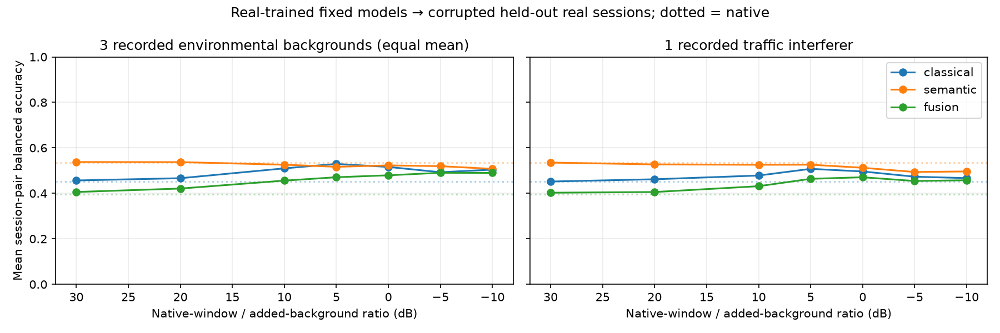

# Controlled-corruption 7/5 results

Date: 2026-09-20. Status: complete and verified; no new model trained.

**Domain: real-trained models -> held-out real recordings with controlled added
recorded background audio.** Microphone-response tests are separately labeled
simulations. These results do not replace the native-real Milestone 7 gate result.

## Experiment

The exact 593 windows from 7 tracked / 5 wheeled sessions were transformed under
30 conditions: four real backgrounds at seven ratios (30 to -10 dB), plus two
simulated microphone responses without added noise. All 35 native outer session
pairs reused their saved probes and original thresholds, without retraining,
calibration, threshold tuning, or audibility gating. T90M/JLTV and Sherman/PDSounds
were not evaluated. No native dataset, labels, or checkpoints changed.

The whole native recording window includes existing ambience. Here **SNR is the
native-window-to-added-background power ratio**, not isolated engine SNR. A common
gain prevents clipping while preserving that ratio. It is saved per transformation.

The three environmental backgrounds are heavy rain, rain/thunder, and birdsong.
The fourth recording contains road traffic and is reported separately as competing
vehicle interference. Entire background originals were excluded from fitting the
current native probes. They were not newly sealed relative to historical project
work; external AudioSet encoder exposure is unknown.

## Results

Environmental rows below average the three original backgrounds equally, with
equal session weighting within each class. BA means balanced accuracy.

| Condition | Classical BA | Semantic BA | Fusion BA | Fusion tracked recall | Fusion wheeled recall |
|---|---:|---:|---:|---:|---:|
| Native, no added background | 45.24% | 53.40% | 39.70% | 51.98% | 27.42% |
| Environmental, 30 dB | 45.67% | 53.78% | 40.60% | 53.24% | 27.96% |
| Environmental, 10 dB | 50.98% | 52.59% | 45.60% | 61.38% | 29.81% |
| Environmental, 0 dB | 51.60% | 52.28% | 47.93% | 65.06% | 30.80% |
| Environmental, -10 dB | 50.42% | 50.76% | 49.00% | 68.63% | 29.36% |
| Simulated low-frequency attenuation | 37.95% | 52.05% | 36.00% | 40.99% | 31.01% |
| Simulated high-frequency rolloff | 37.57% | 51.58% | 39.01% | 43.09% | 34.93% |

Full curves, all seven noise levels, individual backgrounds, confusion matrices,
per-session results and descriptive uncertainty are in the
[versioned artifact directory](../benchmarks/v0.1/corruption_7t5w_v1/README.md).



## Interpretation

- **Generalization remains the primary problem.** No tested condition approaches
  the 75% BA target. The minimum held-out session-context recall remains zero for
  primary fusion in every condition, including the native reference.
- **A score rising toward chance is not evidence of useful robustness.** Under
  environmental backgrounds at -10 dB, semantic tracked recall rises to 93.52%
  while wheeled recall collapses to 8.00%. Its 50.76% BA hides a strong tracked
  bias. Fusion's score rises from 39.70% to 49.00%, but wheeled recall remains
  only 29.36%; most of the gain comes from increased tracked recall.
- **Background identity matters.** At -10 dB, fusion recalls tracked/wheeled at
  49.89%/46.89% for heavy rain, 74.24%/24.20% for rain/thunder, and 81.76%/17.01%
  for birdsong. One average noise curve cannot explain these different responses.
- **Microphone-response sensitivity is present in these samples.** Low-frequency
  attenuation changes fusion BA by -3.70 percentage points; high-frequency rolloff
  by -0.69 points. These are simulated curves, not actual device comparisons.
- **Traffic is not neutral background.** Fusion BA is 47.07% at 0 dB and 45.75% at
  -10 dB under added traffic. The target label refers to the original event, not
  every vehicle audible in the mixture; a louder traffic interferer can dominate.

The environmental -10 dB fusion BA has a descriptive session-bootstrap 95% interval
of 39.37%-58.45%; its paired change from native has an interval of -1.92 to +20.45
percentage points. These intervals resample the 12 vehicle sessions, not dependent
windows or 35 folds. They omit model-refit and new-background uncertainty. One
crop seed was used; this is not a multi-seed augmentation study.

## Verification and runtime

- All three saved model branches reproduce native recalls exactly in all 35 folds.
- All 593 native windows were rebuilt exactly from hash-verified source recordings.
- All 17,790 corrupted waveforms were regenerated with exact float32 byte hashes.
- All 1,050 fold-condition predictions passed held-out-membership and saved-probe
  replay checks. Every SNR sweep reused the same crop for a given source/background.
- Maximum absolute requested-versus-measured mixing error: 0.00000052 dB.
- Full test suite: 107 passing tests; 12 added tests cover saved probability replay,
  split leakage, deterministic mixing, SNR, crop bounds and microphone identity.
- Initial evaluation took 312.55 seconds on this Darwin arm64 machine, CPU only,
  four Torch threads, batch size eight. Per-condition work totaled 309.18 seconds.
  This is batch benchmark runtime, not streaming inference latency.

## Reproduce

```bash
uv run python scripts/evaluate_controlled_corruption.py
uv run python scripts/verify_corruption_benchmark.py
uv run python scripts/summarize_corruption_benchmark.py
```

See the [fixed protocol](benchmark_v0_1_corruption_protocol.md) for input roles and
the [artifact README](../benchmarks/v0.1/corruption_7t5w_v1/README.md) for dependency,
resume and versioning details. Audio and prediction tensors remain local. Packaging
this completed track is allowed while Milestone 7 remains blocked.
