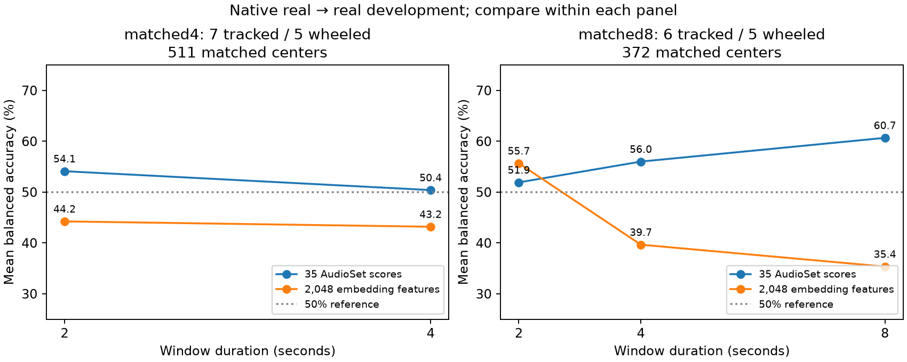

# Full embeddings, context length and sample-rate path: results

2026-09-20. **Native real → real, nested unseen-session development.**
These follow-ups do not replace the original benchmark and do not use any
Sherman/PDSounds, T90M or JLTV recordings. The PANNs encoder remains frozen;
only the session-balanced logistic classifiers are trained.

## Outcome

The full embedding did **not** improve generalization. Longer context helped the
35-score head only in the supplemental 11-session comparison; the primary
12-session 2/4-second comparison did not improve. Direct 32 kHz extraction did
not improve either representation. **Milestone 7 remains blocked.**

All headline results below use the preregistered equal-probability ensemble of
five regularization values and threshold 0.5. Inner-selected-C results are
secondary and preserved alongside them, not chosen after looking at test scores.

## 1. Full frozen embeddings: exact original 593 windows, 7 tracked / 5 wheeled

| Representation / path | Balanced accuracy | Tracked recall | Wheeled recall |
|---|---:|---:|---:|
| Original 35 AudioSet scores, 16→32 kHz | 53.40% | 81.04% | 25.77% |
| Full 2,048-dimensional embedding, 16→32 kHz | 44.99% | 74.29% | 15.68% |
| 35 scores, direct source→32 kHz | 50.50% | 78.59% | 22.41% |
| Full embedding, direct source→32 kHz | 44.44% | 75.04% | 13.83% |

The embedding-minus-score difference is **−8.42 percentage points**, with a
descriptive paired session-bootstrap 95% interval of **−22.92 to +3.76 points**.
This small corpus does not support a population-level superiority claim either
way. There is no observed benefit that justifies replacing the existing head.

As a **post-hoc training-fit diagnostic**, the full embedding reaches 100.00%
mean session-balanced training accuracy across the 35 outer fits, versus 89.15%
for the 35-score ensemble. Its held-out score is only 44.99%. That is a strong
overfitting/generalization-gap warning: increasing head input dimensionality
makes training separation easy, but does not establish transferable class cues.
It does not prove which nuisance or vehicle/context confound is responsible.
See [saved training diagnostic](../benchmarks/v0.1/embedding_context_v1/training_fit_diagnostic.json).

Original classical-only and equal-fusion controls remain 45.24% and 39.70%
balanced accuracy, respectively, in the [frozen native report](benchmark_v0_1_native_real_results.md).
We did not retune fusion using these follow-up outcomes.

## 3. Longer context, with matched two-second controls

| Matched set | Duration | 35-score balanced accuracy | Full-embedding balanced accuracy |
|---|---:|---:|---:|
| 12 sessions, 511 centers | 2 s | 54.11% | 44.24% |
| Same 12 sessions / centers | 4 s | 50.40% | 43.19% |
| 11 sessions, 372 centers | 2 s | 51.91% | 55.66% |
| Same 11 sessions / centers | 4 s | 56.00% | 39.66% |
| Same 11 sessions / centers | 8 s | 60.67% | 35.35% |



Compare only **within** a matched set. StuG cannot supply an eight-second window
inside a reviewed interval, so it is excluded only from the supplemental set.
The Goodwood/Abarth session contributes just **one** matched center there;
overlapping windows elsewhere do not supply extra independent sessions.

- Primary 12-session 2→4 s change: **−3.71 points** for the 35-score head,
  descriptive paired interval −11.29 to +1.99 points.
- Supplemental 11-session 2→8 s change: **+8.76 points** for the 35-score head,
  interval **−1.90 to +22.00 points**. This is a lead worth checking on more
  independent recordings, not a confirmed duration benefit.
- At eight seconds, 35-score tracked recall is **88.33%**, wheeled recall
  **33.02%**. Stryker mean recall is **0.81%**, HMMWV **35.86%**, and Goodwood's
  single center is wrong in every held-out context. Worst session-context recall
  remains **0%**. Longer context has not solved the difficult wheeled sessions.
- The full embedding worsens with longer context in this setup. This does not
  establish that temporal context is intrinsically harmful; encoder pooling,
  the representation, training-set size and domain differences all remain factors.

The secondary inner-selected head reaches 65.77% at eight seconds on the
11-session set (88.79% tracked / 42.75% wheeled), versus its matched two-second
43.33%. It still fails gates and is not promoted over the primary rule.

## Separate bandwidth/resampling-path test

Direct source→32 kHz kept all original two-second centers and the same frozen
checkpoint. Relative to the original 16→32 kHz path, balanced accuracy changed
by −2.90 points for the 35-score head and −0.55 points for the full embedding.
Their paired descriptive intervals are −6.75 to +0.54 and −4.17 to +2.58 points.
Missing high frequencies are therefore **not a demonstrated explanation** of
the failure under this tested pipeline. This changes the resampling path as well
as available bandwidth; it cannot restore frequencies already absent in a source.

## Verification, artifacts and reproduction

- Original semantic comparator: all 35 folds' complete metrics reproduced exactly.
- Cached/uncached evaluator: regression test verifies identical metrics, splits
  and selected coefficients. Cached fits reuse only identical training partitions.
- Saved probes: **920 head/fold replays** independently reproduced held-out recalls.
  Session splits and all reviewed interval bounds were checked.
- **1,848 source-window hashes** regenerated exactly from the original files; raw sources and the
  frozen benchmark remain unchanged. Finder `.DS_Store` files are explicitly
  ignored as non-experimental metadata during artifact verification.
- Session-stratified bootstrap intervals are descriptive: each recording's mean
  recall is the resampling unit, not individual overlapping windows or outer fits.
  They do not capture every source of model-selection or training uncertainty.
- Fourteen representation/context/path conditions are preserved, including all
  failures, configurations, code/dependency versions, dirty git state, splits,
  source/window hashes, model hashes, per-fold confusion matrices and per-session
  results. Heads/features remain local under `runs/embedding_context_v1/`.
- Final regression suite: **114 tests passed**; changed-code lint and whitespace
  checks passed.

See [all results and metadata](../benchmarks/v0.1/embedding_context_v1/README.md),
[verification](../benchmarks/v0.1/embedding_context_v1/verification.json),
[preregistered protocol](embedding_context_protocol.md), and
[preprocessing/model research](audio_preprocessing_model_review.md).

The probe fitting/evaluation loops took 124.76 seconds in aggregate on this
arm64 Mac, using four PyTorch threads and one BLAS thread. This excludes source
extraction, PANNs inference, packaging and verification; it is not an end-to-end
demo latency measurement.

Run from the repository root with the existing reviewed audio and pinned PANNs
checkpoint. Use a new output directory for a new run; the evaluator fails closed
instead of overwriting prior results. The three stages must run in order:

```bash
uv run python scripts/evaluate_embedding_context.py --stage embedding --output runs/embedding_context_repeat
uv run python scripts/evaluate_embedding_context.py --stage context --output runs/embedding_context_repeat
uv run python scripts/evaluate_embedding_context.py --stage bandwidth --output runs/embedding_context_repeat
uv run python scripts/package_embedding_context.py --run runs/embedding_context_repeat --output benchmarks/v0.1/embedding_context_repeat
uv run pytest -q
```

## Next decision

Keep the original benchmark intact. Test DC removal, bounded level normalization
and mild high-pass filtering as separate preregistered controls; do not assume
wind is the universal cause or install an aggressive speech denoiser. Compare
one lightweight frozen encoder and one transformer under the same session
protocol before fine-tuning a larger model. Continue collecting independent
heavy-wheeled sessions. No confirmation recording should be consumed yet.
