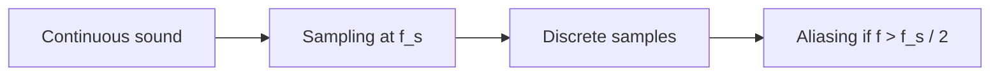
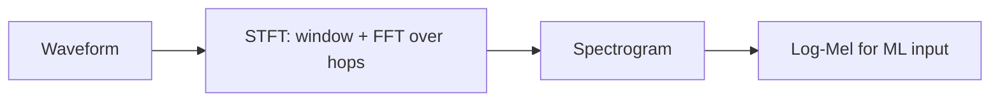

# Signal Fundamentals

## Waveforms & sampling

- **Signal** = quantity varying over time; sound = air-pressure variation.
- **Transducer** = converts one signal form to another (mic, speaker).
- **Periodic signal** repeats over its **period**; one repeat = one **cycle**; shape = **waveform** (determines timbre).
- **Frequency** in Hz (cycles/sec); standard tuning A = 440 Hz.
- **Sample rate** $f_s$ = samples per second. Discrete points = **samples/frames**; time between them = **time step**.
- **Aliasing**: high frequencies masquerade as lower ones when sampling is too sparse.
- **Nyquist frequency** $f_{Nyquist} = f_s / 2$ — highest representable frequency.

## Decibels & SNR

- **Amplitude ratio (dB)** — uses 20:

$$G_{dB} = 20 \log_{10}\frac{A_2}{A_1}$$

- **Power ratio (dB)** — uses 10:

$$SNR_{dB} = 10 \log_{10}\frac{P_{signal}}{P_{noise}}$$

- We use dB because audio spans a huge dynamic range.
- **0 dB SNR** = equal signal and noise power — NOT silence.

> Q: What does 0 dB SNR mean, and why is it not silence?
> A: Powers are equal (ratio 1 → 0 dB); the combined waveform is audibly noisy, not silent.

- **Controlled-SNR mixing** — to reach requested SNR $R$ (dB) with signal power $P_s$ and original noise power $P_n$:

$$\alpha = \sqrt{\frac{P_s}{P_n \cdot 10^{R/10}}} \qquad y = x + \alpha\, n$$

## Fourier, STFT, spectrograms

- **Spectral decomposition**: any signal = sum of sinusoids of different frequencies.
- **DFT** transforms signal → **spectrum**; **FFT** is the fast algorithm.
- **Fundamental frequency** = lowest (usually dominant) component; **harmonics** = integer multiples.
- **Phase** = where in the period the signal starts.
- **STFT** = windowed FFT over time → **spectrogram** (frequency × time).
- **Time vs frequency resolution**: long window → good frequency, poor time; short window → the reverse. **Spectral leakage** reduced by window functions.

> Q: Why can a single FFT hide an acceleration event that an STFT reveals?
> A: One FFT averages over the whole window; the STFT shows the frequency ridge rising over time.

## Filters, resampling, convolution, distortion

- **Low/high/band-pass** = keep frequencies below/above/between cutoffs.
- **Resampling** must anti-alias filter first.
- **Convolution** with an **impulse response** (IR) models a linear system (e.g. room):

$$y[n] = (x * h)[n] = \sum_k x[k]\, h[n-k]$$

- **Clipping** = hard amplitude limit → harmonic distortion.
- **Compression** = gain reduction above a threshold — not the same as clipping.

> Q: What does convolving with a room IR represent physically?
> A: Summing the direct sound plus all reflections arriving at the listener.

## Acoustics & microphones (quick)

- **SPL** uses sound pressure; $p(r) \propto 1/r$ (pressure) but $I(r) \propto 1/r^2$ (intensity).
- "6 dB quieter per distance doubling" is a free-field approximation; real environments add reflections (direct + early + diffuse **reverberation**, **RT60**).
- Mic **frequency response** and **directionality** shape what the sensor captures.
- Microphone effects can change the **measured** SNR after the mixing stage — the recorded `snr_db` is the mixing-stage value.

## Where in the repo

- [[08 - Equation Reference]] for all formulas.
- `src/vehicle_audio/mixing.py` — `mix_at_snr` noise scaling.
- `src/vehicle_audio/augment.py` — filter/EQ/resample/clip/compress/IR/mic stages.
- `src/vehicle_audio/audio.py` — reading, resampling, channel validation.
- `tests/test_mixing.py`, `tests/test_augment.py` — the assertions that verify SNR etc.
