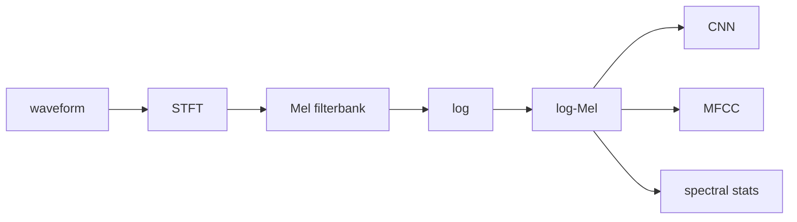
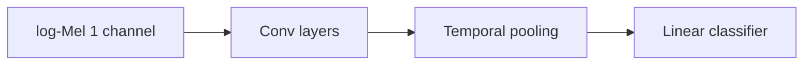
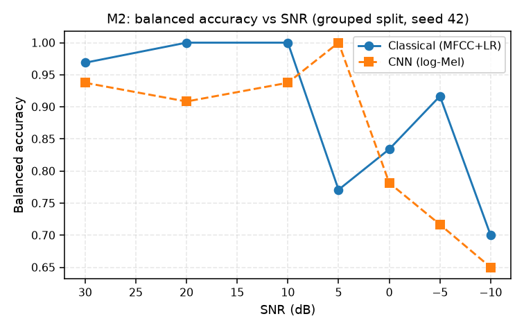

# Features & Classification

## From waveform to features

- **log-Mel spectrogram**: STFT magnitude → Mel filterbank (perceptual scale) → log.
- **MFCC**: DCT of the log-Mel energies → compact coefficients.

## Classical features (used in `baseline.py`)

| Feature                                 | What it measures                         |
| --------------------------------------- | ---------------------------------------- |
| MFCC                                    | spectral envelope shape                  |
| Spectral centroid                       | "brightness" — weighted mean frequency   |
| Spectral bandwidth                      | spread around centroid                   |
| Spectral rolloff                        | frequency below which ~X% of energy sits |
| Spectral flatness                       | noise-like vs tonal                      |
| Harmonic peak concentration             | harmonic structure strength              |
| RMS / zero-crossing rate / crest factor | loudness, noisiness, peakiness           |

→ feed standardized features into **logistic regression**.

## CNN baseline

- Standardized log-Mel input → small conv encoder → **temporal pooling** (drops exact timing) → linear head.
- Encoder/classifier split is **modular** — a pretrained encoder can be swapped in (see [[06 - Invariance & Session Eval]] for PANNs).

## Evaluation metrics

- **Accuracy** = correct / total. Misleading when classes imbalanced.
- **Balanced accuracy** = mean of per-class recall.
- **Precision** $= TP/(TP+FP)$ — of predicted positives, how many right.
- **Recall** $= TP/(TP+FN)$ — of true positives, how many caught.
- **F1** $= 2 \cdot \frac{P\cdot R}{P+R}$.
- **Confusion matrix** — rows true, cols predicted.
- **Calibration**: does 90% confidence mean ~90% correct? ECE / reliability diagram.

## The leakage rule (non-negotiable)

Never randomly split windows from the same recording across train and test. Group by
`recording_session` (or equivalent source ID). Same for: source vehicle, location,
date, media source, simulation run.

> Q: Why can a model get excellent random-window accuracy while learning nothing generalizable?
> A: It can memorize session-specific cues (mic, gain, venue, reverb, background) that don't exist in a new recording.

## M2 results (grouped split, seed 42, synthetic → synthetic)

| Model | Accuracy | Balanced acc | Macro F1 | ECE | Confusion |
|---|---:|---:|---:|---:|---|
| Classical | 0.887 | 0.889 | 0.887 | 0.038 | [[72,12],[6,69]] |
| CNN | 0.849 | 0.854 | 0.849 | 0.040 | [[65,19],[5,70]] |

- Not expected to be monotonic: each SNR slice also varies filters, EQ, clip, compress, background, mic response.
- Old `runs/simple_cnn_channel0_seed42` is a **known-leaked historical artifact** — never report it as evidence.

## Where in the repo

- `src/vehicle_audio/baseline.py` — classical extractor + CNN.
- `scripts/train_baseline.py` — training CLI with `--split-strategy grouped`.
- `tests/test_baseline.py`.
- `runs/m2_classical_grouped_seed42/`, `runs/m2_cnn_grouped_seed42/`.
