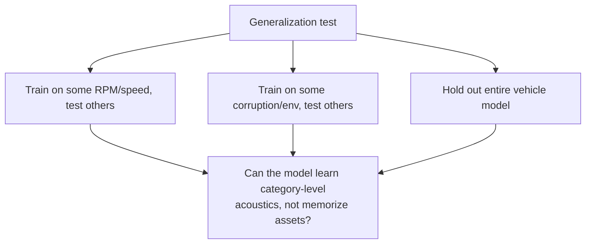

# Vehicle Acoustics & Synthetic Data

## RPM, order analysis

- **Rotational frequency** $f_{rot} = RPM / 60$.
- **Engine order** $n$ = harmonic of rotation: $f_{order} = \frac{RPM}{60} \times order$.
- Firing events create harmonics; acceleration shows as **diagonal ridges rising** on a spectrogram.
- **Tracked vs wheeled cues**: tracked → track-link impacts / periodic clatter; wheeled → tire-road broadband noise, gear whine, engine harmonics.

> Q: Why is "the model detects track clatter" a hypothesis, not a conclusion, from high accuracy?
> A: High accuracy can come from confounders — mic, codec, venue, background, vehicle model, gain, reverb — not from the tracked/wheeled distinction.

**Confounder checklist:** microphone · codec · location · background · vehicle model · recording gain · session reverb · vehicle identity.

## The generative model

$$x = g(v,\ s,\ e,\ m,\ n)$$

- $v$ = vehicle identity / mobility class
- $s$ = operating state
- $e$ = environment
- $m$ = microphone response & geometry
- $n$ = background noise

Goal: keep information about **mobility class** while not depending on a single value of the nuisance variables.

## Domain shift & the three unseen-* tests

- **Domain randomization**: vary nuisance variables in training so the model ignores them. Powerful, but it does **not** prove real-world transfer.
- **In-distribution** = test drawn like training; **out-of-distribution** = different state/env/vehicle.
- **synthetic → synthetic** ≠ **synthetic → real**. Always label the domain.

## M3: controlled procedural corpus

- **Separate** from augmentation: a procedural source generator (`synthesize-sources`), labeled `procedural_synthetic`.
- 4 tracked + 4 wheeled identities × 4 operating states (idle, accelerate, steady, decelerate) × 2 runs × 2 geometries.
- 840 augmented observations; records vehicle ID/class, engine state, RPM/throttle/speed ranges, load, run, geometry.

### M3 results (classical, seed 42)

| Experiment | Holdout | Balanced acc | Takeaway |
|---|---|---:|---|
| Unseen state | decelerating | 0.977 | dynamic state generalizes well |
| Unseen environment | animals/insects bg | 0.868 | environment matters more |
| Unseen vehicle | tracked/wheeled Delta | 0.762 (classical) / 0.795 (CNN) | **biggest drop** — identity is a shortcut |

The grouped-session → unseen-vehicle drop is the most informative number: source
identity remains a strong shortcut even in the controlled corpus.

## Where in the repo

- `src/vehicle_audio/source_simulation.py` — procedural vehicle generator.
- `scripts/generate_synthetic_corpus.py` / `vehicle_audio.cli synthesize-sources`.
- `configs/procedural_vehicles.yaml`.
- `docs/milestones_1_3_report.md` — full tables and commands.
