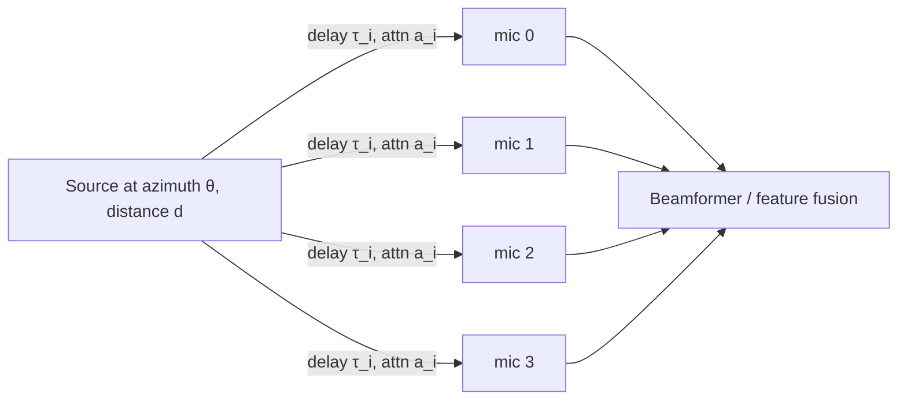
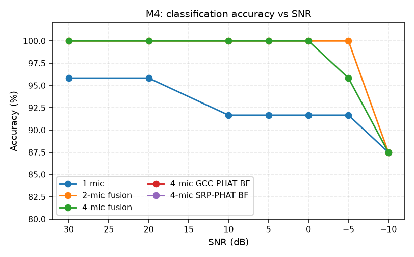
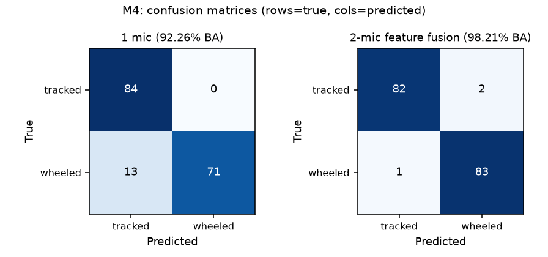
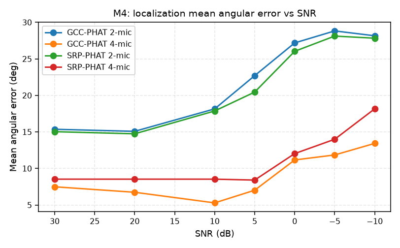

# Multichannel & Beamforming (M4)

## Array model

Each mic observation ≈

$$x_i(t) = \underbrace{a_i}_{\text{attn}} \cdot (\text{source} * \text{ir}_i)(t) + \text{noise}_i$$

with per-mic: propagation **delay**, **attenuation**, **impulse response**, **frequency response**, independent background + sensor noise. Output tensors are `[num_channels, num_samples]`.

**Azimuth convention** (broadside-referenced): 0° = positive y, positive angles rotate toward +x.

- Uniform linear array → **front/back ambiguity**; only the front half-plane `(-90, 90)` is unambiguous.

## Direction of arrival

- **Delay between mics** (far-field, plane wave): $\tau_i = -\frac{p_i \cdot u}{c}$, with $u = (\sin\theta,\ \cos\theta,\ 0)$, $c = 343\ \text{m/s}$.
- **GCC-PHAT**: phase-only weighted cross-correlation; robust in noise/reverb.

$$\hat{R}(\tau) = \int \frac{X_1(\omega) X_2^*(\omega)}{|X_1(\omega) X_2^*(\omega)|} e^{j\omega\tau}\,d\omega,\qquad \hat\tau = \arg\max_\tau \hat R(\tau)$$

- **SRP-PHAT**: search over candidate source directions, summing PHAT correlations across all mic pairs.
- **Fractional delay**: interpolate, don't round — sub-sample delays matter.

## Beamforming

- **Delay-and-sum**: steer by estimated delays, sum the aligned channels.
- Improves SNR by coherently adding the source, incoherently adding noise.
- Compare: single mic vs multiple mics (no beamforming, feature fusion) vs multiple mics (beamforming).

## M4 results (synthetic → synthetic, seed 42)

| Representation | Balanced acc |
|---|---:|
| Single mic | 92.3% |
| **2-mic feature fusion** | **98.2%** |
| 4-mic feature fusion | 97.6% |
| 2/4-mic GCC-PHAT beamforming | 97.0 / 96.4% |
| 2/4-mic SRP-PHAT beamforming | 97.0 / 97.0% |

| Estimator | Mean error | Median | Within 10° |
|---|---:|---:|---:|
| 2-mic GCC-PHAT | 22.2° | 9.7° | 50.6% |
| **4-mic GCC-PHAT** | **9.0°** | 2.9° | 64.3% |
| 2-mic SRP-PHAT | 21.5° | 10.0° | 56.6% |
| 4-mic SRP-PHAT | 11.2° | **2.0°** | **70.2%** |

## Interpretation (key teaching moment)

- More mics **materially help** over 1 mic.
- **Feature fusion beat beamforming**; more mics were **not monotonically better** for classification.
- 4 mics **clearly help localization** (mean error 22° → 9–11°).
- Lesson: "more channels" helps different tasks differently — measure both.

> Q: Why is a 4-mic ULA restricted to the front half-plane `(-90, 90)`?
> A: A linear array can't tell front from back — the delay pattern is mirror-symmetric.

## Where in the repo

- `src/vehicle_audio/multichannel.py` — `simulate_microphone_array`, `gcc_phat_azimuth`, `srp_phat_azimuth`, `delay_and_sum_beamform`, `angular_error_degrees`.
- `src/vehicle_audio/multichannel_evaluation.py` — the comparison runner.
- `configs/multichannel.yaml` — the checked 4-mic config.
- `docs/milestone4_report.md`.
