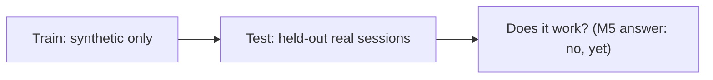
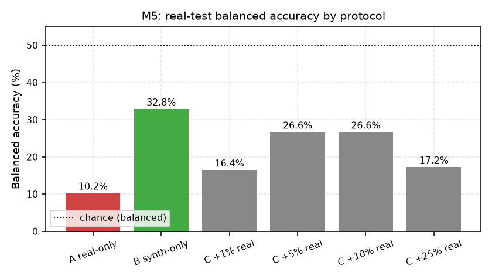

# Real-World Transfer (M5)

## The question

Do features learned on **synthetic** data transfer to **real** recordings never seen in training?

## The real corpus (M5)

- Prepared **separately** from augmentation: explicit channel, resample, fixed windows, **no** synthetic corruption, no invented SNR (`null`).
- 271 windows: 170 tracked / 101 wheeled, from **4 tracked + 3 wheeled independent sessions**.
- Provenance recorded: source URL, license, hashes, window boundaries, review status.
- `corpus_audit.json` **fails closed** unless ≥3 complete sessions/class + full provenance + reviewed boundaries.

## Protocols

| Protocol | Train | Test |
|---|---|---|
| A — Real only | real train sessions | fixed held-out real sessions |
| B — Synthetic only | synthetic sessions | fixed held-out real sessions |
| C — Synthetic + limited real | B, then 1/5/10/25% real windows | same fixed held-out real sessions |

All splits grouped by `recording_session`. Requested and actual fractions both recorded (small sets may force ≥1 sample/class).

## The negative result (seed 42)

| Protocol | Balanced acc (real test) |
|---|---:|
| A — real only | 10.2% |
| B — synthetic only | **32.8%** |
| C — +1% real | 16.4% |
| C — +5% real | 26.6% |
| C — +10% real | 26.6% |
| C — +25% real | 17.2% |

**Every model had 0% recall on the held-out Maserati (wheeled) session.**

- Real-only: 98.5% validation BA → **10.2% test BA**. Huge validation/test reversal = **source/session overfitting**.
- Adding limited real data generally **degrades** the synthetic-only checkpoint — it does not close the gap.
- Calibration poor: ECE 0.414 (real-only), 0.505 (synthetic-only) on real test.

## Why this is a negative result, not a bug

- Test = one session per class; real train split has only one short wheeled session.
- Source identity, venue, microphone, and vehicle identity are **inseparable** in this small corpus.
- This says nothing yet about category generalization — it documents the current failure mode.

> Q: If a model scores 95% synthetic→synthetic but 30% real→real, what did it learn?
> A: It learned the synthetic domain's structure and the training sessions' identities, not a category rule that transfers.

## Where in the repo

- `src/vehicle_audio/real_corpus.py` — `prepare_real_corpus`, `audit_real_manifest` (fails closed).
- `src/vehicle_audio/transfer_evaluation.py` — `evaluate_transfer`, `stratified_fraction_indices`.
- `configs/real_corpus.yaml`, `docs/milestone5_status.md`, `runs/m5_transfer_seed42/`.
- M6 must keep this exact result as the **transfer baseline**.
