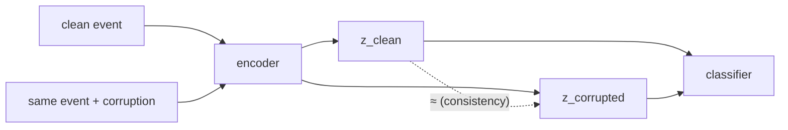
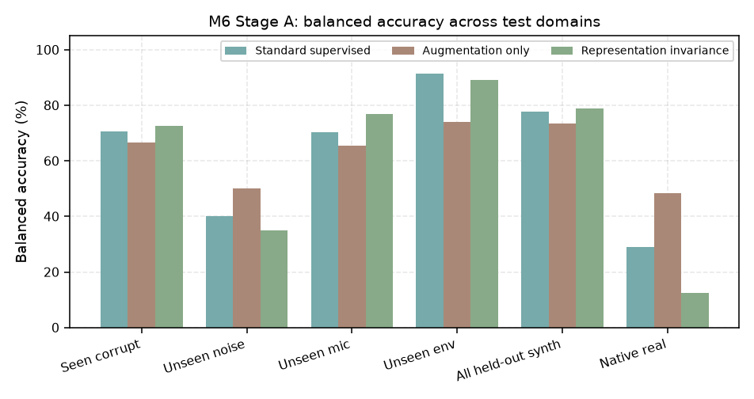
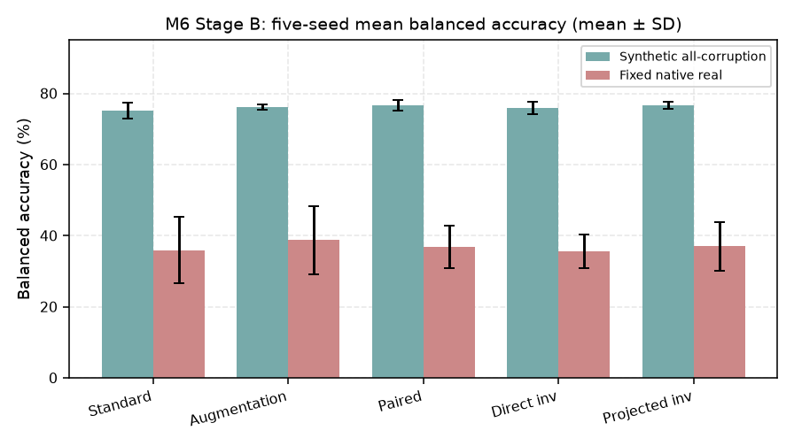
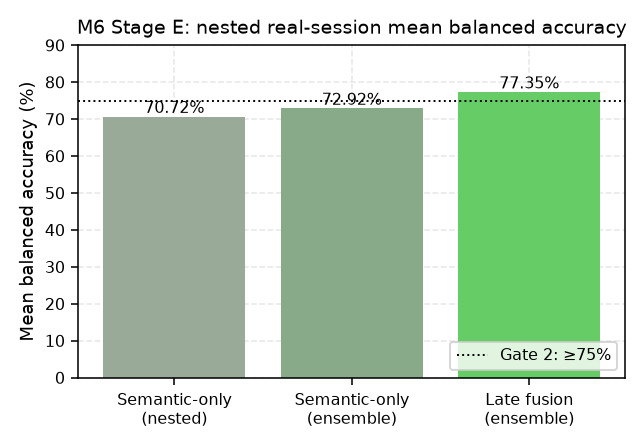

# Invariance & Session Eval (M6)

## The idea

Use M1's paired examples — same event, clean vs corrupted — and train so the
representation ignores the corruption while keeping class information:

## Training objectives

- **Classification loss** (class-weighted cross-entropy) + $\lambda \cdot$ **consistency loss**.
- **Consistency**: cosine similarity between $z_{clean}$ and $z_{corrupted}$.
- **Hard positives**: same vehicle, different RPM/speed/distance/env/mic.
- **Hard negatives**: different vehicle, similar acoustics.
- **Triplet margin** (cosine distance): push anchor closer to positive than negative:

$$L_{triplet} = \max(0,\ d(a,p) - d(a,n) + m)$$

- **Projection head**: apply invariance in a separate head so the classifier encoder keeps class info.

## Methods compared

| Method | Training |
|---|---|
| Standard supervised | CE on clean inputs |
| Augmentation only | CE on corrupted inputs |
| Paired supervised | clean+corrupted CE, no consistency |
| Direct invariance | CE + cosine consistency + triplet |
| Projected invariance | same, in a projection head |

Nuisance partitions held out of training: held-out noise category, held-out geometry
(environment proxy), microphone-response augmentation.

## M6 results

**Stage A (seed 42):**

| Domain | Standard | Augmentation | Invariance |
|---|---:|---:|---:|
| All held-out synthetic | 77.7% | 73.4% | **78.9%** |
| Paired cosine similarity | 0.845 | 0.890 | **0.916** |
| **Native real** | 29.0% | **48.4%** | **12.5%** |

**The teaching moment:** invariance training *helps in-distribution* (and makes embeddings consistent) but is the **worst real-transfer model**. Augmentation-only's 48.4% was also not useful — it predicted nearly everything as tracked.

**Stage B (five seeds, factorial):** no invariance variant gives a repeatable real gain; all five methods ≈ 0.7–1.3% wheeled recall on the fixed real test. Source/vehicle identity dominates.

## PANNs (pretrained encoder)

- Frozen **PANNs Cnn14** (AudioSet-pretrained) as external representation. Not a strict synthetic-only model.
- 2,048-dim embedding vs 527 AudioSet outputs; paired AudioSet-output probe reached 47.9% fixed-real BA but **flipped class bias** (tracked 23%, wheeled 73%).
- Adapting only the linear head with all real-development data → 65.5% ± 13.9% BA — data-limited, non-monotonic learning curve.

## Leakage-safe session evaluation

- **Nested leave-session-pair-out**: every outer fold excludes one complete tracked + one wheeled session; regularization/`C` and wheeled threshold chosen **only on inner folds**.
- Semantic probe = 35 vehicle/engine AudioSet outputs; classical = 53 MFCC/spectral features.
- **Late fusion** = 0.5/0.5 average of the two branch probability ensembles (each C ∈ {0.001, 0.01, 0.1, 1, 10}).

| Metric (12 outer pairs) | Semantic nested | Semantic ensemble | **Late fusion** |
|---|---:|---:|---:|
| Mean balanced acc | 70.72% | 72.92% | **77.35%** |
| Tracked recall | 89.37% | 89.81% | **77.42%** |
| Wheeled recall | 52.07% | 56.03% | **77.28%** |

First leakage-safe development run to pass the mean-BA and mean-recall gates. But **Ford Model T wheeled recall collapses to 0–14.7%** in several contexts — the average is not reliable per-session.

## Three answers

1. Can paired training make synthetic reps less corruption-sensitive? **Yes.**
2. Did invariance close the sim-to-real gap? **No.**
3. Can an audited real-session model separate tracked/wheeled on average? **Provisionally yes** — but not reliably for every unseen session.

## Where in the repo

- `src/vehicle_audio/invariance_evaluation.py` — `evaluate_invariance`, `build_nuisance_partitions`, hard pos/neg partners.
- `src/vehicle_audio/invariance_aggregation.py` — seed aggregation (rejects mismatched runs).
- `src/vehicle_audio/pretrained_evaluation.py` — PANNs.
- `src/vehicle_audio/semantic_session_evaluation.py`, `fusion_session_evaluation.py` — nested session eval.
- `docs/milestone6_report.md`, `docs/milestone6_improvement_checkpoint.md`, `docs/milestone6_pretrained_transfer_report.md`, `docs/milestone6_semantic_session_report.md`, `docs/milestone6_fusion_session_report.md`.
