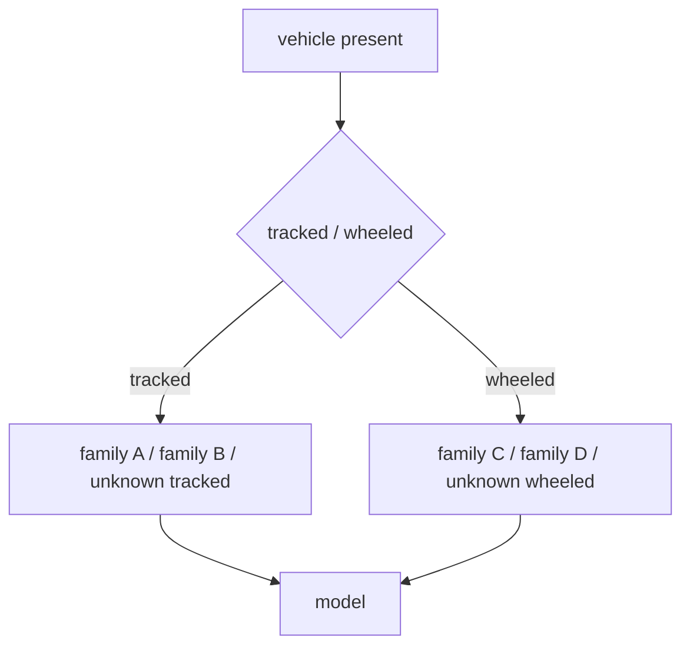

# Milestone 7 & Open Set

## The goal: hierarchical + open-set

Move beyond forced tracked/wheeled — allow UNKNOWN and go finer only when the level
above is reliable:

Reliability ordering: presence → tracked/wheeled → family → model. **Never** do finer
classification before the preceding level is reliable.

## Open-set evaluation

The system must be allowed to return **UNKNOWN** instead of forcing every observation
into a known class. Measure:

- **known-class accuracy** — right among known classes;
- **unknown detection rate** — how many true unknowns get rejected;
- **false-known rate** — how many unknowns are wrongly called known;
- **confidence calibration** — is confidence honest?

Use vehicles **completely excluded from training** to test this.

> Q: Unknown vehicle vs unseen operating state — what's the difference?
> A: Unknown = a new identity/class with no training example. Unseen state = a known identity under a condition it never saw. They test different failures.

## The five gate criteria (must all pass first)

| # | Gate | Best current evidence | Status |
|---|---|---|---|
| 1 | ≥5 reviewed sessions per class | 4 tracked / 3 wheeled | Fail |
| 2 | Nested unseen-session mean BA ≥ 75% | 77.35% | **Pass** |
| 3 | Mean recall ≥ 70% both classes | 77.42% / 77.28% | **Pass** |
| 4 | No held-out session below 50% recall | 22.22% / 29.41% min | Fail |
| 5 | Confirmation on a newly admitted locked pair | none evaluated | Fail |

**Why 77% mean BA doesn't clear the gate:** a stronger average cannot compensate for
catastrophic individual sessions (a Ford Model T at 0–14.7% recall in several
contexts) or the missing corpus / fresh-confirmation requirements.

## Next defensible step

1. Add independent reviewed real sessions (≥5/class).
2. Reserve one **new tracked/wheeled pair**, untouched.
3. Evaluate the already-frozen fusion rule **exactly once** on that locked pair.
4. Only then build hierarchy / family / open-set thresholds.

## Where in the repo

- `AGENTS.md` — Milestone 7 spec + research priority list.
- `docs/milestone6_fusion_session_report.md` — gate assessment + frozen confirmation protocol.
- `scripts/evaluate_locked_fusion.py` — one-shot locked-pair evaluator (already exists).
- The frozen checkpoint: `runs/m6_fusion_frozen_development_v2/frozen_fusion_model.pt`.
