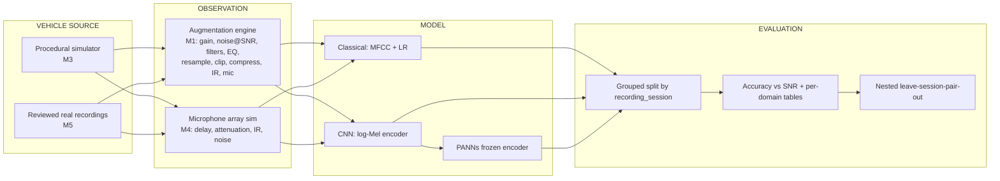
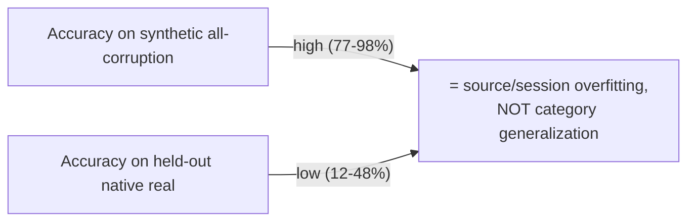

# ABVID Condensed Study Guide

One-stop cheat-sheet version of the full 15-week plan. Everything here maps to code
in the repo and to the milestone reports in `docs/`. Open any page in Obsidian —
Mermaid diagrams and charts render natively.

## Index

- [[01 - Signal Fundamentals]] — waveforms, sampling, dB, SNR, Fourier, STFT, filters, convolution
- [[02 - Features & Classification]] — log-Mel, MFCC, classical features, CNN, metrics, leakage
- [[03 - Vehicle Acoustics & Synthetic Data]] — RPM/order analysis, domain shift, unseen-* tests
- [[04 - Multichannel & Beamforming]] — arrays, GCC-PHAT, SRP-PHAT, delay-and-sum, M4 results
- [[05 - Real-World Transfer]] — M5 corpus, A/B/C protocols, the negative result
- [[06 - Invariance & Session Eval]] — M6 objectives, PANNs, nested session eval, the gate
- [[07 - Milestone 7 & Open Set]] — hierarchy, UNKNOWN rejection, the five gate criteria
- [[08 - Equation Reference]] — every equation on one page

## Source companion notes

Condensed notes for the three main learning sources, each mapping its concepts to
this repo:

- [[Think DSP - Digital Signal Processing in Python]] — waveforms, spectra, filters
- [[MIT 6.003 Signals and Systems]] — signals, LTI, Fourier, sampling, filters
- [[MIT 6.551J Acoustics of Speech and Hearing]] — wave physics, dB, arrays, mics

## The whole project in one diagram



## Milestone map

| M | Name | Question answered | Headline result |
|---|---|---|---|
| 1 | Augmentation engine | Can we make controlled corruptions? | Deterministic paired clean/corrupted WAVs |
| 2 | Baselines | Does category info survive corruption? | Classical 0.889 BA, CNN 0.854 BA (grouped) |
| 3 | Synthetic corpus | Can we generalize to unseen state/env/vehicle? | Unseen-vehicle drop: ~0.76–0.80 BA |
| 4 | Multichannel | Do more mics help? | 2-mic fusion 98.2% vs 1-mic 92.3%; 4-mic localizes better |
| 5 | Real transfer | Does synthetic transfer to real? | **No** — 32.8% BA, 0% on held-out wheeled session |
| 6 | Invariance | Can representations discard nuisance? | Helps in-distribution; **hurts** real transfer |
| 7 | Open set | Can we reject unknowns? | Blocked on 5 gate criteria |

## The recurring plot line



**Rule:** never report performance without naming the test domain. `synthetic -> synthetic`,
`real -> real`, `synthetic -> real`, `synthetic + real -> real` are different results.

## How to read the code quickly

```text
configs/*.yaml            → experiment knobs
scripts/*.py              → entry points (generate / train / evaluate)
src/vehicle_audio/*.py    → the actual algorithms
runs/m<M>_*_seed<seed>/   → every experiment's artifacts
docs/milestone*_report.md → interpreted results
docs/notes/               → this vault
```

Every run writes `experiment.json`, `splits.json`, `metrics.json`, model checkpoints,
and per-condition CSVs — the reproducibility contract from `AGENTS.md`.

## Non-negotiable rules

- [ ] Split by `recording_session`, never by window.
- [ ] Same source → same group → one partition.
- [ ] Report balanced accuracy, not just accuracy.
- [ ] Report per-SNR and per-domain, not just aggregate.
- [ ] Record commit, config, seed, dataset hash, split, checkpoint, metrics.
- [ ] Label the test domain explicitly.
