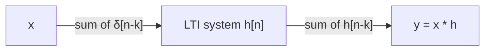

# 02 — LTI Systems & Convolution

## LTI systems

**Linear + Time-Invariant** systems are the workhorse of audio processing.

- The **impulse response** $h[n]$ completely characterizes an LTI system:
  input the unit impulse $\delta[n]$, the output is $h[n]$.
- Output = **convolution** of input with impulse response:

$$y[n] = (x * h)[n] = \sum_{k=-\infty}^{\infty} x[k]\, h[n-k]$$

- In continuous time: $y(t) = \int x(\tau) h(t-\tau)\, d\tau$.

## Why convolution works

Any input can be written as a sum of shifted impulses:

$$x[n] = \sum_k x[k]\, \delta[n-k]$$

By linearity + time invariance, the output is the sum of shifted, scaled impulse
responses — that sum *is* convolution.

## Properties that matter

- **Commutative**: $x * h = h * x$.
- **Associative**: $(x * h_1) * h_2 = x * (h_1 * h_2)$ — cascades commute.
- **Distributive**: $x * (h_1 + h_2) = x*h_1 + x*h_2$ — parallel systems add.
- **Frequency domain**: convolution ↔ multiplication (see [[03 - Fourier Analysis]]).

## Physical meaning for acoustics

Convolving a signal with a **room impulse response (IR)** adds the direct sound plus
all reflections:

$$y(t) = \underbrace{x(t)}_{\text{direct}} + \underbrace{\sum_{\text{reflections } i} a_i x(t - \tau_i)}_{\text{echoes / reverb}}$$

- The IR *is* the acoustic "fingerprint" of the space.
- This is exactly what `augment.py`'s impulse-response stage does when an IR is available.

> Q: Why is convolving with a room IR a good model for reverberation?
> A: The room is an LTI system (linear + time-invariant to a good approximation), so
> its whole behavior is captured by its impulse response — the sum of all echoes.

## In the frequency domain

An LTI system is a **filter**: it multiplies the spectrum of the input by the
**frequency response** $H(\omega)$ (the DTFT of $h[n]$):

$$Y(\omega) = H(\omega) X(\omega)$$

- Magnitude $|H(\omega)|$ scales, phase $\angle H(\omega)$ shifts each frequency.
- This is why filtering, EQ, and mic-response shaping are all "multiply a frequency
  response" operations (see [[05 - Filters & Frequency Response]]).

## Where in ABVID

- `src/vehicle_audio/mixing.py` / `augment.py` — convolution for impulse responses.
- `src/vehicle_audio/audio.py` — resampling (an LTI-ish operation with anti-alias filter).
- Filters in the augmentation pipeline are designed as frequency responses and applied
  as convolution/IIR stages.
