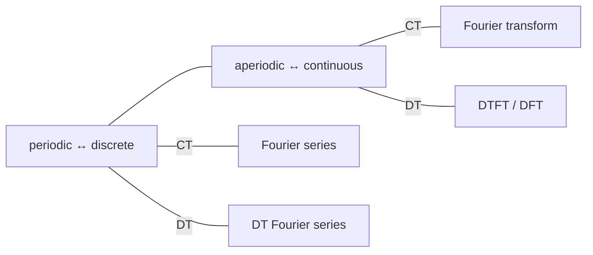
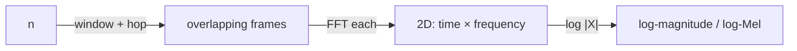
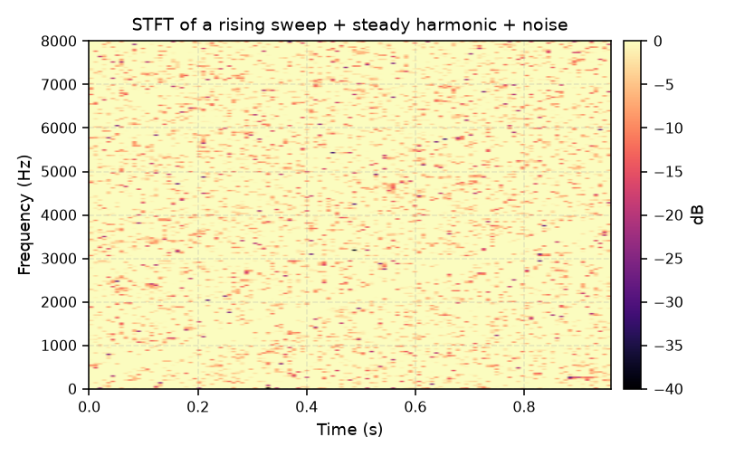

# 03 — Fourier Analysis

## The big idea

Represent a signal as a sum of sinusoids / complex exponentials. For **LTI** systems
this is the natural domain: each complex exponential passes through unchanged (scaled +
phase-shifted), so convolution becomes multiplication.

## The Fourier family

| Transform | Signal | Result | Use |
|---|---|---|---|
| **Fourier series (CTFS)** | periodic CT | discrete spectrum (harmonics) | engine harmonics, periodic tones |
| **Fourier transform (CTFT)** | aperiodic CT | continuous spectrum | analytical |
| **DT Fourier series** | periodic DT | discrete spectrum | analysis of sampled periodic signals |
| **DT Fourier transform (DTFT)** | aperiodic DT | continuous spectrum over $[-\pi,\pi]$ | sampled signals (our case!) |
| **DFT / FFT** | finite DT | finite spectrum | what code actually computes |

Relations among them (Lecture 19):

> Rule of thumb: **periodicity in one domain ⇔ discreteness in the other.** A sampled
> (discrete-time) signal has a **periodic** spectrum, which is why DTFT uses a
> $2\pi$-periodic frequency axis.

## The DFT / FFT (what runs in code)

For a length-$N$ sequence:

$$X[k] = \sum_{n=0}^{N-1} x[n]\, e^{-j 2\pi kn/N}, \qquad k = 0, \dots, N-1$$

- **FFT** = fast algorithm for the same DFT ($O(N \log N)$ vs $O(N^2)$).
- Output bins span $0$ to $f_s$; bin $k$ corresponds to $f_k = k \cdot f_s / N$.
- Torchaudio / numpy / scipy all compute the FFT under the hood.

## From FFT to spectrogram (STFT)

A single FFT over a long signal loses **time** information. The **Short-Time Fourier
Transform** windows the signal into overlapping frames and FFTs each:

- **Window length** ↔ frequency resolution (long window = fine frequency, coarse time).
- **Hop length** ↔ time resolution / overlap.
- **Window function** (Hann etc.) reduces **spectral leakage** — energy smearing from
  non-integer-period truncation.

## Spectral leakage & windowing

Truncating a signal to $N$ samples = multiplying by a rectangular window → the true
line spectrum smears into a $\mathrm{sinc}$-shaped blob. A tapered (Hann) window
trades main-lobe width for lower sidelobes.

> Q: Why does a single FFT hide an acceleration event that an STFT reveals?
> A: One FFT averages the whole window into one spectrum; the STFT shows the harmonic
> ridge *moving up* over time.

## Where in ABVID

- Log-Mel spectrograms are the CNN input (`src/vehicle_audio/baseline.py`) — Mel
  filterbank + log after the STFT.
- MFCC = DCT of log-Mel energies (still Fourier-based).
- Spectrogram inspection tool: `scripts/inspect_sample.py`.
- See [[02 - Features & Classification]] for the feature details.
