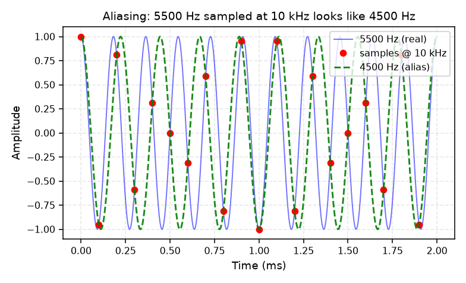
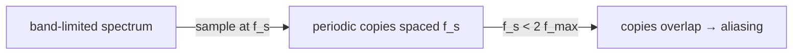

# 04 — Sampling & Quantization

## Sampling theorem (Nyquist)

A CT signal band-limited to $f_{max}$ can be exactly reconstructed from samples taken
at rate

$$f_s > 2 f_{max}$$

The **Nyquist frequency** $f_{Nyquist} = f_s/2$ is the highest frequency representable
without aliasing.

- **Undersampling** → **aliasing**: a frequency above $f_s/2$ folds down and appears
  as a lower frequency:

$$f_{alias} = f_s - f_{real} \quad (\text{for } f_s/2 < f_{real} < f_s)$$

> Q: Why is 5500 Hz sampled at 10 kHz indistinguishable from 4500 Hz?
> A: Both produce identical sample values. Only prior knowledge (the anti-alias filter)
> can tell them apart — which is why resamplers low-pass first.

## Sampling in the frequency domain

Sampling = multiplying by an impulse train → the spectrum becomes **periodic**, with
copies of $X(\omega)$ centered at multiples of $f_s$:

- Reconstruction = low-pass filter to extract one copy.
- **Anti-alias filter** = low-pass before sampling/downsampling to remove content above
  $f_s/2$. This is why resampling includes a low-pass stage.

## Quantization

Sampling captures *when*; **quantization** captures *how large* (finite amplitude levels).

- $B$ bits → $2^B$ levels; each sample rounded to nearest level.
- **Quantization error** behaves like additive noise: SNR ≈ $6.02B + 1.76$ dB.
  - 16-bit ≈ 98 dB, 8-bit ≈ 50 dB.
- Dithering (adding tiny noise before quantizing) turns correlated distortion into
  benign noise.

## Resampling pipeline (how it actually works)

- **Downsample** by $M$: low-pass to $f_s/(2M)$, then keep every $M$th sample.
- **Upsample** by $L$: insert zeros, low-pass to interpolate.
- **Rate change** by $L/M$ = combine both, one anti-alias filter at the common rate.
- Round-trip resampling (as in `augment.py`'s degradation stage) = down then back up,
  permanently losing the high frequencies removed by the anti-alias filter.

> Q: Why does round-trip resampling "return to the configured output sample rate" yet
> degrade the signal?
> A: It goes out to a lower rate and back; the rate is correct again but the content
> above the intermediate Nyquist is gone.

## Audio CD example (L25)

44.1 kHz chosen because human hearing tops out ~20 kHz: $f_s > 2 \times 20$ kHz with
margin, and 16-bit quantization gives ~96 dB dynamic range. This is the canonical
"pick sample rate and bit depth from the signal and noise requirements" design.

## Where in ABVID

- `src/vehicle_audio/audio.py` — explicit resampling with anti-alias filtering.
- `augment.py` — `round-trip resampling degradation` (down to 4/8/12 kHz and back).
- Sample rates and bit depth are recorded in every manifest record.
- See [[01 - Signal Fundamentals]] for the dB / SNR side.
