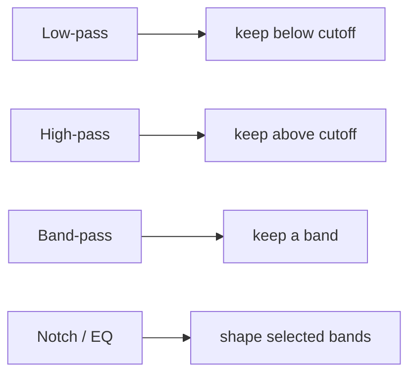
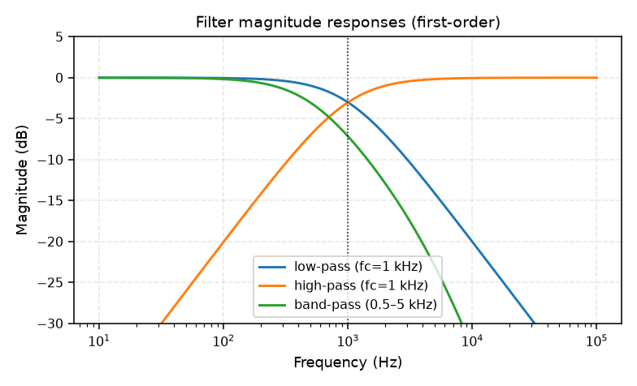

# 05 — Filters & Frequency Response

## Frequency response

For an LTI system with impulse response $h[n]$, the **frequency response** is the DTFT
of $h$:

$$H(\omega) = \sum_n h[n] e^{-j\omega n}$$

- **Magnitude** $|H(\omega)|$ = how much each frequency is scaled.
- **Phase** $\angle H(\omega)$ = how much each frequency is delayed/rotated.
- Output spectrum $= H(\omega) \cdot X(\omega)$.

## Filter types

- **Cutoff frequency**: where magnitude drops ~3 dB (−0.707).
- **Order** = steepness of rolloff (more poles → faster drop past cutoff).
- **FIR** (finite impulse response) = convolution with a finite $h$; **IIR** = recursive
  difference equation (feedback).

## Decibel view

A filter is naturally plotted in dB (log magnitude) vs log frequency — a **Bode plot**.
This is why "random EQ" and "mic frequency response" in the augmentation pipeline are
specified as **dB curves** across frequency.

## What a filter does to a vehicle signal

- **Low-pass**: removes high-frequency tire/track detail, dulls the sound.
- **High-pass**: removes rumble below ~30–300 Hz.
- **Band-pass**: isolates an engine-order band.
- **EQ**: boosts/cuts selected bands (e.g. mic coloration).
- **Mic frequency response**: a fixed (often non-flat) $H(\omega)$ per sensor —
  each mic colors the signal differently.

> Q: Why do frequency-selective corruptions change the *measured* SNR even though the
> mixing-stage SNR is fixed?
> A: The noise was scaled to hit the target ratio at mixing; a subsequent filter can
> attenuate signal or noise unevenly, shifting the ratio actually measured on the
> final waveform. The manifest records the *mixing-stage* `snr_db`.

## Filtering as convolution

Every filter is a convolution with its impulse response:

- FIR: direct convolution.
- IIR / "analog-style" filters (Butterworth etc.): implemented as recursive difference
  equations — still an LTI system, still characterized by $h$ and $H(\omega)$.

## Where in ABVID

- `src/vehicle_audio/augment.py` — low/high/band-pass, random EQ, microphone frequency
  response stages, all configurable in `configs/default.yaml`.
- `src/vehicle_audio/audio.py` — resampling anti-alias filtering.
- The `snr_db` caveat is documented in the README and in every generated manifest.
- See [[01 - Signal Fundamentals]].
