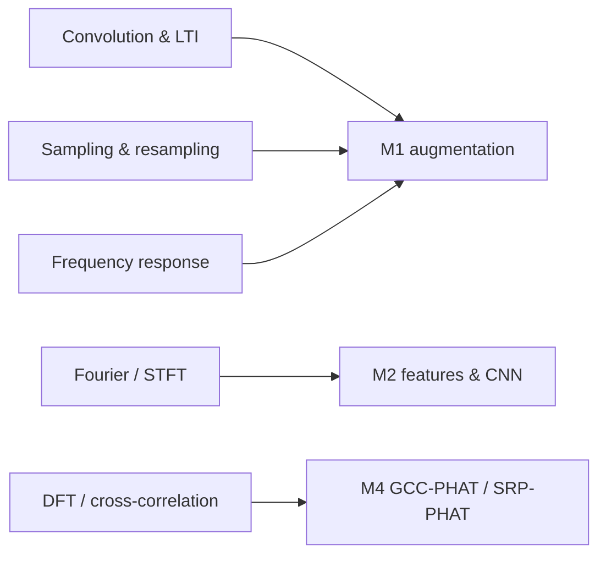

# 06 — 6.003 → ABVID Map

Every concept from 6.003 and where it lives in this repository.

## Concept → code

| 6.003 concept | ABVID location |
|---|---|
| DT signals, sample rate | `src/vehicle_audio/audio.py`; tensors `[channels, samples]` |
| LTI systems, convolution | `augment.py` IR stage; `mixing.py` SNR stage |
| Impulse response | `data/impulse_responses/`; convolution in augmentation |
| Frequency response | filter/EQ/mic-response stages in `augment.py` |
| Fourier / DFT / FFT | log-Mel front end in `baseline.py`; `scripts/inspect_sample.py` |
| STFT / spectrogram | `inspect_sample.py`; CNN input in `baseline.py` |
| Sampling / aliasing / resampling | `audio.py` resampling; `augment.py` round-trip degradation |
| Quantization | float WAVs, 16 kHz, 2-second events |
| Filtering | `configs/default.yaml` (filter ranges, probabilities) |
| dB / SNR | `mixing.py` `mix_at_snr`; SNR recorded per sample |
| Modulation | (deferred) — relates to M4 beamforming math |
| Z / Laplace / feedback | (deferred) — control & filter design |

## Concept → milestone

## The "I can explain it" checklist

- [ ] I can predict what happens to a spectrum when I change $f_s$.
- [ ] I can explain aliasing with a concrete frequency example.
- [ ] I can connect convolution to room reverberation.
- [ ] I can explain why a filter is a multiplication in the frequency domain.
- [ ] I can explain why the STFT is needed for time-varying signals.
- [ ] I can explain why the recorded `snr_db` may differ from a waveform-measured SNR.
- [ ] I can state the Nyquist condition and why audio is resampled with a low-pass.

## How this course connects to the other MIT course

6.003 gives you the *math of signals*; [[MIT 6.551J Acoustics of Speech and Hearing]] gives you the
*physics of sound* — the wave equation, pressure/dB, room acoustics, microphones, and
arrays. Together they cover the whole chain: sound → wave → microphone → sample →
spectrum → classifier.
