# MIT 6.003 — Signals and Systems (Condensed)

Condensed, ABVID-filtered notes from [MIT 6.003 Signals and Systems (Fall 2011, Dennis Freeman)](https://ocw.mit.edu/courses/6-003-signals-and-systems-fall-2011/).
Textbook: Oppenheim & Willsky, *Signals and Systems*, 2nd ed. The [RES.6-007](https://ocw.mit.edu/courses/res-6-007-signals-and-systems-spring-2011/) course is the same material as video lectures.

## What this course is for ABVID

Everything the augmentation engine and classifiers do is built on these ideas:

| ABVID need | 6.003 topic |
|---|---|
| Sampling audio at 16 kHz | Sampling & Nyquist, aliasing |
| Resampling degradation | Sampling & quantization |
| Spectrograms / log-Mel | Fourier, DTFT/DFT, STFT, windowing |
| Filters, EQ, mic response | LTI, frequency response, filtering |
| Impulse-response convolution | Convolution, LTI, impulse response |
| SNR / gain in dB | (acoustics side — see [[MIT 6.551J Acoustics of Speech and Hearing]]) |

## Index

- [[01 - Signals & Systems]] — signals, DT vs CT, difference equations
- [[02 - LTI Systems & Convolution]] — LTI, impulse response, convolution
- [[03 - Fourier Analysis]] — Fourier series, FT, DTFT/DFT, STFT
- [[04 - Sampling & Quantization]] — Nyquist, aliasing, resampling
- [[05 - Filters & Frequency Response]] — filtering, Bode, applications
- [[06 - 6.003 to ABVID]] — every concept → repo file

## Lecture map (25 lectures)

```mermaid
flowchart LR
    subgraph Foundations["Foundations"]
        L1[Signals & Systems]
        L2[DT Systems]
        L4[CT Systems]
        L3[Feedback, poles, modes]
    end
    subgraph CoreOps["Core Ops"]
        L8[Convolution]
        L9[Frequency Response]
    end
    subgraph Transforms["Transforms"]
        L5[Z Transform]
        L6[Laplace]
        L14[Fourier Representations]
        L15[Fourier Series]
        L16[Fourier Transform]
        L17_18[DT Fourier]
    end
    subgraph Applications["Applications"]
        L21_22[Sampling & Quantization]
        L23_24[Modulation]
        L25[Audio CD]
        L11[CT Freq Resp & Bode]
    end
    Foundations --> CoreOps --> Transforms --> Applications
```

## Which lectures matter for ABVID

- **Must-read (map directly to the pipeline):** L8 Convolution, L9/L11 Frequency Response, L15–18 Fourier, L21/22 Sampling & Quantization, L25 Audio CD.
- **Context (builds intuition):** L1/2/4 systems basics, L14 Fourier representations, L19 relations among Fourier reps, L20 applications, L23/24 modulation.
- **Defer (control theory, low relevance here):** L3 feedback/poles/modes, L5 Z, L6 Laplace, L7 discrete approx, L10/12/13 feedback & control.

## Textbook section map (Oppenheim & Willsky)

| Topic | Sections |
|---|---|
| CT systems | 1.0–1.5, 2.4–2.5 |
| Convolution | 2.0–2.6 |
| Frequency response | 3.10, 6.0–6.2.3, 6.5–6.5.3 |
| CT Fourier series | 3.0–3.5.9 |
| CT Fourier transform | 4.0–4.8 |
| DT Fourier series | 3.6–3.12 |
| DT Fourier transform | 5.0–5.9 |
| Sampling | 7.0–7.6 |
| Modulation | 8.0–8.9 |
| Z transform / Laplace | 10.x / 9.x (defer) |

> Rule of thumb: you need Fourier + sampling + convolution + filtering to understand
> every audio pipeline stage. Z/Laplace/feedback are useful later (e.g. control,
> filter design) but are not prerequisites for the ABVID baselines.
