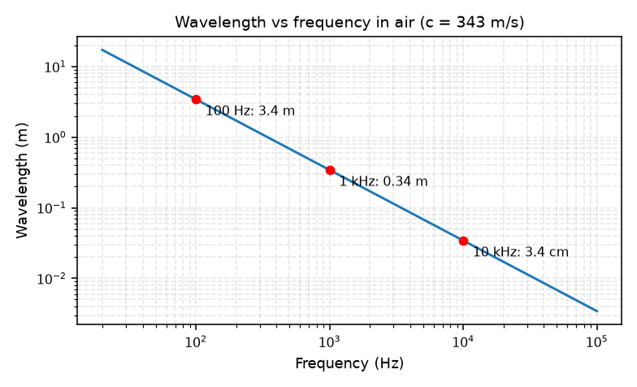

# 01 — Sound Measurement (L1)

## What sound is

- **Sound** = a propagating mechanical disturbance in a medium (no net matter transport).
- Two coupled quantities:
  - **Sound pressure** $p(t)$ — variation about atmospheric pressure. Units: pascals (Pa). Scalar.
  - **Particle velocity** $v(t)$ — the oscillating velocity of a volume element of air. Units: m/s. Vector.
- An **acoustic particle** = a volume big enough to be a continuum, small enough that $p,v$ are nearly constant inside.

> A 1 Pa pressure at 1 kHz is uncomfortable-but-not-painful loudness; it is 1/100,000
> of an atmosphere and ~50,000× the quietest audible pressure. That huge dynamic range
> is why we use dB.

## The wave equation (where it comes from)

Three pieces combine into the 1-D wave equation:

- **Newton's 2nd law** (F=ma for air): $\frac{\partial p}{\partial x} = -\rho_0 \frac{\partial v_x}{\partial t}$
- **Conservation of mass**: $\rho_0 \frac{\partial v_x}{\partial x} = -\frac{\partial \rho}{\partial t}$
- **Elasticity / adiabatic compressibility**: $\rho(x,t) = \frac{\rho_0}{B_A} p(x,t)$

Result:

$$\frac{\partial^2 p}{\partial x^2} = \frac{\rho_0}{B_A}\frac{\partial^2 p}{\partial t^2}, \qquad c = \sqrt{\frac{B_A}{\rho_0}}$$

- **Bulk modulus** $B_A = \gamma P_0 \approx 1.4 \times 10^5$ Pa for air (adiabatic).
- **Density** $\rho_0 \approx 1.21$ kg/m³.
- **Speed of sound** $c \approx 340$ m/s at 20 °C.
- **Characteristic impedance** $z_0 = \sqrt{B_A \rho_0} = \rho_0 c$ (unit: rayl).
  For a plane wave: $p(t) = z_0 v_x(t)$.

## Wavelength & frequency

$$\lambda = \frac{c}{f}$$

Human hearing ~20 Hz–20 kHz → wavelengths from >10 m to <2 cm. This matters: some
sounds are bigger than the objects around them, others smaller — which is why
diffraction behavior changes with frequency.

## dB and SPL

- **Intensity** (power/area): $I = \frac{1}{2}\mathrm{Re}\{P V^*\}$; average intensity ∝ pressure².
- **Decibel** is a log of a *ratio*:
  - intensity / power: $\;10\log_{10}(I/I_0)$
  - pressure: $\;20\log_{10}(P/P_{ref})$
- **SPL reference**: $P_{ref} = 2\times10^{-5}$ Pa; $I_0 = 10^{-12}$ W/m².
- Why log? Wide dynamic range + our ears respond to *fractional* changes (Weber/Fechner).

> Q: Why 20 for pressure but 10 for power?
> A: Intensity ∝ pressure², so $10\log_{10}(P^2/P_{ref}^2) = 20\log_{10}(P/P_{ref})$.

## Complex notation

- A tone $p(t) = A\cos(\omega t + \phi)$ written as the real part of a complex
  exponential: $p(t) = \mathrm{Re}\{ \underline{P}\, e^{j\omega t} \}$, with complex
  amplitude $\underline{P} = |P| e^{j\angle P}$.
- **Euler**: $e^{j\theta} = \cos\theta + j\sin\theta$.
- This is the same machinery as [[01 - Signals & Systems]] —
  the two courses meet here.

## Fourier for periodic sounds (L1)

Any periodic signal of period $T$ = DC + harmonics of $1/T$:

$$p(t) = P_0 + \sum_{n=1}^{\infty} |\underline{P}_n| \cos\left(\frac{2\pi n}{T}t + \angle\underline{P}_n\right)$$

- The **magnitude spectrum** $|\underline{P}_n|$ and **angle spectrum** $\angle\underline{P}_n$ fully describe the periodic sound.
- **rms** pressure from the spectrum: $P_{rms}^2 = \sum_n |\underline{P}_n|^2 / 2$.
- **Intensities add** for different frequencies: two 2-Pa tones at different
  frequencies → $P_{total} = \sqrt{P_1^2 + P_2^2} = 2.0$ Pa rms.

## Where in ABVID

- dB / SNR / SPL math is the foundation of `mixing.py`'s `mix_at_snr`.
- Wavelength/frequency intuition explains why filters (see
  [[05 - Filters & Frequency Response]]) behave the way they do.
- See [[01 - Signal Fundamentals]].
