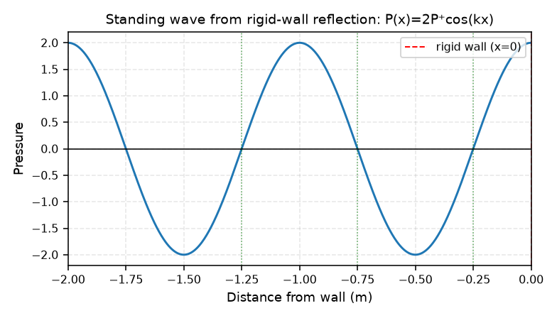
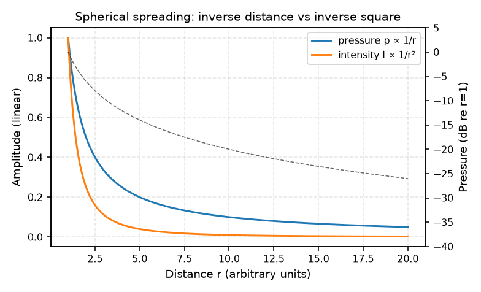

# 02 — Waves: Plane & Spherical (L2, L3)

## Traveling waves

The 1-D wave equation solution is two waves moving in opposite directions:

$$p(t,x) = f^+(t - x/c) + f^-(t + x/c)$$

- The argument `(t − x/c)` is time *shifted by the travel time* — a wave front moves at speed $c$.
- For a plane wave, pressure and particle velocity in each wave are related by $z_0$:
  $v_x = \frac{1}{z_0}(f^+ - f^-)$ (velocities subtract because directions differ).
- Transmission-line analogy: distributed air mass ↔ inductance, compressibility ↔ capacitance.

## Sinusoidal traveling waves & wavenumber

$$p(t,x) = \mathrm{Re}\{ \underline{P}^+ e^{j(\omega t - kx)} + \underline{P}^- e^{j(\omega t + kx)} \}$$

with **wavenumber** $k = \omega/c = 2\pi/\lambda$ (radians per meter — spatial frequency).

- A pure tone "travels": the peak moves across space at speed $c$.
- Microphones at different positions see the same tone at different times (this is the
  seed of TDOA localization in M4).

## Reflections & standing waves

At a **rigid wall** (object much larger than λ), the reflected wave combines with the
incident wave:

- Pressure at the wall doubles: $P(x) = 2P^+ \cos(kx)$ (for wall at $x=0$).
- **Nodes** (zeros) at odd multiples of λ/4 from the wall; **antinodes** (2× amplitude) at multiples of λ/2.
- This is a **standing wave** — fixed spatial pattern, no net propagation.

> Q: Why does the pressure double at a rigid wall and not cancel?
> A: The wall enforces zero particle velocity (rigid), so the reflected pressure adds
> in phase there; it cancels where the round-trip path difference is λ/2.

## Spherical waves (L3)

For a source radiating into free space (spherical symmetry):

$$p(r,t) = \frac{f(t - r/c)}{r}$$

- **Amplitude ∝ 1/r** — pressure decays with distance (unlike a plane wave, which doesn't).
- **Intensity ∝ 1/r²** (inverse square law) because intensity ∝ pressure².

## Near field vs far field

Using $k r$ (electrical distance):

- **Far field** ($kr \gg 1$): $V(r) \approx P(r)/z_0$ (plane-wave-like), $I \propto 1/r^2$.
- **Near field** ($kr \ll 1$): particle velocity lags pressure by 90° (reactive), little power radiated.

The dividing line is roughly where $r \sim \lambda/(2\pi)$. For low frequencies (long λ)
the "near field" extends farther.

## Characteristic impedance recap

$z_0 = \rho_0 c$ relates pressure and particle velocity in a **propagating** wave.
The **specific acoustic impedance** $Z_S(x) = P(x)/V(x)$ can be complex and position-dependent
near objects/reflections — the free-field $z_0$ is only the simplest case.

## Where in ABVID

- The **1/r attenuation** and per-mic delay in the M4 array simulator are the spherical
  far-field model (`multichannel.py`).
- Near/far field explains why a mic's placement relative to the source changes what
  the simulator captures.
- Reflections / IR = the room acoustics the augmentation IR stage approximates.
- See [[04 - Multichannel & Beamforming]].
