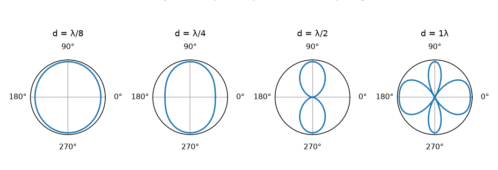

# 03 — Sources & Arrays (L3)

## Simple (monopole) sources

A **simple source** = an acoustically small radiator ($ka \ll 1$) whose surface vibrates
in phase. Characterized by **source strength** $U_S$ (a volume velocity, m³/s):

$$U_S = 4\pi a^2 V(a)$$

Far-field pressure from a monopole:

$$P(r) = \frac{j\omega \rho_0 U_S}{4\pi r} e^{-jkr}$$

- Radiation is **omnidirectional** (spherically symmetric).
- **Radiation impedance** $Z_R$: at low $ka$ the real (radiated power) part ∝ $\omega^2$ —
  small sources radiate little power at low frequencies unless driven hard.

## Directivity: two sources form an array

Two in-phase equal sources separated by $d$ produce (far field):

$$P(r,\theta) = \frac{j\omega \rho_0 U_0}{2\pi r} e^{-jkr} \underbrace{\cos\left(\frac{kd}{2}\cos\theta\right)}_{g(\theta)}$$

- The pattern $|g(\theta)|$ depends on spacing $d$ relative to wavelength.

- **d ≪ λ**: nearly omnidirectional.
- **d = λ/2**: figure-8 (broadside lobes, nulls along the array axis).
- **d = λ**: multiple lobes (grating lobes).

> Key lesson (feeds M4): **spacing and phase determine directionality.** A linear array
> of mics has an angular response; spacing relative to wavelength controls where the
> lobes and nulls are.

## Monopole vs dipole

- **Monopole** (in-phase simple source): omnidirectional.
- **Dipole** (two sources out of phase): pattern ∝ cos θ, with nulls on the broadside
  axis; much weaker at low frequency.
- **Directivity Index** quantifies how concentrated the response is:
  $$D = \frac{\text{response in reference direction}}{\text{mean over all angles}}$$
  - monopole D=1 (0 dB); dipole D=3 (≈4.8 dB).

## General conclusions

- Arrays of simple sources → **directional** radiation patterns.
- The directivity depends on spacing, phase, and frequency.
- This is exactly the principle behind **beamforming**: align (steer) the phases of
  multiple mics so their sensitivity peaks toward the source.

## Where in ABVID

- M4's `delay_and_sum_beamform` steers the array toward the estimated azimuth —
  the computational realization of the directivity idea above.
- The ULA front/back ambiguity is the spatial counterpart of "spacing creates lobes":
  a linear array cannot distinguish mirror directions.
- See [[04 - Multichannel & Beamforming]] and
  `src/vehicle_audio/multichannel.py`.
