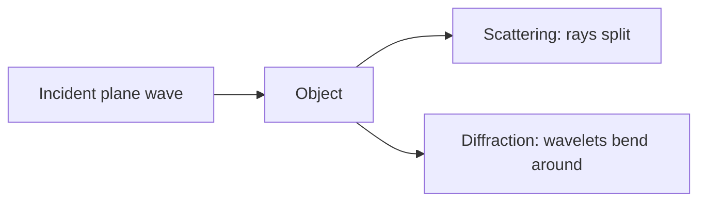
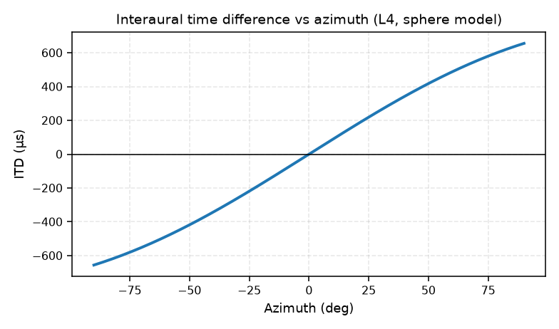

# 04 — Localization & Diffraction (L4)

## Diffraction & scattering

- **Scattering**: an object breaks an incident wave into multiple waves (reflection off
  a rough surface, etc.).
- **Diffraction**: wave behavior that ray theory can't explain; analyzed with
  **Huygens' principle** — every point on a wavefront acts as a new spherical source.

- An object is "large" or "small" **relative to the wavelength**. At low frequency
  (λ bigger than the object), sound diffracts around it; at high frequency it shadows.

## Localization cues (human hearing → the model for TDOA)

The brain localizes using **interaural** differences:

- **ITD** — interaural *time* difference (works best at low frequency).
- **ILD** — interaural *level* difference (works best at high frequency, where the head
  shadows).
- **Duplex theory**: low frequencies use time/phase; high frequencies use level.

Simple spherical-head model of ITD (radius $a$):

$$\mathrm{ITD} = \frac{a}{c}(\theta + \sin\theta)$$

- ITD is ~independent of frequency in this model.
- Real heads show frequency dependence because of diffraction (larger effective size at low frequency).

> The **same physics** underlies M4: a microphone array measures *inter-microphone time
> differences* (TDOA) and turns them into an azimuth estimate — GCC-PHAT is the machine
> version of "find the delay that aligns the two channels."

## Why TDOA is the key quantity

For a plane wave at azimuth θ hitting two mics separated by $d$:

$$\Delta \tau = \frac{d \cos\theta}{c} \qquad (\text{or } d\sin\theta \text{ depending on the axis convention})$$

- Measure the delay → solve for θ.
- GCC-PHAT estimates the delay robustly in noise/reverb (phase-only weighting).
- SRP-PHAT searches over candidate directions, summing pairwise correlations.

## Where in ABVID

- `src/vehicle_audio/multichannel.py`: `far_field_arrival_delays_seconds`,
  `gcc_phat_azimuth`, `srp_phat_azimuth`.
- The M4 localization table (mean angular error 9–22° by estimator) is the machine
  counterpart of human minimum-audible-angle studies.
- See [[04 - Multichannel & Beamforming]].
