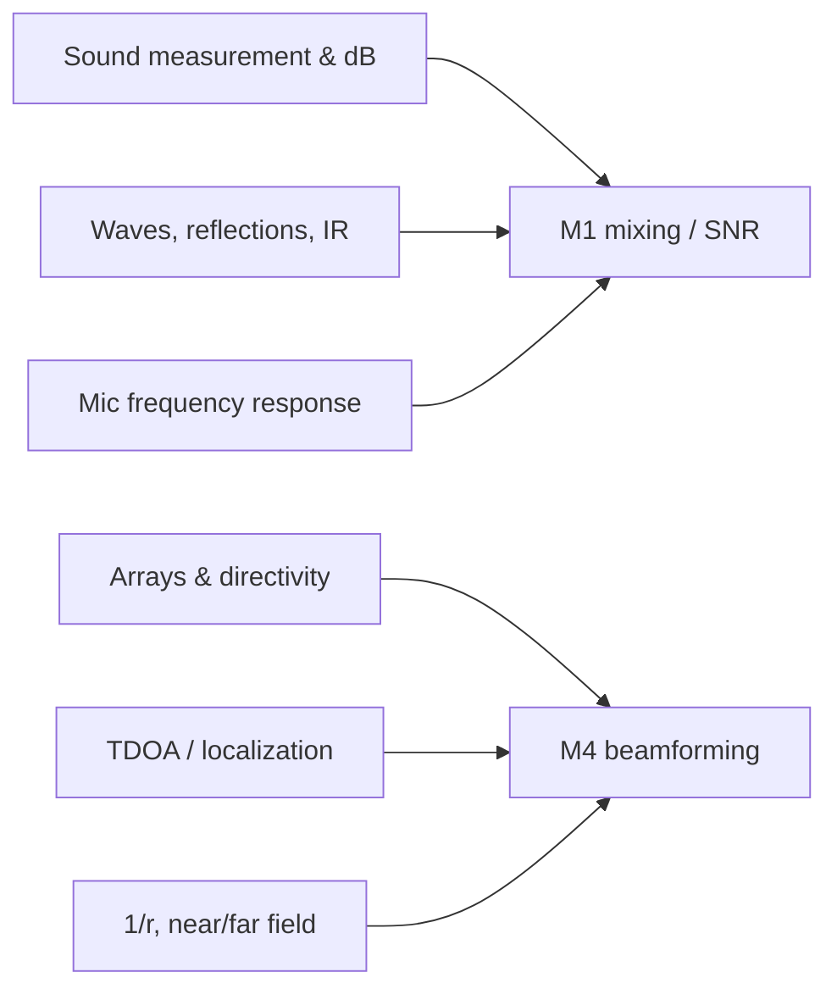

# 06 — 6.551J → ABVID Map

## Concept → code

| 6.551J concept | ABVID location |
|---|---|
| Sound pressure, particle velocity, impedance | conceptual foundation; `mixing.py` uses pressure-like amplitudes |
| dB, SPL, 10 vs 20 | `mixing.py` `mix_at_snr`; `configs/default.yaml` dB ranges |
| Speed of sound $c=343$ m/s | `multichannel.py` `far_field_arrival_delays_seconds` |
| 1/r attenuation, inverse square | M4 per-mic attenuation |
| Near/far field, plane-wave assumption | M4 far-field steering model |
| Reflections / standing waves / IR | `data/impulse_responses/`; `augment.py` IR convolution |
| Source directivity, arrays | M4 beamforming / feature fusion |
| Interaural time difference (TDOA) | `multichannel.py` `gcc_phat_azimuth`, `srp_phat_azimuth` |
| Mic frequency response / coloration | `augment.py` mic-response stage; M4 per-mic response |
| Transducer impedance / loading | why mic response isn't flat; per-mic variation |

## Concept → milestone

## The "I can explain it" checklist

- [ ] I can define sound pressure vs particle velocity.
- [ ] I can derive why intensity uses 10 dB and pressure uses 20 dB.
- [ ] I can explain the inverse-square law and when it breaks down (near field).
- [ ] I can explain why pressure doubles at a rigid wall.
- [ ] I can explain why a linear array is ambiguous front/back.
- [ ] I can connect ITD to GCC-PHAT.
- [ ] I can explain why mic frequency response "colors" sound.

## Course pair

- **6.003** = how we *represent and process* signals (Fourier, filters, sampling).
- **6.551J** = what sound *is physically* (waves, pressure, radiation, transducers).
- Together they cover the full ABVID chain:
  vehicle vibration → wave in air → microphone → samples → features → classifier.
- Link from here: [[MIT 6.003 Signals and Systems]] and the
  [[README]].
