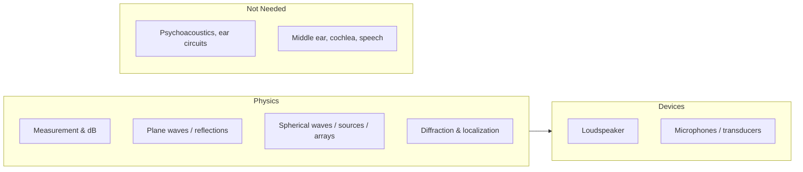

# MIT 6.551J — Acoustics of Speech and Hearing (Condensed)

Condensed, ABVID-filtered notes from [MIT 6.551J/HST.714J Acoustics of Speech and
Hearing (Fall 2004)](https://ocw.mit.edu/courses/6-551j-acoustics-of-speech-and-hearing-fall-2004/).
Graduate-level physical acoustics; we only need the lectures that describe how sound
is measured, propagates, radiates from sources, and gets captured by microphones.

## What this course is for ABVID

The physics behind every number and stage in the project:

| ABVID need | 6.551J lecture |
|---|---|
| dB, SPL, amplitude vs power | L1 Sound Measurement |
| What sound is (pressure, particle velocity) | L1 |
| Speed of sound, wavelength, impedance | L1, L2 |
| Inverse-square / inverse-distance, near/far field | L3 Spherical Waves |
| Room acoustics, reflections, reverberation | L2 (plane waves, reflections) |
| Source directivity, arrays | L3 (simple sources, arrays) |
| Localization / direction of arrival | L4 (ITD, diffraction) |
| Microphone frequency response & transduction | L10/L11 (transducers) |

## Index

- [[01 - Sound Measurement]] — pressure, particle velocity, dB, SPL, complex notation
- [[02 - Waves Plane and Spherical]] — wave equation, plane/spherical waves, near/far field
- [[03 - Sources and Arrays]] — simple sources, directivity, arrays → M4
- [[04 - Localization and Diffraction]] — ITD, duplex theory → M4 localization
- [[05 - Microphones and Transducers]] — capacitance mics, impedance, reciprocity
- [[06 - 6.551J to ABVID]] — every concept → repo file

## Lecture map (which lectures matter)

- **Core for ABVID:** L1–L4, L10–L11.
- **Defer (anatomy/perception):** L5–L9, L12–L25 — interesting but not needed for
  vehicle-acoustic classification.

## The recurring story in one diagram

Each arrow is one or more 6.551J lectures.
