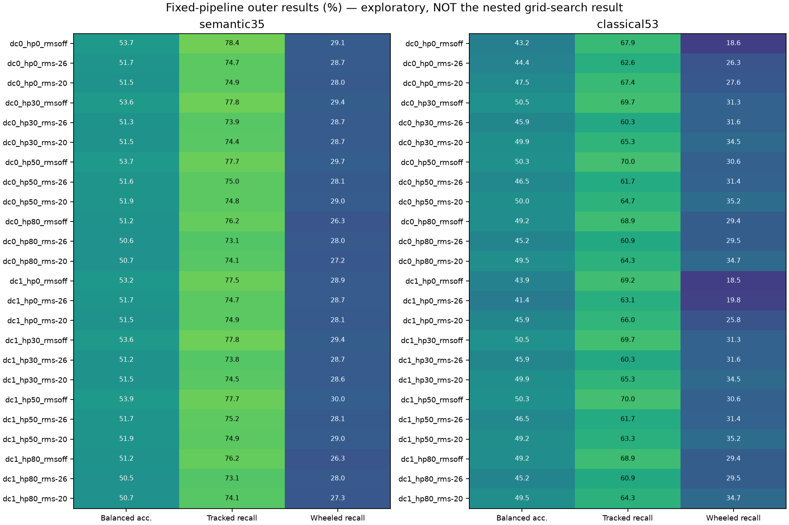

# Non-startup, all-window preprocessing grid: results

2026-09-20. Domain: **native real → real, nested unseen recording sessions**.
This is development evidence, not a locked confirmation or a presence detector.

## Outcome

The 24-way preprocessing search did **not** improve the primary PANNs head.
The classical baseline improved modestly but remains unreliable. Neither passes
the Milestone 7 gate, and no new preprocessing was enabled in the default demo.

| Representation | Rule | Balanced accuracy | Tracked recall | Wheeled recall | Worst session-context recall |
|---|---|---:|---:|---:|---:|
| PANNs 35 scores | Unchanged audio; inner-selected C | 53.73% | 78.35% | 29.10% | 0% |
| PANNs 35 scores | Inner-selected preprocessing + C | **51.86%** | 77.31% | 26.41% | 0% |
| Classical 53 features | Unchanged audio; inner-selected C | 43.23% | 67.86% | 18.61% | 0% |
| Classical 53 features | Inner-selected preprocessing + C | **47.26%** | 67.84% | 26.67% | 0% |

PANNs change: **−1.87 percentage points**, descriptive paired session-bootstrap
95% interval **−4.65 to +0.92 points**. Classical change: **+4.03 points**, interval
**+0.53 to +7.74 points**. The latter is encouraging for that baseline but is far
from useful category reliability. These intervals resample session-level recall
differences, not overlapping windows; they do not capture every source of
training/model-selection uncertainty or guarantee transfer to new recordings.

For the selected PANNs pipelines, mean session recall remains 0% on Ford Model T,
4.80% on Stryker, and 14.47% on HMMWV. Selected classical pipelines have 0.11%
Stryker recall, 0.48% Maserati recall, and 4.06% T-72/BMP-3 recall. A preprocessing
change does not resolve the underlying source-dependent classification failures.

## Startup parked, recordings retained

The operator explicitly requested exclusion from training/evaluation, not merely
removing the label or relabeling startup as idle. Removed from the active catalog:

| Source | Interval excluded | Duration |
|---|---|---:|
| AMX-30 | 00:09–00:40 | 31 s |
| Ford Model T | 00:06–00:14 | 8 s |
| Maserati | 00:00–00:02.5 | 2.5 s |

Total: **41.5 seconds**. Original audio was not deleted or changed. Review
history is archived in
[`configs/archived_startup_intervals.yaml`](../configs/archived_startup_intervals.yaml),
and worksheet decisions are marked `exclude`. Sidecars were synchronized with
the catalog. Legacy startup labels remain readable for historical artifacts and
unadmitted sources. The PANNs AudioSet "Engine starting" feature was retained:
it is a pretrained feature, not a ground-truth condition or predicted ABVID class.

## All eligible windows, not just examples

The new dataset contains **785 windows: 486 tracked / 299 wheeled**, covering all
complete two-second windows at one-second hop in the remaining reviewed intervals.
Channel 0, 16 kHz, no RMS gate, no per-session cap. It retains **7 tracked / 5
wheeled independent sessions**. Classes/sessions still have equal total training
weight; longer recordings do not dominate simply by contributing more windows.

There are 572 unchanged windows shared with the old 593-window capped corpus.
Twenty-one old startup windows are excluded, and removing the cap adds 213 other
reviewed windows. Therefore, historical-versus-new scores do **not** isolate the
effect of dropping startup. Every headline preprocessing comparison above uses
an unchanged-input control on the **same new 785-window corpus**.

Remaining conditions: steady speed 498, idle 130, accelerating 74, mixed 61,
decelerating 12, unknown 10; startup zero. Nothing crosses reviewed interval
boundaries or uses rejected/unreviewed audio. Reserved T90M/JLTV and consumed
Sherman/PDSounds were excluded before feature extraction.

Dataset manifest SHA-256:
`c705cc95ef506cbd0ad4d504e53a5cc8fcae71baca63355d9b6b54c24ba81359`.

## Grid and selection

Grid order is DC subtraction → high-pass → bounded scalar RMS gain:

- DC removal: off / on.
- High-pass: none / 30 / 50 / 80 Hz, second-order Butterworth forward/backward
  within each window; effective fourth-order magnitude response, zero phase.
- RMS target: off / −26 / −20 dBFS; gain capped at ±12 dB and peak-limited by
  reducing gain, not clipping samples. Silence handling is explicit.

This gives **24 pipelines × 2 representations**. Five logistic regularization
values are tried: 0.001/0.01/0.1/1/10. The PANNs encoder is frozen and uses the
same 16→32 kHz frontend. No context-length changes, new model, PCEN, denoising
network, synthetic noise or threshold tuning are mixed into this experiment.
The preprocessing is offline, not a causal streaming implementation.

Each of the 35 outer folds holds out an entire tracked and wheeled session.
The 24 inner session-pair folds select preprocessing **and** regularization;
outer predictions are never used for selection. A training partition can reuse
its cached fit only when every training index, feature representation and C match.
The threshold remains 0.5. The report compares nested-selected heads on both sides,
not a selected head against a different ensemble rule.

There is **no single universally selected pipeline**. PANNs' most frequent choice
was DC off / 80 Hz / −20 dBFS in 7/35 folds. Classical choices included DC off /
30 Hz / RMS off and DC off / 80 Hz / RMS off, each in 7/35 folds. These frequencies
are descriptive, not an instruction to deploy the plurality choice.

## Fixed-pipeline diagnostics—not a selection result



The highest fixed-pipeline outer score is **not** the unbiased grid-search result.
For illustration, DC removal + 50 Hz high-pass + no RMS adjustment scored 53.86%
for PANNs, only 0.13 points above its unchanged control. A 30 Hz high-pass with no
RMS adjustment scored 50.49% for classical features. Choosing those settings
because of these outer scores would reuse the evaluation data for tuning.

The separate fixed-C ensembles are retained in the JSON artifacts for continuity
with prior work, but were not selected as the headline after viewing results.
These bounded options do not demonstrate that all possible preprocessing is
ineffective; they show that this grid does not solve unseen-session generalization.

## Verification and artifacts

- All **18,840** processed windows regenerated to identical waveform hashes.
- **3,500** saved-head/fold replays matched per-class recalls, including the
  selected frontend/checkpoint for each outer fold.
- Startup/protected overlap: zero. Reviewed bounds, complete disjoint session
  splits, finite values, unchanged original source hashes and artifact hashes pass.
- The unchanged frontend agrees with the old cache on 572 shared windows to
  maximum absolute differences 3.04e−6 (AudioSet scores) and 1.63e−5 (embeddings),
  consistent with floating-point batching differences.
- **121 tests passed**; changed-code lint and whitespace checks passed.
- Grid extraction and fitting took approximately **12 min 22 s** on this Mac
  (four PyTorch threads, one BLAS thread), excluding final packaging/verification.
  This is experiment runtime, not demo inference latency.

Primary links:

- [Versioned results, configurations and manifest](../benchmarks/v0.1/preprocessing_grid_v1/README.md)
- [Verification record](../benchmarks/v0.1/preprocessing_grid_v1/verification.json)
- [PANNs fold selections](../benchmarks/v0.1/preprocessing_grid_v1/selected_semantic35/selections.json)
- [Classical fold selections](../benchmarks/v0.1/preprocessing_grid_v1/selected_classical53/selections.json)
- [Preregistered protocol](preprocessing_grid_protocol.md)

Local generated audio, all feature caches, all 48 probe experiments and the two
sets of selected fold checkpoints are under `runs/preprocessing_grid_v1/`.
The metadata package does not redistribute audio. It records licenses, hashes,
configuration, seed, git commit/dirty state, code/dependency versions and all
inner/outer splits and results. No production checkpoint was promoted.

Reproduce from the repository root with existing approved source files and PANNs
checkpoint; use a new output path (or `--resume` for identical interrupted inputs):

```bash
uv run python scripts/sync_catalog_metadata.py --catalog configs/audio_sources.yaml --output data
uv run python scripts/run_preprocessing_grid.py --output runs/preprocessing_grid_repeat
uv run python scripts/summarize_preprocessing_grid.py --run runs/preprocessing_grid_repeat --output benchmarks/v0.1/preprocessing_grid_repeat
uv run pytest -q
```

Milestone 7 remains blocked: session count passes, but mean balanced accuracy,
both-class recall and worst-session gates fail. No reserved confirmation was run.
