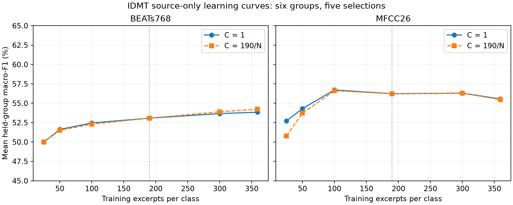
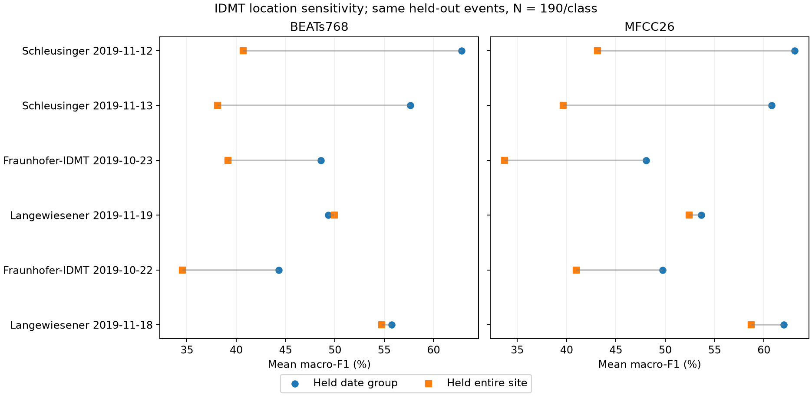

# H1 source-only diagnostic findings

2026-10-03. Protocol `h1_source_diagnostics_v1`; run `source_diagnostics_20261003_v1`. **All five frozen checks are complete. The test domain throughout is IDMT real → held-out IDMT real, car versus truck.** No new MELAUDIS/synthetic evaluation was performed. This is a development diagnostic, not a transfer result.

The main finding is a large loss when an entire location is unseen, alongside a substantial BEATs training/generalization gap. More excerpts from the existing groups barely improve the reference. Restoring bandwidth helps modestly; threshold tuning improves macro-F1 at the expense of truck recall. These results do not identify source-model mismatch or propagation-model mismatch as the dominant synthetic-to-real cause.

## Evidence and interpretation rules

- [Frozen protocol](ARTIFACT_INDEX.md#artifact-493f997fa48f), [exact selections and hashes](ARTIFACT_INDEX.md#artifact-3bf6b0e3155d), [config](ARTIFACT_INDEX.md#artifact-9f5318d56a84).
- [All aggregates and paired intervals](ARTIFACT_INDEX.md#artifact-839ccdd59669), [every outer evaluation](ARTIFACT_INDEX.md#artifact-28c1e99e4964), [inner selections](ARTIFACT_INDEX.md#artifact-e140773869e0), [verification](ARTIFACT_INDEX.md#artifact-6864b4cfa236), [reproduction commands](../experiments/h1_baselines/source_diagnostics/README.md).
- [Unchanged original H1](H1_baseline_results.md) and [qualified data admission](dataset_admission_provenance.md).

Use all 4,413 admitted sE8 CH34 excerpts: 3,902 cars and 511 trucks, six conservative site/date groups at three locations. Five seeds vary training selection: 42, 123, 456, 789, 1024. Unless named otherwise, reuse H1’s exact 190/class selections, two-second mean-channel native→8 kHz→16 kHz waveform, frozen official BEATs768 or MFCC26, train-only StandardScaler and C=1 logistic regression. No augmentation, encoder training, relabelling or padding.

Scores below are percentages, except Brier/log loss/ECE and explicitly stated raw units. Primary scores average each of six group metrics equally, then five seeds; they are not pooled clip scores or ensemble predictions. Paired differences are percentage points. Brackets are 95% conditional percentile intervals from 10,000 paired whole-group/seed resamples; a three-site block sensitivity carries both dates together. Six groups/three sites give uncertain coverage, and these diagnostic comparisons are not multiplicity-adjusted confirmation. The source groups were already evaluated in H1. Three F1 points is a practical reference, not a gate.

## D1 — Can the head fit the training data, and does regularization help?

| Representation | Train F1 | Held-out F1 | Train BA | Held-out BA | Train ROC-AUC | Held-out ROC-AUC |
| --- | --- | --- | --- | --- | --- | --- |
| BEATs768 | 100.00 | 53.08 | 100.00 | 65.87 | 100.00 | 71.49 |
| MFCC26 | 79.31 | 56.23 | 79.32 | 71.00 | 87.34 | 80.22 |

**Finding:** BEATs perfectly separates every balanced training selection but loses 34.13 balanced-accuracy points and 28.51 AUC points on held-out groups. Thus the linear head can fit these features; the poor held-out score is not simple failure to fit training labels. This is consistent with overfitting and recording-context sensitivity, without proving which cues were learned. MFCC has a smaller 8.32-point BA fit gap and stronger held-out discrimination. Training is balanced while testing is naturally imbalanced, so a train/test F1 difference alone would not establish overfitting.

Nested regularization uses five inner held-out groups inside each outer fold and C∈{.01,.1,1}, with mean inner-group F1 selecting C before outer evaluation. Every final fit retains the original 190/class selection.

| Representation | Selected C counts / 30 | Nested F1 | ΔF1 [group CI] | ΔF1 [site CI] | Nested BA | Nested AUC |
| --- | --- | --- | --- | --- | --- | --- |
| BEATs768 | 0.01: 26, 0.1: 4 | 54.89 | +1.81 [+0.86, +2.78] | +1.81 [+1.14, +2.54] | 68.39 | 75.17 |
| MFCC26 | 0.01: 3, 0.1: 14, 1: 13 | 55.56 | -0.67 [-2.60, +0.72] | -0.67 [-3.09, +1.01] | 70.98 | 80.39 |

BEATs benefits modestly from stronger regularization: +1.81 F1 points, with the conditional interval entirely below the three-point practical reference. Training BA falls to 90.07%, held-out BA rises to 68.39%, and AUC rises to 75.17%. MFCC does not show a corresponding F1 benefit. BEATs’ worst individual group/seed recall worsens from 40% to 30% despite the mean improvement. Inner tuning sees additional source validation labels; its label access differs from H1’s fixed untuned rule. This result does not justify silently replacing H1 or claiming transfer improvement.

## D2 — Is the 190-per-class budget the main bottleneck?

Training selections are classwise nested prefixes at N=25,50,100,190,300,359. The largest budget feasible in every outer fold is 359/class. The primary curve fixes C=1; the secondary C=190/N curve holds the installed logistic solver’s mean-loss L2 coefficient constant. Feature scales are still training-estimated. Both curves reuse the same six groups.

| N / class | BEATs F1, C=1 | BEATs F1, C=190/N | MFCC F1, C=1 | MFCC F1, C=190/N |
| --- | --- | --- | --- | --- |
| 25 | 49.98 | 50.00 | 52.71 | 50.78 |
| 50 | 51.62 | 51.51 | 54.31 | 53.73 |
| 100 | 52.46 | 52.30 | 56.71 | 56.60 |
| 190 | 53.08 | 53.08 | 56.23 | 56.23 |
| 300 | 53.66 | 53.89 | 56.30 | 56.29 |
| 359 | 53.84 | 54.24 | 55.55 | 55.47 |

| Representation | Contrast | ΔF1 [group CI] | ΔF1 [site CI] |
| --- | --- | --- | --- |
| BEATs768 | fixed 359 minus 190 | +0.76 [-1.88, +3.07] | +0.76 [-1.57, +2.61] |
| BEATs768 | scaled 359 minus 190 | +1.16 [-1.50, +3.62] | +1.16 [-1.37, +3.00] |
| BEATs768 | fixed 359 minus 25 | +3.86 [-1.57, +10.04] | +3.86 [-2.95, +11.06] |
| BEATs768 | scaled 359 minus 25 | +4.24 [-1.19, +10.34] | +4.24 [-2.74, +11.44] |
| MFCC26 | fixed 359 minus 190 | -0.68 [-2.39, +1.45] | -0.68 [-2.46, +1.85] |
| MFCC26 | scaled 359 minus 190 | -0.76 [-2.40, +1.38] | -0.76 [-2.39, +1.70] |
| MFCC26 | fixed 359 minus 25 | +2.84 [-1.56, +8.76] | +2.84 [-1.52, +6.98] |
| MFCC26 | scaled 359 minus 25 | +4.70 [+0.35, +10.54] | +4.70 [+0.56, +9.41] |

**Finding:** nearly doubling 190→359 examples/class gives BEATs +0.76 F1 points (+1.16 under the penalty control), and MFCC −0.68 (−0.76 controlled); all intervals include zero. BEATs shows a gradual upward curve, but no demonstrated ≥3-point gain from relaxing the current budget. The controlled MFCC 25→359 contrast is positive, so this is not evidence that sample count never matters. It says that adding excerpts from these same groups is not an established remedy for the current baseline. Larger, more diverse collections remain untested. Do not replace the matched H1 budget or choose the highest-scoring N post hoc.

## D3 — Are bandwidth or context length hiding useful information?

| Representation | Observation | F1 | BA | ROC-AUC | ΔF1 [group CI] | ΔF1 [site CI] |
| --- | --- | --- | --- | --- | --- | --- |
| BEATs768 | native16_2s | 56.05 | 70.43 | 77.40 | +2.97 [+0.51, +5.26] | +2.97 [+1.13, +5.50] |
| BEATs768 | core8_1s | 52.06 | 65.52 | 70.53 | -1.01 [-2.88, +0.75] | -1.01 [-3.24, +0.79] |
| MFCC26 | native16_2s | 59.12 | 75.65 | 83.99 | +2.89 [+1.16, +4.84] | +2.89 [+1.23, +4.66] |
| MFCC26 | core8_1s | 56.89 | 73.59 | 81.51 | +0.66 [-1.24, +2.28] | +0.66 [-1.02, +1.97] |

**Bandwidth finding:** direct native→16 kHz gives +2.97 BEATs and +2.89 MFCC F1 points. The group and site intervals are above zero but cross the three-point practical reference. BA improves by 4.56 and 4.65 points, respectively. This supports sensitivity to the bandwidth/resampling route in IDMT. It does not isolate upper-frequency source information from road, propagation or sensor cues, because the resampling route changes too. The original 8 kHz intermediate made the procedural/real bandwidth comparable; a real-only full-band result cannot be substituted into that comparison.

**Context finding:** one second versus two gives BEATs −1.01 and MFCC +0.66 F1 points, both intervals crossing zero. MFCC BA rises from 71.00% to 73.59%, but there is no consistent F1 advantage across representations. The one-second encoder sees true one-second input, not zero/repeat padding. Released excerpts are only about two seconds long, so this check cannot address longer pass-by context. No combination of regularization, bandwidth and threshold “winners” was run.

## D4 — Is useful ranking hidden by the decision rule, and are probabilities reliable?

| Representation / decision | F1 | BA | Car precision | Car recall | Truck precision | Truck recall |
| --- | --- | --- | --- | --- | --- | --- |
| BEATs768 / baseline | 53.08 | 65.87 | 94.95 | 66.15 | 18.87 | 65.60 |
| BEATs768 / nested_threshold | 59.80 | 63.33 | 93.26 | 84.82 | 26.52 | 41.84 |
| MFCC26 / baseline | 56.23 | 71.00 | 96.12 | 69.66 | 21.34 | 72.34 |
| MFCC26 / nested_threshold | 63.63 | 64.72 | 93.05 | 92.73 | 37.84 | 36.71 |

| Representation | ROC-AUC | Truck AP | Brier | Log loss | ECE10 |
| --- | --- | --- | --- | --- | --- |
| BEATs768 | 71.49 | 31.09 | 0.2750 | 1.2374 | 0.3041 |
| MFCC26 | 80.22 | 37.14 | 0.1998 | 0.5950 | 0.2918 |

The equal-group mean truck prevalence is 10.26% (the pooled dataset prevalence is 11.58%). Mean AP exceeds that prevalence reference for both representations, and every group’s mean AP exceeds its own prevalence. Thus there is useful within-group ranking. It is not strong enough to support reliable binary decisions: baseline truck precision is only 18.87% for BEATs and 21.34% for MFCC. The group-specific AP references appear below.

The fixed C=1 inner predictions select thresholds on {.05,.10,…,.95}, without using the outer group. BEATs chooses .95 in 29/30 cases and .90 once; MFCC chooses .75 (4), .80 (8), .85 (16), .90 (2). The grid was not expanded when BEATs reached its upper boundary.

| Representation | ΔF1 [group CI] | ΔF1 [site CI] | ΔBA [group CI] |
| --- | --- | --- | --- |
| BEATs768 | +6.73 [+4.28, +9.17] | +6.73 [+3.54, +9.06] | -2.54 [-5.20, -0.32] |
| MFCC26 | +7.40 [+3.72, +10.90] | +7.40 [+5.40, +9.09] | -6.27 [-9.00, -3.45] |

**Finding:** threshold tuning raises F1 by 6.73 BEATs / 7.40 MFCC points, but truck recall falls from 65.60→41.84% / 72.34→36.71%. BA decreases 2.54 / 6.27 points. Worst truck recall becomes 7.14% for BEATs and 0% for MFCC. This is a majority-class tradeoff, not improved acoustic discrimination. Ranking and all probability metrics remain exactly unchanged because only the decision threshold changed.

Baseline probability errors are substantial: mean truck-probability ECE is .3041/.2918. For orientation, always predicting car has 47.27% mean group F1, 50% BA and zero truck recall; its Brier is .1026, lower than either learned baseline but uninformative for trucks. BEATs regularization improves Brier .2750→.2106 while ECE slightly worsens .3041→.3111; probability quality is not summarized by a single number. Balanced-training and test priors differ, and conditional distribution shift also remains possible. We did not isolate prior shift, fit a probability calibrator or estimate a target-domain threshold. Threshold selection is not calibration.

## D5 — How much does performance depend on recording group and location?

Each row below averages five selection seeds; brackets around F1 show the observed seed range, not a confidence interval. “Site-held F1” trains on the other two sites, evaluates this same date group, and uses the same N=190/class and C=1.

### BEATs768

| Held group | Car/truck | F1 [seed range] | BA | Car recall | Truck recall | AUC | AP / prevalence | Site-held F1 |
| --- | --- | --- | --- | --- | --- | --- | --- | --- |
| Schleusinger-Allee 2019-11-12 | 491/79 | 62.84 [54.29, 69.37] | 72.63 | 73.36 | 71.90 | 79.12 | 50.26 / 13.86 | 40.69 |
| Schleusinger-Allee 2019-11-13 | 666/110 | 57.64 [54.45, 63.28] | 71.37 | 62.91 | 79.82 | 79.94 | 52.02 / 14.18 | 38.12 |
| Fraunhofer-IDMT 2019-10-23 | 254/14 | 48.56 [43.76, 53.49] | 62.82 | 69.92 | 55.71 | 68.61 | 12.35 / 5.22 | 39.16 |
| Langewiesener-Strasse 2019-11-19 | 1365/152 | 49.33 [44.55, 51.64] | 65.09 | 58.46 | 71.71 | 71.20 | 27.22 / 10.02 | 49.93 |
| Fraunhofer-IDMT 2019-10-22 | 302/10 | 44.32 [42.63, 45.93] | 57.94 | 67.88 | 48.00 | 58.98 | 7.28 / 3.21 | 34.53 |
| Langewiesener-Strasse 2019-11-18 | 824/146 | 55.77 [51.03, 58.11] | 65.39 | 64.34 | 66.44 | 71.09 | 37.41 / 15.05 | 54.74 |

### MFCC26

| Held group | Car/truck | F1 [seed range] | BA | Car recall | Truck recall | AUC | AP / prevalence | Site-held F1 |
| --- | --- | --- | --- | --- | --- | --- | --- | --- |
| Schleusinger-Allee 2019-11-12 | 491/79 | 63.10 [56.16, 66.97] | 76.59 | 69.90 | 83.29 | 85.32 | 57.75 / 13.86 | 43.16 |
| Schleusinger-Allee 2019-11-13 | 666/110 | 60.80 [58.87, 62.54] | 72.15 | 69.40 | 74.91 | 81.05 | 54.98 / 14.18 | 39.65 |
| Fraunhofer-IDMT 2019-10-23 | 254/14 | 48.06 [44.23, 52.71] | 77.46 | 60.63 | 94.29 | 85.82 | 24.15 / 5.22 | 33.74 |
| Langewiesener-Strasse 2019-11-19 | 1365/152 | 53.66 [51.54, 56.60] | 69.72 | 64.31 | 75.13 | 76.32 | 34.20 / 10.02 | 52.44 |
| Fraunhofer-IDMT 2019-10-22 | 302/10 | 49.74 [47.56, 52.14] | 58.89 | 81.79 | 36.00 | 75.39 | 7.03 / 3.21 | 40.96 |
| Langewiesener-Strasse 2019-11-18 | 824/146 | 62.01 [59.50, 63.26] | 71.16 | 71.92 | 70.41 | 77.39 | 44.75 / 15.05 | 58.70 |

### Entire-site holdout

| Representation | Date-group F1 | Site-held F1 | ΔF1 [group CI] | ΔF1 [site CI] | Date-group BA | Site-held BA |
| --- | --- | --- | --- | --- | --- | --- |
| BEATs768 | 53.08 | 42.86 | -10.21 [-17.46, -3.23] | -10.21 [-19.98, -1.15] | 65.87 | 59.21 |
| MFCC26 | 56.23 | 44.77 | -11.46 [-18.91, -4.84] | -11.46 [-20.98, -2.80] | 71.00 | 65.97 |

**Finding:** holding out a site costs 10.21 BEATs and 11.46 MFCC F1 points; both resampling schemes put these decreases below zero. The largest losses occur on Schleusinger-Allee, with additional losses on Fraunhofer. Langewiesener changes much less. Mean car recall collapses to 48.80% / 49.36%, while truck recall rises to 69.63% / 82.58%. BEATs AUC falls .7149→.6384; MFCC .8022→.7451. The MFCC BA-change interval includes zero, despite the clear F1 loss. The site-held result must therefore be read as more than a single aggregate number.

Across individual group/seed fits, baseline minimum class recall is 40% BEATs / 30% MFCC. Site-held minima are 10% BEATs (truck) / 20.12% MFCC (car). Only 10 and 14 trucks occur in the two Fraunhofer groups, so recall is especially coarse and uncertain there. These are repeated predictions of the same retained events, not additional independent vehicles.

| Group | Direction counts | Road token counts | Posted limit |
| --- | --- | --- | --- |
| Schleusinger-Allee 2019-11-12 | L:275, R:295 | W:570 | 70Kmh |
| Schleusinger-Allee 2019-11-13 | L:357, R:419 | D:520, W:256 | 70Kmh |
| Fraunhofer-IDMT 2019-10-23 | L:149, R:119 | D:268 | 30Kmh |
| Langewiesener-Strasse 2019-11-19 | L:720, R:797 | D:1517 | 50Kmh |
| Fraunhofer-IDMT 2019-10-22 | L:167, R:145 | D:312 | 30Kmh |
| Langewiesener-Strasse 2019-11-18 | L:492, R:478 | D:970 | 50Kmh |

Both directions occur in all groups. Posted limits are completely tied to location (30/50/70 km/h), and wet-road tokens occur only at Schleusinger. A posted limit is not measured vehicle speed; D/W is a road-condition annotation, not a weather measurement. Acquisition uses the same sE8 channel selection throughout, so this is not a held-out-sensor experiment. Actual vehicle identity, RPM, load, exact distance and original recording-session independence are not established.

The location check also reduces training-group diversity from five groups to four. Location bundles fleet/source states, road/path/background and recording context. Consequently the loss demonstrates location-associated vulnerability under this split, but does not isolate propagation or any other physical factor. We did not train a location classifier or infer missing physical metadata.

## Verification, runtime and scope

Eight metadata/selection/threshold tests passed. Two artificial-waveform encoder checks established exact two-second agreement with the existing adapter and finite repeatable one-second output. Independent verification checked **1,757 training-only scalers/heads, 1,080 outer evaluations, 900 inner evaluations and all 60 nested choices**, including saved probabilities, class/group separation, scalar metrics and all aggregate/paired intervals. All 60 H1 source prediction arrays reproduce exactly (maximum absolute error 0); 798 protected H1 files remain byte-identical. No target probability array was decoded.

Apple M3 Pro CPU, 18 GiB, four Torch threads and one BLAS thread: extraction **345.54 s**, fitting/scoring/resampling **56.16 s**, independent verification **26.27 s**. Three profiles × 4,413 files = 13,239 observations. No GPU, download or cloud service was needed. Each model, training list, score, feature hash, config, code snapshot and software version is retained. Peak RAM was not measured.

These checks establish reproducible computation and separation of known provenance groups. They cannot certify unknown original-session/physical-vehicle independence, annotation correctness, pretrained-data non-overlap or performance outside these three sites. No source simulator, propagation model, background randomizer or sensor model was altered. H1 remains a historical fixed reference; military milestones and protected evaluation sources are unaffected.

## Consequences for the next experimental phase

1. **Keep H1, and add an explicitly frozen source-diagnostic successor before component attribution.** The real reference is limited by generalization as well as decision/prior effects. Preserve the fixed C=1 result; source-group-only regularization is a supported candidate control, not a demonstrated target improvement. MFCC remains necessary because it still outperforms BEATs within IDMT.
2. **Do not spend the next phase merely increasing excerpt count or maximizing F1 through thresholds.** More independent contexts are more informative than more clips from these same groups. This is a research priority suggested by D2/D5, not a causal demonstration that collecting new sites will solve the gap. Keep class recall, BA, ROC-AUC, AP and worst-group outcomes alongside F1. Any future threshold rule needs a preregistered tradeoff and group-separated source validation.
3. **Make bandwidth and operating context explicit in the source × propagation factorial.** Use matched bandwidth in every cell; carry a separate full-band sensitivity if all cells can supply it. Use the same head, threshold rule, event budget and physical-condition distributions across paired cells. Otherwise a roughly three-point bandwidth effect or a roughly ten-point site-associated loss could be mistaken for a simulator-component effect.
4. **Do not infer that propagation dominates either.** Location is entangled with source fleet/state, road conditions, background and acquisition context. The source-dominance hypothesis remains untested. It still requires auditable source alternatives crossed with specified propagation alternatives, matched environment/sensor treatment, and an explicit interaction estimate.
5. **Freeze any subsequent transfer comparison before target access.** No new MELAUDIS evaluation was run here. Existing MELAUDIS remains exposed development data; redesign cannot turn it into untouched confirmation. A later transfer sensitivity must declare its exposure, and genuinely unexposed provenance-clean recordings are needed for an independent confirmation claim. No combined “best” diagnostic configuration has been evaluated or promoted.

The immediate change is therefore interpretive and procedural: the project now has a reproducible diagnosis of the weak source reference. It has not yet tested a physical source-versus-propagation intervention. Finish the next comparison’s freeze and provenance requirements before implementing that factorial; no new architecture is justified by this pass alone.
