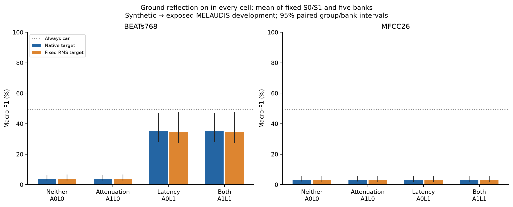
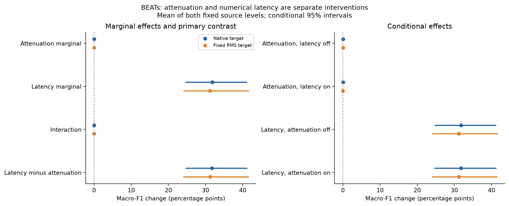
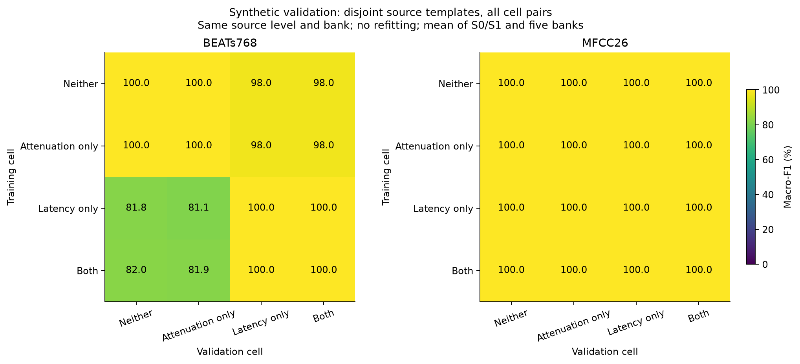

# H2 follow-up: air attenuation versus implementation latency

**Test domain: controlled synthetic → previously exposed MELAUDIS development data.**

Completed and independently audited 2026-10-05 local time.

**The implemented filter latency reproduces the earlier BEATs transfer benefit.
The tested atmospheric amplitude shaping adds very little.** Ground reflection
is present in all four conditions below; “neither” refers only to the two air-filter
components. Numbers equally average fixed S0/S1 and five banks.

| Training condition | Native-real BEATs macro-F1 | Car recall |
|---|---:|---:|
| Ground; neither air component | 3.65% | 0.59% |
| Ground + attenuation only | 3.68% | 0.61% |
| Ground + implementation latency only | 35.43% | 48.01% |
| Ground + both air components | 35.46% | 48.10% |

The primary latency-minus-attenuation advantage is **+31.76 macro-F1 points,
conditional 95% CI [24.77, 41.06]**. Adding attenuation with latency already
present gives **+0.030 [−0.138, 0.206] points**, within the declared ±3-point
practical-equivalence margin. This supports the latency explanation for this
implemented-path gain. It does not establish that artificial delay is physically
correct or useful in general. Every cell still has a zero-recall head/group/class
case, and even the joint condition remains below the 49.19% always-car macro-F1
reference on this imbalanced target.

## Findings for each check

### 1. Renderer and reproducibility checks — passed

All 74 admission checks passed, including independent scalar-stencil agreement
for moving coefficients, delayed-identity behavior, endpoint equality,
repeatability and 64 static complex-transfer checks. Maximum magnitude error
was 0.0143 dB and maximum phase error was 0.000951 radians against the declared
analytic responses. The centered response stayed positive on the tested
1,025-distance × 2,049-frequency grid. These check the declared numerical model;
they do not calibrate it against a real road surface.

All 9,600 new complete float64 waveforms and final float32 observations replayed
exactly. All 9,600 reused endpoints matched their original waveform/observation
hashes during generation. No geometry failed, was redrawn or selectively removed.
Maximum observation peak was 0.34812, below the 0.98 bound. All 80 heads retain
fixed class mapping, disjoint template roles, balanced training, training-only
scalers and converged fixed-parameter fits. All matched synthetic validation
macro-F1 scores are 100%.

### 2. Attenuation versus latency — clear conditional ordering

The latency marginal is **+31.78 [24.77, 41.07] points**; the attenuation marginal
is **+0.027 [−0.053, 0.117] points**. Their interaction is **+0.006
[−0.177, 0.185] points**. Latency helps with attenuation off (+31.78 points)
and on (+31.79 points). Attenuation alone changes F1 by only +0.025
[0.000, 0.063] points relative to ground-only.

The primary interval exceeds the prespecified three-point margin, and the
latency marginal lower bound is positive: practical latency dominance passes.
The earlier ground × implemented-air interaction combined ground with the air
branch's delay, changing direct/reflected interference. The present control shows
that its attenuation is not needed to recover that gain. It does not rule out
absorption effects at other frequencies, ranges, atmospheres, noise levels or
source populations. Crop RMS normalization also conditions out received level.

### 3. Latency-only versus joint — equivalence at the declared margin

Joint minus latency-only is +0.030 points, with its complete conditional interval
[−0.138, 0.206] inside [−3,+3]. The declared secondary practical-equivalence
diagnostic passes. The alternative outcome in which attenuation-only recovered
the gain while latency-only failed did not occur. This is performance equivalence
under the tested rule, not waveform equivalence or a universal physical claim.

### 4. Both source variants — same direction

Latency minus attenuation is +34.27 [29.06, 42.03] points at S0 and +29.24
[20.12, 40.60] at S1. Both support the same ordering. The S1-minus-S0 change in
that advantage is −5.04 [−9.78, 1.00] points, so a difference in its magnitude
between source levels is not established. Full source interactions are reported
below; the source interventions are not random samples of real vehicle models.

### 5. MFCC comparator — representation-dependent benefit

MFCC macro-F1 stays between 3.08% and 3.13% on native target audio, with almost
every event predicted truck. Latency-only gives 0% mean car recall. Its AUROC
is 69.61%, versus 65.51% for attenuation-only, so some ordering exists despite
the failed fixed decision boundary. No target calibration was fitted. The BEATs
benefit cannot be generalized to all representations.

### 6. Fixed target RMS matching — attribution unchanged

On the already fixed RMS-matched target, attenuation-only scores 3.58%, latency-only
34.78%, and joint 34.77% BEATs macro-F1. Latency minus attenuation remains +31.19
[24.13, 41.50] points. Native target audio remains primary; this secondary check
was not used to choose preprocessing or thresholds.

### 7. Cross-cell synthetic validation — latency affects the feature problem

BEATs heads trained without additional latency score 100% on no-latency validation
and about 98.00% on latency validation. Latency-only training scores 81.81% on
ground-only validation, 81.14% on attenuation-only validation, and 100% on both
latency cells. Joint training gives 82.04%, 81.92%, 100% and 100%, respectively.
MFCC scores 100% for every pair in this restricted comparison. These are disjoint
synthetic templates, not real-domain reliability evidence. All 320 comparisons
were evaluated without refitting.

### 8. Direct-path truck collapse — earlier diagnosis retained

The [previous report's individual checks](H2_ground_air_collapse.md#findings-for-each-check)
remain unchanged. Software/class-ID/scaler checks passed. Matching real RMS
changed direct-path BEATs F1 by only +0.005 points; ±12 dB synthetic gain stress
retained 100% car/truck recall for both direct-path representations. Scalar
loudness mismatch is insufficient to explain this collapse in the tested range.

The observed failure is broader feature and score displacement: mean direct-path
BEATs car scores move from −9.31 in synthetic training to +6.83 on real cars,
crossing into the truck side of the fixed boundary. Its AUROC is only 48.61%,
so poor ranking accompanies the boundary failure. MFCC retains better ranking
but places almost everything on the truck side. Spectral differences persist,
including substantially more real 2–4 kHz energy. Their decomposition into
vehicle-source, background, microphone and processing effects remains **unknown**.
This control explains the implemented-path benefit; it does not uniquely identify
the residual physical mismatch.

### 9. Independent reconstruction and remaining failures — passed audit

The audit reproduced all 160 target evaluations, 320 cross-cell checks and every
manual linear-score probability. Maximum saved-versus-recomputed prediction
error was zero. All 80 reused native/matched prediction vectors were preserved.
It independently reconstructed 504 intervals from integer confusion counts and
verified 240 additional source-interaction intervals and the decision rules.
Inventories of 19,877 ground/air parent files, 22,316 original H2 files and
8,257 historical files remained unchanged.

All cells, representations and target variants still retain a zero-recall
head/group/class case. Latency-only BEATs reaches 60.66% balanced accuracy but
only 48.01% car recall and 73.32% truck recall. Neither the gain nor the audit
passes a reliability gate. The target was already exposed development audio;
these are not independent confirmation results.

## What changes downstream

The observed H2 path advantage must now be described as an **implemented
ground/interference/filter-latency effect**, with negligible additional benefit
from the tested attenuation. It is not evidence that physical air absorption
dominates source modeling. The original H2 numbers remain valid for their
specified interventions; interpreting them as a ranking of physical source versus
propagation mismatch is unsupported. The broader source-dominance hypothesis
remains open.

A future physical-propagation comparison should first declare and validate the
relative filter-delay convention, using both magnitude and phase checks, in a
new renderer version. Latency-only is a diagnostic witness, not a realism target
to optimize against MELAUDIS. This investigation stops here: no further source
priors, target tuning, encoder changes, H3–H5 experiments or military milestone
work were introduced. Resolving source/background/sensor contributions and
obtaining independent confirmation require separate evidence.

## What this control identifies

The [previous ground/air study](H2_ground_air_collapse.md) found a joint BEATs
benefit, but the implemented air filters also changed relative path delay. One
symmetric 11-tap FIR acts on the direct route and two act on the reflected route.
Their static implementation delays are five versus ten samples, adding 0.625 ms
of relative delay at 8 kHz. This follow-up separates the two implemented changes
while retaining ground reflection in every cell.

| Cell | Air-amplitude shaping | Air-filter latency | Construction |
|---|---|---|---|
| A0L0 | Off | Off | Reuse verified ground-only G1A0 and its heads. |
| A1L0 | On | Off | Same air coefficients, centered offline application. |
| A0L1 | Off | On | Unit impulse at tap 5 at each original air-filter position. |
| A1L1 | On | On | Reuse verified ground+air G1A1 and its heads. |

The causal operator is `sum_k h[n,k] x[n-k]`; the centered control is
`sum_k h[n,k] x[n+5-k]`. Both use the same coefficients evaluated at output sample
`n`. The latency-only operator is `x[n-5]`. The centered filter is an offline
numerical control, not a physically calibrated deployment renderer. For moving
geometry, the latency intervention includes its placement relative to varying
geometry and ground filtering. It is not solely a static phase experiment.
All interventions retain the same ground filter, geometric delays and spreading.

The [protocol](../experiments/h2_air_latency/PROTOCOL.md) and
[configuration](../experiments/h2_air_latency/config.json) were frozen before
generation of either new arm. Known endpoint results motivated the control; this
is an adaptive development investigation, not blind preregistration or independent
confirmation. No historical renderer or result was overwritten.

## Fixed population, learning and evaluation

The exact 240 base templates, 480 dry sources and 1,200 geometry slots are reused.
S0 is the baseline procedural source; S1 changes harmonic rolloff, firing-frequency
modulation and component balance under the original H2 priors. Neither is a
measured vehicle identity, nor is S1 established as more realistic. The four
cells and two source levels contain 19,200 observations, half newly generated.
Banks are 42, 123, 456, 789 and 1024. Per cell/bank, each head uses 380 training
observations (190/class, 19 templates/class × ten paths) and 100 validation
observations (50/class, five disjoint templates/class × ten paths). Every parent
source retains its train/validation role across all transformations. Car=0,
truck=1; motorcycles remain excluded.

Rendering uses ten-second 8 kHz float64 waveforms. The same geometry-defined
interior two-second crop is normalized to −26 dBFS and resampled to 16 kHz,
giving 32,000 float32 samples. Full new waveforms are retained by SHA-256 and
exact fresh-process regeneration; all new final observations are retained as
arrays. Zero padding applies only outside the ten-second grid. No clipping,
redraw or selective failure exclusion is allowed. Receiver RMS normalization
conditions out scalar range-attenuation/SNR effects.

BEATs768 and MFCC26 are unchanged. BEATs stays frozen; MFCC comprises the means
and standard deviations of 13 coefficients. Every StandardScaler uses only its
head's 380 training rows. Logistic regression is L2, C=1, with intercept, lbfgs,
tol=1e−6, max_iter=5000, no class weights and the bank seed. Truck is predicted
only when probability is greater than 0.5. Forty new heads and forty verified
reused heads were locked before the target comparison. No validation-based
selection, threshold tuning, adaptation, architecture change, background addition
or sensor randomization occurs. The unchanged BEATs checkpoint has a verified
local mirror hash; official upstream checksum identity remains unverified.

The target is exactly the prior 8,066 MELAUDIS crops: 7,810 cars and 256 trucks,
in four conservative, uneven provenance groups. Original recording sessions are
unknown. Native input level is primary; the already extracted fixed −26 dBFS
target cache is a secondary diagnostic. This follow-up does not create a new
target population, target-selected normalization or a new gain sweep. All
cross-cell synthetic validation pairs use the same source level and bank,
without refitting.

## Contrasts and limits of uncertainty

Let Q be per-head complete-target macro-F1, averaged first over five banks and
then equally over fixed S0 and S1. Predictions are not pooled.

```text
attenuation = ((Q_A1L0 − Q_A0L0) + (Q_A1L1 − Q_A0L1)) / 2
latency = ((Q_A0L1 − Q_A0L0) + (Q_A1L1 − Q_A1L0)) / 2
interaction = Q_A1L1 − Q_A0L1 − Q_A1L0 + Q_A0L0
latency minus attenuation = Q_A0L1 − Q_A1L0
```

The sole primary contrast is native BEATs mean_S latency minus attenuation.
A conditional 95% interval wholly above/below zero supports the corresponding
ordering. Practical dominance additionally requires at least a three-point
lower-bound advantage and a positive marginal-benefit lower bound for that
factor. A secondary diagnostic declares latency-only and joint practically
equivalent at the stated tolerance only if the paired 95% interval for joint
minus latency-only lies wholly inside [−3,+3] macro-F1 points. Failure to meet
this rule does not itself prove a difference.

Intervals use 10,000 paired whole-group/whole-bank draws, PCG64 seed 314159,
shared by all cells, representations and target variants. Source levels are
fixed and are not resampled. Conditional effects and S1-minus-S0 effect changes
are retained. Secondary intervals are descriptive. Four uneven groups, including
one with a single truck, provide limited uncertainty information; more clips do
not create more independent sessions. These controls identify effects of the
specified numerical interventions on this exposed target, not physical shares
of the general synthetic-to-real gap or reliable field recognition.

## Complete-target results

All four cells include ground reflection. A means air-amplitude shaping and L means its finite-FIR implementation latency. Percentages are means over both fixed source levels and five banks, not pooled predictions. Brackets show paired 95% intervals. Worst recall is the minimum across individual heads, groups and classes.

| Representation | Cell | Target level | Macro-F1 [95% CI] | Balanced accuracy | Car recall | Truck recall | Predicted truck | Worst recall |
|---|---|---|---:|---:|---:|---:|---:|---:|
| BEATs768 | A0L0: Neither | native | 3.65 [2.70, 6.57] | 49.88 | 0.59 | 99.18 | 99.40 | 0.00 |
| BEATs768 | A0L0: Neither | matched | 3.57 [2.63, 6.62] | 49.97 | 0.50 | 99.45 | 99.50 | 0.00 |
| BEATs768 | A1L0: Attenuation only | native | 3.68 [2.76, 6.58] | 49.90 | 0.61 | 99.18 | 99.38 | 0.00 |
| BEATs768 | A1L0: Attenuation only | matched | 3.58 [2.70, 6.61] | 49.98 | 0.51 | 99.45 | 99.48 | 0.00 |
| BEATs768 | A0L1: Latency only | native | 35.43 [27.97, 47.17] | 60.66 | 48.01 | 73.32 | 52.67 | 0.00 |
| BEATs768 | A0L1: Latency only | matched | 34.78 [27.26, 47.65] | 61.09 | 46.48 | 75.70 | 54.22 | 0.00 |
| BEATs768 | A1L1: Both | native | 35.46 [27.97, 47.24] | 60.65 | 48.10 | 73.20 | 52.58 | 0.00 |
| BEATs768 | A1L1: Both | matched | 34.77 [27.23, 47.62] | 60.95 | 46.55 | 75.35 | 54.15 | 0.00 |
| MFCC26 | A0L0: Neither | native | 3.10 [2.02, 5.56] | 49.94 | 0.03 | 99.84 | 99.97 | 0.00 |
| MFCC26 | A0L0: Neither | matched | 3.08 [1.97, 5.53] | 49.96 | 0.01 | 99.92 | 99.99 | 0.00 |
| MFCC26 | A1L0: Attenuation only | native | 3.13 [2.06, 5.57] | 49.93 | 0.06 | 99.80 | 99.94 | 0.00 |
| MFCC26 | A1L0: Attenuation only | matched | 3.08 [1.96, 5.53] | 49.94 | 0.01 | 99.88 | 99.99 | 0.00 |
| MFCC26 | A0L1: Latency only | native | 3.08 [1.97, 5.53] | 49.98 | 0.00 | 99.96 | 100.00 | 0.00 |
| MFCC26 | A0L1: Latency only | matched | 3.08 [1.97, 5.53] | 49.98 | 0.00 | 99.96 | 100.00 | 0.00 |
| MFCC26 | A1L1: Both | native | 3.08 [1.97, 5.53] | 49.98 | 0.00 | 99.96 | 100.00 | 0.00 |
| MFCC26 | A1L1: Both | matched | 3.08 [1.97, 5.53] | 49.98 | 0.00 | 99.96 | 100.00 | 0.00 |



## Individual source levels

Native target is primary. The full equivalent tables for the matched target and all metrics are in the linked `report_facts.json` and `statistics.json`.

| Representation | Source | Cell | Macro-F1 [95% CI] | Car recall | Truck recall | Worst recall |
|---|---|---|---:|---:|---:|---:|
| BEATs768 | S0 | A0L0 | 3.86 [2.79, 6.94] | 0.79 | 99.22 | 0.00 |
| BEATs768 | S0 | A1L0 | 3.88 [2.83, 6.97] | 0.81 | 99.22 | 0.00 |
| BEATs768 | S0 | A0L1 | 38.16 [32.40, 48.59] | 51.92 | 74.06 | 0.00 |
| BEATs768 | S0 | A1L1 | 38.19 [32.40, 48.80] | 52.01 | 73.98 | 0.00 |
| BEATs768 | S1 | A0L0 | 3.45 [2.63, 6.25] | 0.39 | 99.14 | 0.00 |
| BEATs768 | S1 | A1L0 | 3.47 [2.69, 6.25] | 0.41 | 99.14 | 0.00 |
| BEATs768 | S1 | A0L1 | 32.71 [23.23, 46.20] | 44.10 | 72.58 | 0.00 |
| BEATs768 | S1 | A1L1 | 32.74 [23.19, 46.12] | 44.19 | 72.42 | 0.00 |
| MFCC26 | S0 | A0L0 | 3.08 [1.97, 5.53] | 0.01 | 99.92 | 0.00 |
| MFCC26 | S0 | A1L0 | 3.09 [1.97, 5.53] | 0.02 | 99.92 | 0.00 |
| MFCC26 | S0 | A0L1 | 3.08 [1.97, 5.53] | 0.00 | 100.00 | 0.00 |
| MFCC26 | S0 | A1L1 | 3.08 [1.97, 5.53] | 0.00 | 100.00 | 0.00 |
| MFCC26 | S1 | A0L0 | 3.12 [2.10, 5.59] | 0.05 | 99.77 | 0.00 |
| MFCC26 | S1 | A1L0 | 3.17 [2.18, 5.61] | 0.10 | 99.69 | 0.00 |
| MFCC26 | S1 | A0L1 | 3.07 [1.97, 5.53] | 0.00 | 99.92 | 0.00 |
| MFCC26 | S1 | A1L1 | 3.08 [1.97, 5.53] | 0.00 | 99.92 | 0.00 |

## Factor effects and source interactions

Changes are macro-F1 percentage points. The sole primary contrast is native BEATs, mean_S, latency minus attenuation. All remaining intervals are descriptive. Marginal effects average the two settings of the other factor; conditional effects keep it fixed.

| Representation | Source | Target | Attenuation marginal | Latency marginal | Interaction | Latency minus attenuation |
|---|---|---|---:|---:|---:|---:|
| BEATs768 | mean_S | native | 0.03 [-0.05, 0.12] | 31.78 [24.77, 41.07] | 0.01 [-0.18, 0.19] | 31.76 [24.77, 41.06] |
| BEATs768 | mean_S | matched | 0.01 [-0.08, 0.09] | 31.20 [24.15, 41.48] | -0.02 [-0.21, 0.14] | 31.19 [24.13, 41.50] |
| BEATs768 | S0 | native | 0.03 [-0.02, 0.19] | 34.30 [29.05, 42.18] | 0.01 [-0.10, 0.31] | 34.27 [29.06, 42.03] |
| BEATs768 | S0 | matched | 0.01 [-0.06, 0.10] | 33.62 [28.32, 42.47] | 0.00 [-0.12, 0.15] | 33.61 [28.33, 42.41] |
| BEATs768 | S1 | native | 0.03 [-0.11, 0.11] | 29.27 [20.13, 40.64] | 0.00 [-0.28, 0.19] | 29.24 [20.12, 40.60] |
| BEATs768 | S1 | matched | -0.00 [-0.13, 0.09] | 28.77 [19.49, 40.96] | -0.05 [-0.33, 0.15] | 28.78 [19.51, 40.99] |
| MFCC26 | mean_S | native | 0.01 [0.00, 0.03] | -0.04 [-0.10, 0.00] | -0.02 [-0.05, 0.00] | -0.05 [-0.13, 0.00] |
| MFCC26 | mean_S | matched | -0.00 [-0.01, 0.00] | -0.00 [-0.01, 0.01] | 0.00 [0.00, 0.02] | -0.00 [-0.01, 0.02] |
| MFCC26 | S0 | native | 0.00 [0.00, 0.01] | -0.01 [-0.02, 0.00] | -0.01 [-0.02, 0.00] | -0.01 [-0.03, 0.00] |
| MFCC26 | S0 | matched | 0.00 [0.00, 0.00] | 0.00 [0.00, 0.00] | 0.00 [0.00, 0.00] | 0.00 [0.00, 0.00] |
| MFCC26 | S1 | native | 0.02 [0.00, 0.05] | -0.07 [-0.21, 0.00] | -0.04 [-0.10, 0.00] | -0.09 [-0.26, 0.00] |
| MFCC26 | S1 | matched | -0.00 [-0.02, 0.00] | -0.01 [-0.03, 0.02] | 0.00 [0.00, 0.03] | -0.01 [-0.03, 0.03] |

| Representation | Source | Target | Attenuation, L off | Attenuation, L on | Latency, A off | Latency, A on |
|---|---|---|---:|---:|---:|---:|
| BEATs768 | mean_S | native | 0.02 [0.00, 0.06] | 0.03 [-0.14, 0.21] | 31.78 [24.79, 41.08] | 31.79 [24.76, 41.13] |
| BEATs768 | mean_S | matched | 0.02 [-0.01, 0.07] | -0.01 [-0.18, 0.16] | 31.21 [24.14, 41.52] | 31.19 [24.11, 41.49] |
| BEATs768 | S0 | native | 0.02 [0.00, 0.06] | 0.03 [-0.07, 0.34] | 34.30 [29.08, 42.08] | 34.31 [29.03, 42.27] |
| BEATs768 | S0 | matched | 0.01 [-0.02, 0.06] | 0.02 [-0.12, 0.17] | 33.62 [28.35, 42.42] | 33.62 [28.28, 42.54] |
| BEATs768 | S1 | native | 0.03 [0.00, 0.07] | 0.03 [-0.24, 0.20] | 29.26 [20.16, 40.63] | 29.27 [20.09, 40.63] |
| BEATs768 | S1 | matched | 0.02 [0.00, 0.09] | -0.03 [-0.29, 0.16] | 28.80 [19.52, 41.07] | 28.75 [19.47, 40.92] |
| MFCC26 | mean_S | native | 0.03 [0.00, 0.05] | 0.00 [0.00, 0.00] | -0.03 [-0.08, 0.00] | -0.05 [-0.13, 0.00] |
| MFCC26 | mean_S | matched | -0.00 [-0.02, 0.00] | 0.00 [0.00, 0.00] | -0.01 [-0.01, 0.00] | -0.00 [-0.01, 0.02] |
| MFCC26 | S0 | native | 0.01 [0.00, 0.02] | 0.00 [0.00, 0.00] | -0.01 [-0.02, 0.00] | -0.01 [-0.03, 0.00] |
| MFCC26 | S0 | matched | 0.00 [0.00, 0.00] | 0.00 [0.00, 0.00] | 0.00 [0.00, 0.00] | 0.00 [0.00, 0.00] |
| MFCC26 | S1 | native | 0.04 [0.00, 0.10] | 0.00 [0.00, 0.01] | -0.05 [-0.16, 0.00] | -0.09 [-0.26, 0.00] |
| MFCC26 | S1 | matched | -0.00 [-0.03, 0.00] | 0.00 [0.00, 0.00] | -0.01 [-0.03, 0.00] | -0.01 [-0.03, 0.03] |

Source interactions below are S1 effect minus S0 effect, using the same paired draws. Source levels are fixed interventions and are not resampled.

| Representation | Target | Change in attenuation effect | Change in latency effect | Change in interaction | Change in primary contrast |
|---|---|---:|---:|---:|---:|
| BEATs768 | native | -0.00 [-0.17, 0.07] | -5.04 [-9.79, 1.01] | -0.01 [-0.34, 0.14] | -5.04 [-9.78, 1.00] |
| BEATs768 | matched | -0.02 [-0.13, 0.05] | -4.85 [-9.77, 1.47] | -0.06 [-0.29, 0.05] | -4.83 [-9.76, 1.52] |
| MFCC26 | native | 0.02 [0.00, 0.05] | -0.06 [-0.21, 0.00] | -0.03 [-0.09, 0.00] | -0.08 [-0.25, 0.00] |
| MFCC26 | matched | -0.00 [-0.02, 0.00] | -0.01 [-0.03, 0.02] | 0.00 [0.00, 0.03] | -0.01 [-0.03, 0.03] |



## Fixed target RMS check

Changes after reusing the already frozen −26 dBFS target cache; no new target preprocessing, target selection, threshold fitting or gain sweep.

| Representation | Cell | Macro-F1 change [95% CI] | Car recall change | Truck recall change |
|---|---|---:|---:|---:|
| BEATs768 | A0L0 | -0.09 [-0.16, 0.08] | -0.09 [-0.16, 0.05] | 0.27 [0.00, 0.79] |
| BEATs768 | A1L0 | -0.09 [-0.15, 0.09] | -0.10 [-0.16, 0.06] | 0.27 [0.00, 0.79] |
| BEATs768 | A0L1 | -0.66 [-0.92, 0.57] | -1.52 [-1.95, -0.39] | 2.38 [1.09, 7.21] |
| BEATs768 | A1L1 | -0.69 [-0.97, 0.56] | -1.55 [-1.99, -0.40] | 2.15 [0.79, 6.86] |
| MFCC26 | A0L0 | -0.02 [-0.08, 0.00] | -0.02 [-0.08, 0.00] | 0.08 [0.00, 0.18] |
| MFCC26 | A1L0 | -0.05 [-0.14, 0.00] | -0.05 [-0.13, 0.00] | 0.08 [-0.43, 0.23] |
| MFCC26 | A0L1 | 0.00 [0.00, 0.00] | 0.00 [0.00, 0.00] | 0.00 [0.00, 0.00] |
| MFCC26 | A1L1 | -0.00 [-0.00, 0.00] | -0.00 [-0.00, 0.00] | 0.00 [0.00, 0.00] |

## Ranking, calibration and confusion counts

Truck is the positive class, with 3.17% target prevalence. Metrics average individual heads. Confusion entries are **mean counts per head**, ordered [true car→car, car→truck; truck→car, truck→truck]; they are not ensemble predictions. Every integer per-head matrix is retained in `evaluations.json`. Brier and log loss are unscaled; other columns are percentages.

| Representation | Cell | Target | Accuracy | AUROC | Truck AP | Brier | Log loss | ECE | Mean confusion counts |
|---|---|---|---:|---:|---:|---:|---:|---:|---|
| BEATs768 | A0L0 | native | 3.72 | 54.66 | 3.91 | 0.9250 | 5.718 | 94.30 | [46.1, 7763.9; 2.1, 253.9] |
| BEATs768 | A0L0 | matched | 3.64 | 58.97 | 4.53 | 0.9271 | 5.705 | 94.46 | [38.8, 7771.2; 1.4, 254.6] |
| BEATs768 | A1L0 | native | 3.74 | 54.58 | 3.90 | 0.9245 | 5.706 | 94.27 | [48.0, 7762.0; 2.1, 253.9] |
| BEATs768 | A1L0 | matched | 3.65 | 58.86 | 4.51 | 0.9266 | 5.694 | 94.42 | [40.2, 7769.8; 1.4, 254.6] |
| BEATs768 | A0L1 | native | 48.81 | 67.97 | 6.52 | 0.3830 | 1.312 | 49.07 | [3749.4, 4060.6; 68.3, 187.7] |
| BEATs768 | A0L1 | matched | 47.41 | 68.79 | 6.74 | 0.3958 | 1.364 | 50.42 | [3630.4, 4179.6; 62.2, 193.8] |
| BEATs768 | A1L1 | native | 48.89 | 67.96 | 6.52 | 0.3829 | 1.314 | 49.01 | [3756.4, 4053.6; 68.6, 187.4] |
| BEATs768 | A1L1 | matched | 47.46 | 68.71 | 6.70 | 0.3959 | 1.368 | 50.37 | [3635.4, 4174.6; 63.1, 192.9] |
| MFCC26 | A0L0 | native | 3.20 | 65.47 | 5.32 | 0.9132 | 4.279 | 93.87 | [2.4, 7807.6; 0.4, 255.6] |
| MFCC26 | A0L0 | matched | 3.18 | 53.27 | 4.52 | 0.9319 | 4.512 | 94.89 | [0.5, 7809.5; 0.2, 255.8] |
| MFCC26 | A1L0 | native | 3.22 | 65.51 | 5.33 | 0.9052 | 4.166 | 93.42 | [4.4, 7805.6; 0.5, 255.5] |
| MFCC26 | A1L0 | matched | 3.18 | 53.39 | 4.51 | 0.9266 | 4.399 | 94.60 | [0.5, 7809.5; 0.3, 255.7] |
| MFCC26 | A0L1 | native | 3.17 | 69.61 | 6.56 | 0.9483 | 5.245 | 95.79 | [0.0, 7810.0; 0.1, 255.9] |
| MFCC26 | A0L1 | matched | 3.17 | 56.43 | 5.42 | 0.9562 | 5.538 | 96.20 | [0.0, 7810.0; 0.1, 255.9] |
| MFCC26 | A1L1 | native | 3.17 | 69.34 | 6.51 | 0.9471 | 5.195 | 95.73 | [0.1, 7809.9; 0.1, 255.9] |
| MFCC26 | A1L1 | matched | 3.17 | 56.03 | 5.31 | 0.9556 | 5.490 | 96.17 | [0.0, 7810.0; 0.1, 255.9] |

## Group-specific results

Groups are conservative connected components, not verified original recording sessions. G1–G4 abbreviate the IDs below. Car/truck recall averages the ten heads; worst recall is the lowest class recall among those heads for that group. The one-truck group cannot support a precise truck-recall estimate.

| Group | Original identifier | Cars | Trucks |
|---|---|---:|---:|
| G1 | connected_153e3dead5cb84d2 | 626 | 36 |
| G2 | connected_8e14c1e672d4cb88 | 468 | 32 |
| G3 | connected_e345c615fb69bd2d | 6290 | 187 |
| G4 | connected_e4bd1f6e5af7a1dc | 426 | 1 |

**Native target:** recall percentages.

| Representation | Cell | Group | Car recall | Truck recall | Worst head/class recall |
|---|---|---|---:|---:|---:|
| BEATs768 | A0L0 | G1 | 0.64 | 100.00 | 0.00 |
| BEATs768 | A0L0 | G2 | 1.22 | 98.44 | 0.00 |
| BEATs768 | A0L0 | G3 | 0.53 | 99.14 | 0.00 |
| BEATs768 | A0L0 | G4 | 0.66 | 100.00 | 0.00 |
| BEATs768 | A1L0 | G1 | 0.64 | 100.00 | 0.00 |
| BEATs768 | A1L0 | G2 | 1.24 | 98.44 | 0.00 |
| BEATs768 | A1L0 | G3 | 0.56 | 99.14 | 0.00 |
| BEATs768 | A1L0 | G4 | 0.73 | 100.00 | 0.00 |
| BEATs768 | A0L1 | G1 | 60.45 | 62.50 | 19.44 |
| BEATs768 | A0L1 | G2 | 63.10 | 62.81 | 21.88 |
| BEATs768 | A0L1 | G3 | 45.65 | 77.59 | 17.73 |
| BEATs768 | A0L1 | G4 | 48.00 | 0.00 | 0.00 |
| BEATs768 | A1L1 | G1 | 60.24 | 62.50 | 19.44 |
| BEATs768 | A1L1 | G2 | 63.23 | 63.44 | 21.88 |
| BEATs768 | A1L1 | G3 | 45.76 | 77.33 | 17.85 |
| BEATs768 | A1L1 | G4 | 48.22 | 0.00 | 0.00 |
| MFCC26 | A0L0 | G1 | 0.00 | 100.00 | 0.00 |
| MFCC26 | A0L0 | G2 | 0.04 | 100.00 | 0.00 |
| MFCC26 | A0L0 | G3 | 0.03 | 99.79 | 0.00 |
| MFCC26 | A0L0 | G4 | 0.07 | 100.00 | 0.00 |
| MFCC26 | A1L0 | G1 | 0.00 | 100.00 | 0.00 |
| MFCC26 | A1L0 | G2 | 0.06 | 100.00 | 0.00 |
| MFCC26 | A1L0 | G3 | 0.06 | 99.73 | 0.00 |
| MFCC26 | A1L0 | G4 | 0.12 | 100.00 | 0.00 |
| MFCC26 | A0L1 | G1 | 0.00 | 100.00 | 0.00 |
| MFCC26 | A0L1 | G2 | 0.00 | 100.00 | 0.00 |
| MFCC26 | A0L1 | G3 | 0.00 | 99.95 | 0.00 |
| MFCC26 | A0L1 | G4 | 0.00 | 100.00 | 0.00 |
| MFCC26 | A1L1 | G1 | 0.00 | 100.00 | 0.00 |
| MFCC26 | A1L1 | G2 | 0.00 | 100.00 | 0.00 |
| MFCC26 | A1L1 | G3 | 0.00 | 99.95 | 0.00 |
| MFCC26 | A1L1 | G4 | 0.00 | 100.00 | 0.00 |

**Matched target:** recall percentages.

| Representation | Cell | Group | Car recall | Truck recall | Worst head/class recall |
|---|---|---|---:|---:|---:|
| BEATs768 | A0L0 | G1 | 0.59 | 100.00 | 0.00 |
| BEATs768 | A0L0 | G2 | 1.30 | 99.06 | 0.00 |
| BEATs768 | A0L0 | G3 | 0.42 | 99.41 | 0.00 |
| BEATs768 | A0L0 | G4 | 0.54 | 100.00 | 0.00 |
| BEATs768 | A1L0 | G1 | 0.61 | 100.00 | 0.00 |
| BEATs768 | A1L0 | G2 | 1.30 | 99.06 | 0.00 |
| BEATs768 | A1L0 | G3 | 0.44 | 99.41 | 0.00 |
| BEATs768 | A1L0 | G4 | 0.61 | 100.00 | 0.00 |
| BEATs768 | A0L1 | G1 | 59.86 | 69.17 | 22.22 |
| BEATs768 | A0L1 | G2 | 62.24 | 66.25 | 25.00 |
| BEATs768 | A0L1 | G3 | 43.91 | 78.98 | 16.39 |
| BEATs768 | A0L1 | G4 | 47.54 | 0.00 | 0.00 |
| BEATs768 | A1L1 | G1 | 59.79 | 69.17 | 22.22 |
| BEATs768 | A1L1 | G2 | 62.18 | 65.94 | 25.00 |
| BEATs768 | A1L1 | G3 | 43.99 | 78.56 | 16.45 |
| BEATs768 | A1L1 | G4 | 47.65 | 0.00 | 0.00 |
| MFCC26 | A0L0 | G1 | 0.00 | 100.00 | 0.00 |
| MFCC26 | A0L0 | G2 | 0.00 | 100.00 | 0.00 |
| MFCC26 | A0L0 | G3 | 0.01 | 99.89 | 0.00 |
| MFCC26 | A0L0 | G4 | 0.00 | 100.00 | 0.00 |
| MFCC26 | A1L0 | G1 | 0.00 | 99.72 | 0.00 |
| MFCC26 | A1L0 | G2 | 0.00 | 100.00 | 0.00 |
| MFCC26 | A1L0 | G3 | 0.01 | 99.89 | 0.00 |
| MFCC26 | A1L0 | G4 | 0.00 | 100.00 | 0.00 |
| MFCC26 | A0L1 | G1 | 0.00 | 100.00 | 0.00 |
| MFCC26 | A0L1 | G2 | 0.00 | 100.00 | 0.00 |
| MFCC26 | A0L1 | G3 | 0.00 | 99.95 | 0.00 |
| MFCC26 | A0L1 | G4 | 0.00 | 100.00 | 0.00 |
| MFCC26 | A1L1 | G1 | 0.00 | 100.00 | 0.00 |
| MFCC26 | A1L1 | G2 | 0.00 | 100.00 | 0.00 |
| MFCC26 | A1L1 | G3 | 0.00 | 99.95 | 0.00 |
| MFCC26 | A1L1 | G4 | 0.00 | 100.00 | 0.00 |

## Synthetic validation across every cell pair

These checks use source templates excluded from fitting, with the same source level and bank. No head is refitted on the alternate validation cell. Full class metrics, source-specific means and worst-head recall are in `report_facts.json`; all 320 individual evaluations are retained in `cross_cell_validation.json`.



## Measured runtime

Apple M3 Pro, 18 GiB RAM; four render workers, four Torch CPU threads, one BLAS thread, encoder batch eight. These stage times exclude the previously completed study and admission fixtures.

| Stage | Seconds | Minutes |
|---|---:|---:|
| generation | 1035.35 | 17.26 |
| complete replay | 895.14 | 14.92 |
| synthetic features | 309.47 | 5.16 |
| fit | 0.49 | 0.01 |
| evaluate | 19.99 | 0.33 |
| audit | 98.10 | 1.63 |
| Total recorded stages | 2358.54 | 39.31 |


## Reproducibility and artifacts

The numerical results and every individual check are retained below the frozen
protocol ID `attenuation_latency_20261004_v1`. The execution records commit
`0d242c6d76ff036747f89576ee15d5f7399f5891`; exact file hashes additionally identify
the uncommitted execution code. Design lock SHA-256:
`8f3e5d64333627dfa9338592463c9ee208b7266c80c4bf598c568b904108ca4f`.
Execution lock SHA-256:
`091bd320a3946af3e558e2cdd2033faa4287de58cd3de0ed3dd420bd18093d23`.

- [Frozen populations, design and parent inventory](../experiments/h2_air_latency/frozen/attenuation_latency_20261004_v1/lock.json) and [execution lock](../experiments/h2_air_latency/execution/attenuation_latency_20261004_v1/lock.json).
- [Renderer admission checks](../experiments/h2_air_latency/results/renderer_validation_v1/report.json) and [paired pilot replay](../experiments/h2_air_latency/results/pilot_v1/verification.json).
- [New observation manifest and full-render hashes](../experiments/h2_air_latency/corpus/attenuation_latency_20261004_v1/observations.jsonl), [generation summary](../experiments/h2_air_latency/corpus/attenuation_latency_20261004_v1/summary.json) and [complete replay](../experiments/h2_air_latency/corpus/attenuation_latency_20261004_v1/verification.json).
- [Feature provenance](../experiments/h2_air_latency/cache/attenuation_latency_20261004_v1/summary.json), [all head records](../experiments/h2_air_latency/models/attenuation_latency_20261004_v1/fits.json) and [pre-evaluation model lock](../experiments/h2_air_latency/models/attenuation_latency_20261004_v1/lock.json).
- [All target/class/group metrics](../experiments/h2_air_latency/results/attenuation_latency_20261004_v1/evaluations.json), [all cross-cell validation metrics](../experiments/h2_air_latency/results/attenuation_latency_20261004_v1/cross_cell_validation.json) and [every target probability](../experiments/h2_air_latency/results/attenuation_latency_20261004_v1/target_predictions.npz).
- [Every interval and decision](../experiments/h2_air_latency/results/attenuation_latency_20261004_v1/statistics.json), [paired bootstrap indices](../experiments/h2_air_latency/results/attenuation_latency_20261004_v1/bootstrap_indices.npz) and [bootstrap samples](../experiments/h2_air_latency/results/attenuation_latency_20261004_v1/bootstrap_samples.npz).
- [Independent audit](../experiments/h2_air_latency/results/attenuation_latency_20261004_v1/verification.json), [report facts](../experiments/h2_air_latency/results/attenuation_latency_20261004_v1/report_facts.json) and [figure/table generation hashes](../experiments/h2_air_latency/results/attenuation_latency_20261004_v1/report_generation.json).
- [Commands and implementation](../experiments/h2_air_latency/README.md), [preserved ground/air and collapse study](H2_ground_air_collapse.md) and [preserved original source/path study](H2_source_path_results.md).

The three scientific figures are retained in both PNG and SVG. The displayed
PNGs were visually inspected; the SVGs come from the same plotted data and figure
objects. Per-class precision/F1, confusion matrices, every bank and every group
remain available in the linked machine-readable artifacts. Recorded stage times
exclude some process startup and cache-loading overhead and are not end-to-end
pipeline wall time. No model checkpoint was selected using these target scores.

