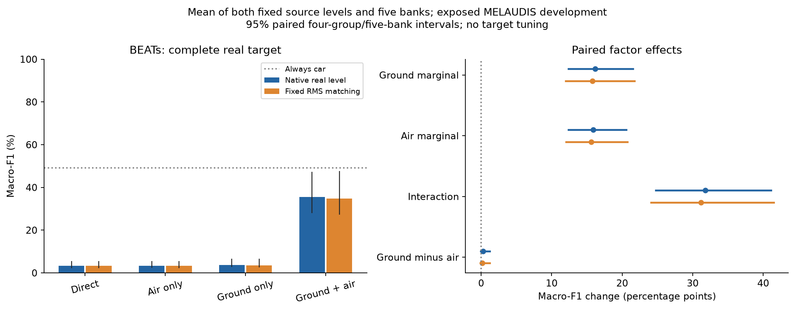
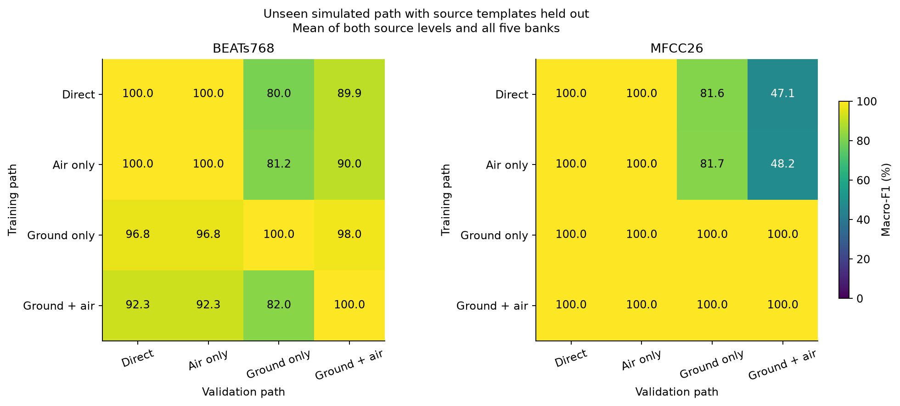
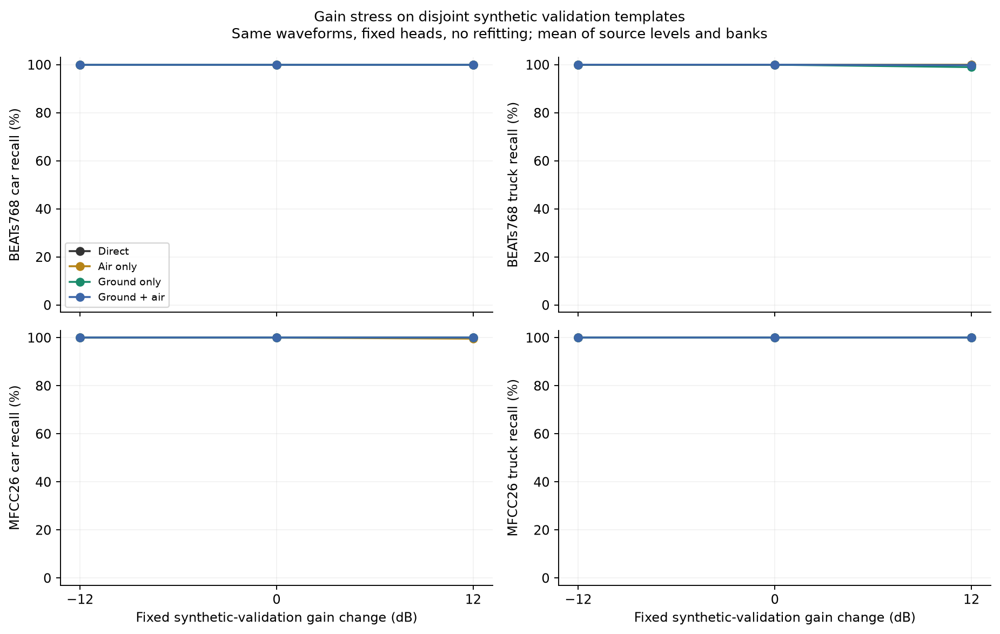
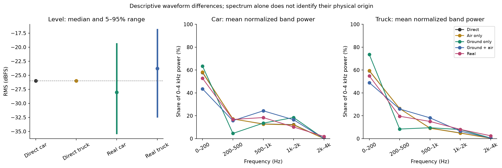

# H2 follow-up: ground, air and direct-path collapse

**Test domain: controlled synthetic → previously exposed MELAUDIS development data.**
Completed 2026-10-04 local time. This report preserves the first mechanism follow-up;
it does not replace [the original H2 result](H2_source_path_results.md).

**The large BEATs gain requires the implemented ground and air branches together.
Neither branch alone reproduces it. Scalar loudness mismatch does not explain the
direct-path collapse. A newly quantified filter-latency confound prevents attributing
the joint gain specifically to physical atmospheric absorption.**

| BEATs training path | Native-real macro-F1 | Native-real car recall |
|---|---:|---:|
| Moving direct path | 3.38% | 0.30% |
| Direct + air branch | 3.40% | 0.32% |
| Direct + ground branch | 3.65% | 0.59% |
| Direct + ground + air branches | 35.46% | 48.10% |

These values equally average the two fixed source levels and five banks. Here and
in the figures, **“air” means the implemented finite-FIR branch, including latency**.
It is not an attenuation-only intervention. The interaction is **+31.80 macro-F1
points, conditional 95% CI [24.76, 41.14]**. The primary ground-minus-air contrast is
only **+0.26 [−0.07, 1.22] points**; neither factor satisfies the prespecified
practical-dominance criterion. All cells and both target-level variants retain a
zero-recall source/bank/group/class case. This is not reliable recognition or
independent confirmation. Joint-path balanced accuracy is 60.65%, but its macro-F1
is still below the 49.19% always-car reference on this heavily imbalanced target.

## Findings for each check

### 1. Reproducibility, roles and software consistency — passed

All 9,600 new complete waveforms replay exactly; all 9,600 reused endpoints match
their original full-waveform and observation hashes. All 80 heads preserve car=0,
truck=1, balanced training, disjoint source-template roles, training-only scalers,
fixed hyperparameters and convergence. Reconstructed logistic scores and saved
probabilities agree; all 40 original native-target prediction vectors are preserved.
The independent audit reproduced every target, cross-path and gain evaluation,
and independently reconstructed 504 F1/balanced-accuracy/truck-rate intervals from
integer confusion counts. This rules out the checked software/ID/scaling mistakes;
it does not establish that every dataset annotation is correct.

### 2. Ground versus air — interaction, not a standalone winner

Adding ground without air gives +0.27 [−0.05, 1.23] F1 points. Adding air without
ground gives +0.014 [−0.004, 0.048] points. Adding ground when air is present gives
+32.07 [24.75, 42.10]; adding air when ground is present gives +31.81 [24.79, 41.14].
The positive interaction appears at both source levels: +34.32 points at S0 and
+29.27 at S1, with both conditional intervals above zero.

The ground and air marginal averages, +16.17 and +15.91 points, therefore must not
be interpreted as two independently useful 16-point improvements or as physical
shares of the domain gap. They average over an almost ineffective standalone
condition and a strongly effective joint condition. MFCC remains near its
always-truck reference throughout. Full conditional estimates are retained below
and in the statistics artifact.

### 3. Matched synthetic validation — perfect, but insufficient

Every head obtains 100% macro-F1 on its matched synthetic validation templates.
These templates are disjoint from fitting, but share the specified generator
families and parameter distributions. This is synthetic generalization within
that construction, not evidence of independent real-vehicle recognition.

### 4. Unseen simulated path — some sensitivity before reaching real audio

BEATs heads trained on the direct path obtain 100% F1 on direct/air-only validation,
80.01% on ground-only and 89.91% on the joint path. MFCC direct-path heads obtain
81.57% on ground-only and 47.14% on the joint path. Thus path changes can move the
representation even with source templates held out. The remaining real-audio
failure is much larger for BEATs: its direct-path real F1 is 3.38%. Every path pair
was evaluated; none was selected as a new training recipe.

### 5. Fixed target RMS matching — no rescue of the direct-path collapse

Setting each existing real crop to −26 dBFS changes direct-path BEATs F1 from
3.3825% to 3.3875%: **+0.0051 points, CI [−0.0316, 0.0302]**. Car recall remains
about 0.31%. MFCC direct-path car recall is 0% after matching. The joint BEATs
condition also does not improve: its F1 changes by −0.69 [−0.97, 0.56] points.

Original real-car RMS has median −28.02 dBFS and a 5–95% range of −35.35 to −19.40;
real trucks have median −23.78, range −32.37 to −16.86. Median gains are +2.02 dB
for cars and −2.22 dB for trucks. All 8,066 original crop and MFCC identities were
verified, and all normalized waveforms were reconstructed by an independent scalar
formula. No clipping or selective exclusion occurred. One normalized float crop
peaks at 1.02015; it is retained as declared, not exported as clipped integer audio.

**Interpretation:** scalar gain mismatch alone is contradicted as a sufficient
explanation for this collapse. This does not establish universal level invariance
or test microphone frequency response, clipping, SNR, or additive background.

### 6. Synthetic ±12 dB gain stress — does not induce the direct-path failure

Both direct-path representations retain 100% car and truck recall at −12, 0 and
+12 dB, on every tested source level/bank. Across other paths, the largest mean
class-recall loss is one point: BEATs ground-only truck recall becomes 99% at
+12 dB. The floating-point stress waveforms are not clipped; their maximum peak
is 1.30902. These checks reinforce the negative loudness finding within the tested
range and source population; they do not prove invariance under all recording gains.

### 7. Real feature displacement and class ranking — the main observed failure

For direct-path BEATs heads, the mean car decision score moves from **−9.31 in
synthetic training to +6.83 on real cars**; positive scores predict truck. Real
truck scores average +6.76. All real observations exceed their respective head’s
training 95th-percentile feature-norm threshold, before and after RMS matching.
For real cars, about 27.49% of standardized coordinates lie outside the training
coordinate ranges. Those are descriptive distances, not a calibrated OOD test.

BEATs direct-path AUROC is 48.61% [45.63, 57.34], rising only to 51.70%
[49.40, 65.05] after matching. Its problem includes poor class ordering, not just
an inconvenient threshold. Joint-path BEATs improves AUROC to 67.96% and lowers
the mean real-car score to +0.12, but does not eliminate the feature-distribution
mismatch or worst-group failures. No target threshold was fitted.

MFCC differs: its direct-path AUROC is 70.64% [66.36, 82.80] despite predicting
almost every event as truck. Its real car/truck mean scores, +9.64/+10.79, show
some ordering on the wrong side of the fixed decision boundary. Mean C0 contributes
only +1.22 to the real-car score shift of +16.54; the other coefficients account
for the rest. This is not a C0-only or scalar-gain explanation, and no new
calibration rule was selected.

### 8. Waveform spectrum — residual differences, with unknown physical origin

Direct synthetic cars have mean 0–4 kHz centroid 355 Hz, joint-path synthetic cars
472 Hz, and real cars 416 Hz. The joint path changes their low/mid-band balance,
but matching a centroid is not evidence that the full signal distribution matches.
The mean 2–4 kHz power share is approximately 0.01% for direct synthetic cars
versus 1.88% for real cars; corresponding truck values are 0.29% versus 2.48%.
All measurements use the same processed bandwidth. Real high-band energy could
come from vehicle source detail, background, sensor/processing, or mixtures of
these. This study does not uniquely identify its origin. BEATs coordinates are
not assigned engine/ground/sensor meanings.

### 9. Air-filter implementation inspection — a concrete attribution confound

This inspection was added after the factorial result; it does not add predictions,
refit heads or change frozen code. The protocol had already specified that air
included finite-FIR latency. The [renderer](../experiments/h2/renderer.py)
constructs symmetric 11-tap filters and applies one to the direct route and one
to each reflected leg. Each has a five-sample static group delay: direct gets
five samples, reflected gets ten, introducing **0.625 ms of extra relative delay
at 8 kHz**. Even the zero-distance/no-absorption filter is a five-sample delayed
identity, to numerical error below 1e−14.

The saved static response inspection gives a concrete witness. At 20 m horizontal
range and 500 Hz, direct-path air attenuation is only about 0.047 dB. The implemented
joint transfer nevertheless differs from a zero-phase, magnitude-only air transfer
by 13.55 dB, because the extra delay changes interference. A delay-only transfer
is within 0.047 dB of the implemented joint transfer at that point. These are
static transfer calculations, **not** classification ablations, and cannot prove
how much of the F1 interaction was caused by delay.

The current experiment therefore identifies a joint *implemented-branch* effect.
It does **not** isolate physical absorption from numerical filter latency. A
separate attenuation × latency control with ground fixed is needed before making
that attribution; the present outputs remain frozen while that control is prepared.

## What changes downstream

The loudness-only explanation can be deprioritized for this collapse. Broad
representation mismatch remains directly observed, with different ranking failures
for BEATs and MFCC. The propagation benefit must be interpreted as a coupled
filter/path result until latency is separated from attenuation. The next controlled
comparison should address that specific implementation confound before adding
source complexity, architecture changes or target-driven tuning. The broad
source-versus-propagation hypothesis remains open beyond these interventions.

## Population, controls and limits

The [frozen protocol](../experiments/h2_mechanisms/PROTOCOL.md) fixes 240 base
templates, 480 dry sources, 1,200 paired geometries, two source levels and four
paths: 19,200 joined observations, half new. Each head uses 190 training events
per class from 19 templates/class and 50 validation events/class from five
disjoint templates/class. Banks are 42, 123, 456, 789 and 1024. Car=0 and truck=1;
motorcycles are excluded. These templates are not independent recorded vehicles.

Ten-second renders use 8 kHz; the geometry-defined two-second crop receives
−26 dBFS RMS normalization before 8→16 kHz resampling. BEATs768 and MFCC26,
training-only StandardScaler and C=1 L2 logistic regression remain fixed. No
encoder fine-tuning, new backgrounds, sensor randomization, target model selection
or threshold tuning occurs. Receiver normalization conditions out absolute
attenuation/SNR benefits. Ground calibration remains unknown. The unchanged BEATs
checkpoint is verified by its local mirror hash; an official upstream checksum
identity remains unverified, as recorded in the parent experiment.

The exact target has 7,810 cars and 256 trucks in four conservative, uneven
provenance groups; original sessions remain unknown. Paired 95% intervals use
10,000 whole-group/whole-bank draws, PCG64 seed 314159. The two source levels are
fixed and equally averaged, not resampled. Only native BEATs ground-minus-air F1
is primary; other intervals are descriptive. Group support, including one group
with a single truck, limits the uncertainty assessment. All findings are on exposed
development audio, not untouched confirmation. No military milestone gate advances.

## Full-target cells

Percentages except Brier score. Point estimates equally average the two fixed source levels and five banks. Brackets are 95% paired whole-group/whole-bank intervals. Worst recall takes the minimum across sources, banks, groups and classes.

| Representation | Path | Target level | Macro-F1 [95% CI] | Balanced accuracy | Car recall | Truck recall | Predicted truck | AUROC | Worst recall |
|---|---|---|---:|---:|---:|---:|---:|---:|---:|
| BEATs768 | Direct | native | 3.38 [2.29, 5.53] | 50.07 | 0.30 | 99.84 | 99.70 | 48.61 | 0.00 |
| BEATs768 | Direct | matched | 3.39 [2.29, 5.53] | 50.10 | 0.31 | 99.88 | 99.70 | 51.70 | 0.00 |
| BEATs768 | Air only | native | 3.40 [2.36, 5.53] | 50.08 | 0.32 | 99.84 | 99.69 | 48.85 | 0.00 |
| BEATs768 | Air only | matched | 3.39 [2.29, 5.53] | 50.10 | 0.31 | 99.88 | 99.70 | 51.89 | 0.00 |
| BEATs768 | Ground only | native | 3.65 [2.70, 6.57] | 49.88 | 0.59 | 99.18 | 99.40 | 54.66 | 0.00 |
| BEATs768 | Ground only | matched | 3.57 [2.63, 6.62] | 49.97 | 0.50 | 99.45 | 99.50 | 58.97 | 0.00 |
| BEATs768 | Ground + air | native | 35.46 [27.97, 47.24] | 60.65 | 48.10 | 73.20 | 52.58 | 67.96 | 0.00 |
| BEATs768 | Ground + air | matched | 34.77 [27.23, 47.62] | 60.95 | 46.55 | 75.35 | 54.15 | 68.71 | 0.00 |
| MFCC26 | Direct | native | 3.08 [1.97, 5.53] | 50.00 | 0.00 | 100.00 | 100.00 | 70.64 | 0.00 |
| MFCC26 | Direct | matched | 3.08 [1.97, 5.53] | 50.00 | 0.00 | 100.00 | 100.00 | 62.36 | 0.00 |
| MFCC26 | Air only | native | 3.08 [1.97, 5.53] | 50.00 | 0.00 | 100.00 | 100.00 | 70.12 | 0.00 |
| MFCC26 | Air only | matched | 3.08 [1.97, 5.53] | 50.00 | 0.00 | 100.00 | 100.00 | 61.70 | 0.00 |
| MFCC26 | Ground only | native | 3.10 [2.02, 5.56] | 49.94 | 0.03 | 99.84 | 99.97 | 65.47 | 0.00 |
| MFCC26 | Ground only | matched | 3.08 [1.97, 5.53] | 49.96 | 0.01 | 99.92 | 99.99 | 53.27 | 0.00 |
| MFCC26 | Ground + air | native | 3.08 [1.97, 5.53] | 49.98 | 0.00 | 99.96 | 100.00 | 69.34 | 0.00 |
| MFCC26 | Ground + air | matched | 3.08 [1.97, 5.53] | 49.98 | 0.00 | 99.96 | 100.00 | 56.03 | 0.00 |

## Ground and air effects

All values are macro-F1 percentage-point changes. The sole primary test is native BEATs, mean_S, ground minus air. Other intervals are descriptive.

| Representation | Source | Target level | Ground marginal | Air marginal | Interaction | Ground minus air |
|---|---|---|---:|---:|---:|---:|
| BEATs768 | mean_S | native | 16.17 [12.38, 21.51] | 15.91 [12.40, 20.57] | 31.80 [24.76, 41.14] | 0.26 [-0.07, 1.22] |
| BEATs768 | mean_S | matched | 15.78 [11.99, 21.74] | 15.60 [12.07, 20.75] | 31.20 [24.10, 41.50] | 0.18 [-0.14, 1.23] |
| BEATs768 | S0 | native | 17.55 [14.60, 22.46] | 17.17 [14.53, 21.15] | 34.32 [29.05, 42.30] | 0.38 [-0.21, 1.66] |
| BEATs768 | S0 | matched | 17.07 [14.14, 22.51] | 16.82 [14.15, 21.27] | 33.64 [28.29, 42.54] | 0.26 [-0.30, 1.53] |
| BEATs768 | S1 | native | 14.79 [9.88, 20.99] | 14.66 [10.08, 20.34] | 29.27 [20.09, 40.66] | 0.14 [-0.21, 0.87] |
| BEATs768 | S1 | matched | 14.49 [9.52, 21.35] | 14.39 [9.75, 20.50] | 28.77 [19.45, 41.00] | 0.10 [-0.25, 1.03] |
| MFCC26 | mean_S | native | 0.01 [-0.01, 0.04] | -0.01 [-0.04, 0.00] | -0.03 [-0.08, 0.00] | 0.02 [-0.01, 0.08] |
| MFCC26 | mean_S | matched | 0.00 [0.00, 0.00] | -0.00 [-0.01, 0.00] | -0.01 [-0.01, 0.00] | 0.00 [0.00, 0.01] |
| MFCC26 | S0 | native | 0.00 [0.00, 0.01] | -0.00 [-0.01, 0.00] | -0.01 [-0.02, 0.00] | 0.01 [0.00, 0.02] |
| MFCC26 | S0 | matched | 0.00 [0.00, 0.00] | 0.00 [0.00, 0.00] | 0.00 [0.00, 0.00] | 0.00 [0.00, 0.00] |
| MFCC26 | S1 | native | 0.02 [-0.02, 0.08] | -0.02 [-0.08, 0.00] | -0.05 [-0.16, 0.00] | 0.04 [-0.01, 0.16] |
| MFCC26 | S1 | matched | 0.00 [0.00, 0.01] | -0.01 [-0.01, 0.00] | -0.01 [-0.03, 0.00] | 0.01 [0.00, 0.02] |

## Fixed target-level intervention

Paired changes after setting each existing final 16 kHz crop to −26 dBFS RMS. No model changes, target-selected gain, clipping or threshold tuning.

| Representation | Path | Macro-F1 change [95% CI] | Car recall change [95% CI] | Truck recall change [95% CI] |
|---|---|---:|---:|---:|
| BEATs768 | Direct | 0.01 [-0.03, 0.03] | 0.00 [-0.03, 0.03] | 0.04 [0.00, 0.13] |
| BEATs768 | Air only | -0.01 [-0.05, 0.01] | -0.01 [-0.05, 0.01] | 0.04 [0.00, 0.13] |
| BEATs768 | Ground only | -0.09 [-0.16, 0.08] | -0.09 [-0.16, 0.05] | 0.27 [0.00, 0.79] |
| BEATs768 | Ground + air | -0.69 [-0.97, 0.56] | -1.55 [-1.99, -0.40] | 2.15 [0.79, 6.86] |
| MFCC26 | Direct | -0.00 [-0.01, 0.00] | -0.00 [-0.01, 0.00] | 0.00 [0.00, 0.00] |
| MFCC26 | Air only | -0.00 [-0.01, 0.00] | -0.00 [-0.01, 0.00] | 0.00 [0.00, 0.00] |
| MFCC26 | Ground only | -0.02 [-0.08, 0.00] | -0.02 [-0.08, 0.00] | 0.08 [0.00, 0.18] |
| MFCC26 | Ground + air | -0.00 [-0.00, 0.00] | -0.00 [-0.00, 0.00] | 0.00 [0.00, 0.00] |

## Ranking and calibration

AUROC/AP/Brier/ECE are averaged over individual heads; AP uses truck as positive and the target truck prevalence is 3.17%. Calibration numbers are descriptive on exposed development data.

| Representation | Path | Level | AUROC % | Truck AP % | Brier | Log loss | ECE % |
|---|---|---|---:|---:|---:|---:|---:|
| BEATs768 | Direct | native | 48.61 | 3.01 | 0.9411 | 6.633 | 95.27 |
| BEATs768 | Direct | matched | 51.70 | 3.24 | 0.9417 | 6.649 | 95.31 |
| BEATs768 | Air only | native | 48.85 | 3.02 | 0.9411 | 6.649 | 95.27 |
| BEATs768 | Air only | matched | 51.89 | 3.26 | 0.9418 | 6.667 | 95.31 |
| BEATs768 | Ground only | native | 54.66 | 3.91 | 0.9250 | 5.718 | 94.30 |
| BEATs768 | Ground only | matched | 58.97 | 4.53 | 0.9271 | 5.705 | 94.46 |
| BEATs768 | Ground + air | native | 67.96 | 6.52 | 0.3829 | 1.314 | 49.01 |
| BEATs768 | Ground + air | matched | 68.71 | 6.70 | 0.3959 | 1.368 | 50.37 |
| MFCC26 | Direct | native | 70.64 | 8.21 | 0.9676 | 9.332 | 96.79 |
| MFCC26 | Direct | matched | 62.36 | 6.03 | 0.9678 | 9.571 | 96.80 |
| MFCC26 | Air only | native | 70.12 | 8.03 | 0.9676 | 9.366 | 96.79 |
| MFCC26 | Air only | matched | 61.70 | 5.91 | 0.9678 | 9.607 | 96.80 |
| MFCC26 | Ground only | native | 65.47 | 5.32 | 0.9132 | 4.279 | 93.87 |
| MFCC26 | Ground only | matched | 53.27 | 4.52 | 0.9319 | 4.512 | 94.89 |
| MFCC26 | Ground + air | native | 69.34 | 6.51 | 0.9471 | 5.195 | 95.73 |
| MFCC26 | Ground + air | matched | 56.03 | 5.31 | 0.9556 | 5.490 | 96.17 |

## Cross-path validation and synthetic gain stress

All validation examples derive from source templates excluded from fitting. Rows in the figure are training paths; columns are validation paths. None of these synthetic results are real-domain validation.

| Representation | Training path | Gain (dB) | Macro-F1 % | Car recall % | Truck recall % | Predicted truck % |
|---|---|---:|---:|---:|---:|---:|
| BEATs768 | Direct | -12 | 100.00 | 100.00 | 100.00 | 50.00 |
| BEATs768 | Direct | 0 | 100.00 | 100.00 | 100.00 | 50.00 |
| BEATs768 | Direct | 12 | 100.00 | 100.00 | 100.00 | 50.00 |
| BEATs768 | Air only | -12 | 100.00 | 100.00 | 100.00 | 50.00 |
| BEATs768 | Air only | 0 | 100.00 | 100.00 | 100.00 | 50.00 |
| BEATs768 | Air only | 12 | 100.00 | 100.00 | 100.00 | 50.00 |
| BEATs768 | Ground only | -12 | 100.00 | 100.00 | 100.00 | 50.00 |
| BEATs768 | Ground only | 0 | 100.00 | 100.00 | 100.00 | 50.00 |
| BEATs768 | Ground only | 12 | 99.50 | 100.00 | 99.00 | 49.50 |
| BEATs768 | Ground + air | -12 | 100.00 | 100.00 | 100.00 | 50.00 |
| BEATs768 | Ground + air | 0 | 100.00 | 100.00 | 100.00 | 50.00 |
| BEATs768 | Ground + air | 12 | 99.90 | 100.00 | 99.80 | 49.90 |
| MFCC26 | Direct | -12 | 100.00 | 100.00 | 100.00 | 50.00 |
| MFCC26 | Direct | 0 | 100.00 | 100.00 | 100.00 | 50.00 |
| MFCC26 | Direct | 12 | 100.00 | 100.00 | 100.00 | 50.00 |
| MFCC26 | Air only | -12 | 100.00 | 100.00 | 100.00 | 50.00 |
| MFCC26 | Air only | 0 | 100.00 | 100.00 | 100.00 | 50.00 |
| MFCC26 | Air only | 12 | 99.80 | 99.60 | 100.00 | 50.20 |
| MFCC26 | Ground only | -12 | 100.00 | 100.00 | 100.00 | 50.00 |
| MFCC26 | Ground only | 0 | 100.00 | 100.00 | 100.00 | 50.00 |
| MFCC26 | Ground only | 12 | 100.00 | 100.00 | 100.00 | 50.00 |
| MFCC26 | Ground + air | -12 | 100.00 | 100.00 | 100.00 | 50.00 |
| MFCC26 | Ground + air | 0 | 100.00 | 100.00 | 100.00 | 50.00 |
| MFCC26 | Ground + air | 12 | 100.00 | 100.00 | 100.00 | 50.00 |

## Feature and waveform diagnostics

Positive logistic scores predict truck. Norms use each head’s own training-only scaler. “Outside p95” is the fraction above that training feature-norm threshold, averaged across fixed source levels and banks. It is not a calibrated OOD detector.

| Representation | Training path | Domain | Class | Mean score | Mean feature norm | Outside train norm p95 % | Coordinates outside train range % |
|---|---|---|---|---:|---:|---:|---:|
| BEATs768 | Direct | train | car | -9.313 | 0.936 | 2.68 | 0.00 |
| BEATs768 | Direct | train | truck | 9.227 | 1.045 | 7.32 | 0.00 |
| BEATs768 | Direct | validation | car | -9.213 | 0.959 | 5.60 | 1.30 |
| BEATs768 | Direct | validation | truck | 8.945 | 1.083 | 10.00 | 1.89 |
| BEATs768 | Direct | native | car | 6.832 | 2.373 | 100.00 | 27.49 |
| BEATs768 | Direct | native | truck | 6.759 | 2.420 | 100.00 | 28.65 |
| BEATs768 | Direct | matched | car | 6.849 | 2.375 | 100.00 | 27.53 |
| BEATs768 | Direct | matched | truck | 7.007 | 2.424 | 100.00 | 28.74 |
| BEATs768 | Air only | train | car | -9.313 | 0.936 | 2.79 | 0.00 |
| BEATs768 | Air only | train | truck | 9.222 | 1.045 | 7.21 | 0.00 |
| BEATs768 | Air only | validation | car | -9.210 | 0.959 | 5.60 | 1.32 |
| BEATs768 | Air only | validation | truck | 8.936 | 1.082 | 10.20 | 1.89 |
| BEATs768 | Air only | native | car | 6.848 | 2.375 | 100.00 | 27.53 |
| BEATs768 | Air only | native | truck | 6.794 | 2.422 | 100.00 | 28.69 |
| BEATs768 | Air only | matched | car | 6.867 | 2.377 | 100.00 | 27.58 |
| BEATs768 | Air only | matched | truck | 7.040 | 2.426 | 100.00 | 28.77 |
| BEATs768 | Ground only | train | car | -9.731 | 0.944 | 2.84 | 0.00 |
| BEATs768 | Ground only | train | truck | 8.884 | 1.032 | 7.16 | 0.00 |
| BEATs768 | Ground only | validation | car | -9.595 | 0.959 | 4.20 | 0.69 |
| BEATs768 | Ground only | validation | truck | 8.765 | 1.059 | 11.20 | 0.98 |
| BEATs768 | Ground only | native | car | 5.874 | 2.585 | 100.00 | 26.74 |
| BEATs768 | Ground only | native | truck | 6.208 | 2.603 | 100.00 | 27.32 |
| BEATs768 | Ground only | matched | car | 5.863 | 2.590 | 100.00 | 26.81 |
| BEATs768 | Ground only | matched | truck | 6.490 | 2.605 | 100.00 | 27.32 |
| BEATs768 | Ground + air | train | car | -9.967 | 0.953 | 2.05 | 0.00 |
| BEATs768 | Ground + air | train | truck | 8.658 | 1.024 | 7.95 | 0.00 |
| BEATs768 | Ground + air | validation | car | -9.708 | 0.960 | 3.00 | 0.71 |
| BEATs768 | Ground + air | validation | truck | 8.724 | 1.048 | 8.60 | 1.00 |
| BEATs768 | Ground + air | native | car | 0.121 | 2.629 | 100.00 | 28.99 |
| BEATs768 | Ground + air | native | truck | 1.604 | 2.617 | 100.00 | 29.11 |
| BEATs768 | Ground + air | matched | car | 0.230 | 2.631 | 100.00 | 29.02 |
| BEATs768 | Ground + air | matched | truck | 1.778 | 2.620 | 100.00 | 29.22 |
| MFCC26 | Direct | train | car | -6.898 | 1.003 | 4.95 | 0.00 |
| MFCC26 | Direct | train | truck | 6.685 | 0.944 | 5.05 | 0.00 |
| MFCC26 | Direct | validation | car | -6.735 | 1.045 | 10.60 | 3.47 |
| MFCC26 | Direct | validation | truck | 6.773 | 0.956 | 5.60 | 2.02 |
| MFCC26 | Direct | native | car | 9.638 | 3.041 | 100.00 | 39.32 |
| MFCC26 | Direct | native | truck | 10.786 | 3.427 | 100.00 | 42.67 |
| MFCC26 | Direct | matched | car | 9.885 | 3.056 | 100.00 | 40.35 |
| MFCC26 | Direct | matched | truck | 10.513 | 3.388 | 100.00 | 42.84 |
| MFCC26 | Air only | train | car | -6.891 | 1.003 | 4.95 | 0.00 |
| MFCC26 | Air only | train | truck | 6.680 | 0.944 | 5.05 | 0.00 |
| MFCC26 | Air only | validation | car | -6.701 | 1.044 | 11.00 | 3.47 |
| MFCC26 | Air only | validation | truck | 6.765 | 0.954 | 5.80 | 1.92 |
| MFCC26 | Air only | native | car | 9.673 | 3.059 | 100.00 | 39.45 |
| MFCC26 | Air only | native | truck | 10.793 | 3.446 | 100.00 | 42.59 |
| MFCC26 | Air only | matched | car | 9.922 | 3.074 | 100.00 | 40.45 |
| MFCC26 | Air only | matched | truck | 10.518 | 3.407 | 100.00 | 42.75 |
| MFCC26 | Ground only | train | car | -6.456 | 1.002 | 4.79 | 0.00 |
| MFCC26 | Ground only | train | truck | 6.400 | 0.962 | 5.21 | 0.00 |
| MFCC26 | Ground only | validation | car | -6.444 | 1.022 | 9.40 | 1.72 |
| MFCC26 | Ground only | validation | truck | 6.606 | 0.977 | 6.20 | 1.17 |
| MFCC26 | Ground only | native | car | 4.387 | 2.313 | 100.00 | 26.09 |
| MFCC26 | Ground only | native | truck | 5.081 | 2.437 | 100.00 | 26.97 |
| MFCC26 | Ground only | matched | car | 4.640 | 2.330 | 100.00 | 27.21 |
| MFCC26 | Ground only | matched | truck | 4.801 | 2.393 | 100.00 | 27.18 |
| MFCC26 | Ground + air | train | car | -6.514 | 1.008 | 6.42 | 0.00 |
| MFCC26 | Ground + air | train | truck | 6.385 | 0.951 | 3.58 | 0.00 |
| MFCC26 | Ground + air | validation | car | -6.584 | 1.034 | 10.00 | 1.61 |
| MFCC26 | Ground + air | validation | truck | 6.615 | 0.981 | 6.40 | 0.91 |
| MFCC26 | Ground + air | native | car | 5.354 | 2.516 | 100.00 | 28.00 |
| MFCC26 | Ground + air | native | truck | 6.230 | 2.627 | 100.00 | 28.51 |
| MFCC26 | Ground + air | matched | car | 5.663 | 2.535 | 100.00 | 29.06 |
| MFCC26 | Ground + air | matched | truck | 5.888 | 2.577 | 100.00 | 28.69 |

MFCC26 comprises 13 coefficient means followed by 13 standard deviations; coordinate 0 is mean C0. The table below gives its contribution to the mean score shift from same-class synthetic training. Contributions sum with all other coordinates to the total; a large C0 term alone does not prove that level explains all errors. BEATs coordinates have no physical labels.

| Path | Target level | Class | Total mean score shift | Mean C0 contribution |
|---|---|---|---:|---:|
| Direct | native | car | 16.535 | 1.224 |
| Direct | native | truck | 4.101 | 1.151 |
| Direct | matched | car | 16.782 | 1.471 |
| Direct | matched | truck | 3.828 | 0.879 |
| Air only | native | car | 16.564 | 1.247 |
| Air only | native | truck | 4.113 | 1.180 |
| Air only | matched | car | 16.813 | 1.496 |
| Air only | matched | truck | 3.838 | 0.905 |
| Ground only | native | car | 10.843 | 1.374 |
| Ground only | native | truck | -1.319 | 1.287 |
| Ground only | matched | car | 11.096 | 1.627 |
| Ground only | matched | truck | -1.599 | 1.007 |
| Ground + air | native | car | 11.868 | 1.491 |
| Ground + air | native | truck | -0.156 | 1.448 |
| Ground + air | matched | car | 12.178 | 1.800 |
| Ground + air | matched | truck | -0.497 | 1.106 |

Exact per-source, per-bank and per-group metrics, feature-coordinate score contributions and waveform quantiles are retained in the linked machine-readable artifacts. Aggregated diagrams must not be interpreted as independent vehicle or recording-session evidence.

## Runtime and artifacts

Measured on Apple M3 Pro, 18 GiB RAM: four render workers, four Torch CPU threads, one BLAS thread; no GPU.

| Stage | Wall time (minutes) |
|---|---:|
| generate | 15.63 |
| complete replay | 15.03 |
| synthetic features and gain | 10.99 |
| fit | 0.19 |
| target gain | 4.66 |
| evaluate | 1.29 |
| audit | 2.17 |

The audit preserved 22,316 parent H2 files and 8,257 historical files. Prediction replay error is zero; 504 primary/secondary F1, balanced-accuracy and truck-rate intervals were independently reconstructed from integer confusion counts.

- [Protocol](../experiments/h2_mechanisms/PROTOCOL.md)
- [Configuration](../experiments/h2_mechanisms/config.json)
- [Design lock](../experiments/h2_mechanisms/frozen/ground_air_collapse_20261004_v1/lock.json)
- [Execution lock](../experiments/h2_mechanisms/execution/ground_air_collapse_20261004_v1/lock.json)
- [Complete waveform replay](../experiments/h2_mechanisms/corpus/ground_air_collapse_20261004_v1/verification.json)
- [Model lock](../experiments/h2_mechanisms/models/ground_air_collapse_20261004_v1/lock.json)
- [Independent result audit](../experiments/h2_mechanisms/results/ground_air_collapse_20261004_v1/verification.json)
- [Statistics and decisions](../experiments/h2_mechanisms/results/ground_air_collapse_20261004_v1/statistics.json)
- [Every target/class/group result](../experiments/h2_mechanisms/results/ground_air_collapse_20261004_v1/evaluations.json)
- [Every cross-path check](../experiments/h2_mechanisms/results/ground_air_collapse_20261004_v1/cross_path_validation.json)
- [Every synthetic gain check](../experiments/h2_mechanisms/results/ground_air_collapse_20261004_v1/validation_gain.json)
- [Per-head feature/score diagnostics](../experiments/h2_mechanisms/results/ground_air_collapse_20261004_v1/collapse_diagnostics.json)
- [Waveform and diagnostic summaries](../experiments/h2_mechanisms/results/ground_air_collapse_20261004_v1/diagnostic_summaries.json)
- [Post-result air-filter phase inspection](../experiments/h2_mechanisms/results/ground_air_collapse_20261004_v1/air_filter_phase_inspection.json)
- [Commands](../experiments/h2_mechanisms/README.md)
