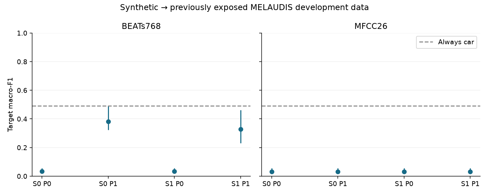
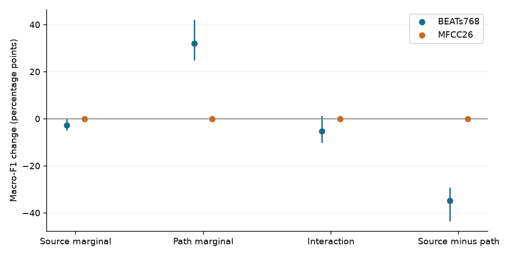
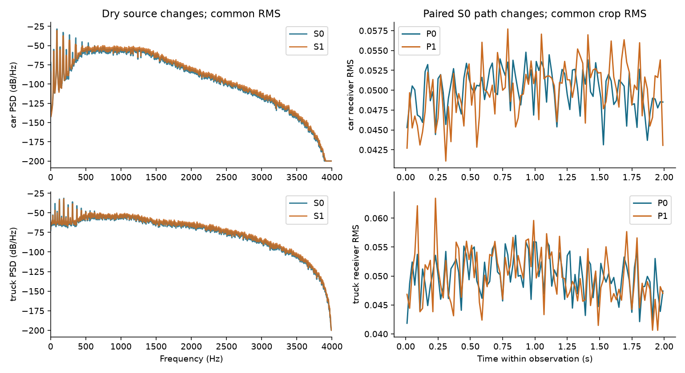
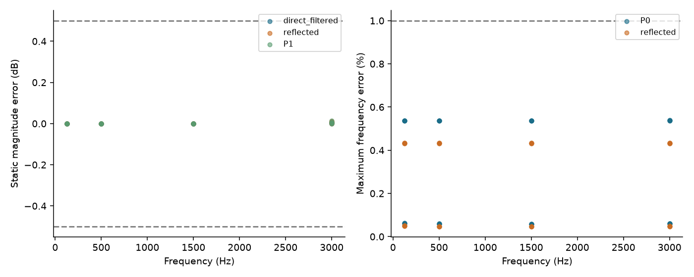

# H2: paired source × propagation results

**Test domain: controlled synthetic → previously exposed MELAUDIS development data.**

The conditional interval contradicts directional source dominance for these interventions: the source-minus-path upper bound is nonpositive.

Primary BEATs source-minus-path contrast D: **-34.90 [-43.56, -29.17] percentage points**.
Source marginal: -2.82 [-4.94, 0.06]; path marginal: 32.08 [24.77, 42.10]; interaction: -5.27 [-10.11, 1.30] percentage points.

This result tests the specified source and path bundles. It does not identify an intrinsic share of the real domain gap, establish that S1 is empirically more realistic, or rank environmental and sensor modeling, which were fixed. It is not independent confirmation.

The relative propagation gain does not establish a reliable classifier: all cells retain a zero-recall seed/group/class case. The BEATs direct-only cells nearly always predict truck; MFCC nearly always predicts truck at every factor setting. The BEATs path intervention restores substantial car recall, while reducing truck recall. All four mean BEATs macro-F1 scores remain below the always-car reference, despite the path-enriched cells exceeding its balanced accuracy.

## What was held fixed

Four paired cells; five frozen banks (42, 123, 456, 789, 1024); 190 car and 190 truck training observations per head; 50/class synthetic validation observations from disjoint source templates. The complete corpus contains 240 base templates, 480 dry source waveforms and 9,600 observations. These are generated sources and events, not independent real vehicles. Motorcycles are excluded.

S1 changes engine harmonic rolloff, 0–2% firing-frequency modulation and component balance. P1 adds ground reflection and atmospheric absorption to the common moving direct path. Both factors are bundles. Source RMS, receiver-crop RMS, geometry, ideal mono microphone, atmosphere, 8 kHz synthesis / 16 kHz model input, two-second observation length, fixed BEATs768/MFCC26 and C=1 logistic heads remain common. Encoders are frozen; each scaler/head sees only its own 380 training rows. No target tuning, adaptation or model selection was performed.

| Cell | Source | Propagation |
|---|---|---|
| F00 | S0: baseline procedural | P0: moving direct path |
| F01 | S0: baseline procedural | P1: direct + ground + air |
| F10 | S1: declared source changes | P0: moving direct path |
| F11 | S1: declared source changes | P1: direct + ground + air |

## Full-target performance

All numbers below are percentages. Brackets are 95% paired group/bank bootstrap intervals; point estimates average five complete-target seed scores. Worst recall is the minimum over every seed, target group and class.

| Representation | Cell | Macro-F1 [95% CI] | Balanced accuracy | Car recall | Truck recall | Worst recall |
|---|---|---:|---:|---:|---:|---:|
| BEATs768 | F00 | 3.47 [2.38, 5.53] | 50.12 | 0.39 | 99.84 | 0.00 |
| BEATs768 | F01 | 38.19 [32.40, 48.80] | 62.99 | 52.01 | 73.98 | 0.00 |
| BEATs768 | F10 | 3.29 [2.22, 5.53] | 50.03 | 0.22 | 99.84 | 0.00 |
| BEATs768 | F11 | 32.74 [23.19, 46.12] | 58.31 | 44.19 | 72.42 | 0.00 |
| MFCC26 | F00 | 3.08 [1.97, 5.53] | 50.00 | 0.00 | 100.00 | 0.00 |
| MFCC26 | F01 | 3.08 [1.97, 5.53] | 50.00 | 0.00 | 100.00 | 0.00 |
| MFCC26 | F10 | 3.08 [1.97, 5.53] | 50.00 | 0.01 | 100.00 | 0.00 |
| MFCC26 | F11 | 3.08 [1.97, 5.53] | 49.96 | 0.00 | 99.92 | 0.00 |

Always-car macro-F1 is 49.19%; always-truck is 3.08%. Both have 50% balanced accuracy on this two-class population.

## Factor effects and falsification

Positive effects mean higher macro-F1. With Qij denoting the five-bank mean for source i and path j: source marginal = ((Q10−Q00)+(Q11−Q01))/2; path marginal = ((Q01−Q00)+(Q11−Q10))/2; interaction = Q11−Q10−Q01+Q00. The primary contrast D is source minus path, equivalently Q10−Q01. Conditional effects show whether a change behaves differently at the other factor level.

| Representation | Contrast | Macro-F1 change [95% CI], percentage points |
|---|---|---:|
| BEATs768 | source_at_P0 | -0.18 [-0.67, 0.28] |
| BEATs768 | source_at_P1 | -5.45 [-10.03, 0.72] |
| BEATs768 | path_at_S0 | 34.72 [29.14, 43.56] |
| BEATs768 | path_at_S1 | 29.45 [19.96, 41.35] |
| BEATs768 | delta_S | -2.82 [-4.94, 0.06] |
| BEATs768 | delta_P | 32.08 [24.77, 42.10] |
| BEATs768 | interaction | -5.27 [-10.11, 1.30] |
| BEATs768 | D | -34.90 [-43.56, -29.17] |
| MFCC26 | source_at_P0 | 0.01 [0.00, 0.02] |
| MFCC26 | source_at_P1 | 0.00 [0.00, 0.00] |
| MFCC26 | path_at_S0 | 0.00 [0.00, 0.00] |
| MFCC26 | path_at_S1 | -0.01 [-0.02, 0.00] |
| MFCC26 | delta_S | 0.00 [0.00, 0.01] |
| MFCC26 | delta_P | -0.00 [-0.01, 0.00] |
| MFCC26 | interaction | -0.01 [-0.02, 0.00] |
| MFCC26 | D | 0.01 [0.00, 0.02] |

Decision flags: practical dominance supported = `False`; ≥3-point margin falsified = `True`; directional dominance contradicted = `True`; useful source improvement contradicted = `False`.

Support requires lower CI(D) ≥3 points and lower CI(source marginal)>0. If both changes hurt, a less harmful source change is not useful source enrichment. Conditional source/path effects and interaction are reported even when they disagree with a simple ranking.

## Target groups and class failure cases

| Group | Cars | Trucks |
|---|---:|---:|
| connected_153e3dead5cb84d2 | 626 | 36 |
| connected_8e14c1e672d4cb88 | 468 | 32 |
| connected_e345c615fb69bd2d | 6290 | 187 |
| connected_e4bd1f6e5af7a1dc | 426 | 1 |

| Representation | Cell | Group | Mean car recall | Mean truck recall | Worst seed/class recall |
|---|---|---|---:|---:|---:|
| BEATs768 | F00 | connected_153e3dead5cb84d2 | 0.00 | 100.00 | 0.00 |
| BEATs768 | F00 | connected_8e14c1e672d4cb88 | 0.00 | 100.00 | 0.00 |
| BEATs768 | F00 | connected_e345c615fb69bd2d | 0.45 | 99.79 | 0.03 |
| BEATs768 | F00 | connected_e4bd1f6e5af7a1dc | 0.56 | 100.00 | 0.23 |
| BEATs768 | F01 | connected_153e3dead5cb84d2 | 63.61 | 63.33 | 33.33 |
| BEATs768 | F01 | connected_8e14c1e672d4cb88 | 67.09 | 63.12 | 53.12 |
| BEATs768 | F01 | connected_e345c615fb69bd2d | 49.77 | 78.29 | 33.47 |
| BEATs768 | F01 | connected_e4bd1f6e5af7a1dc | 51.41 | 0.00 | 0.00 |
| BEATs768 | F10 | connected_153e3dead5cb84d2 | 0.00 | 100.00 | 0.00 |
| BEATs768 | F10 | connected_8e14c1e672d4cb88 | 0.00 | 100.00 | 0.00 |
| BEATs768 | F10 | connected_e345c615fb69bd2d | 0.24 | 99.79 | 0.00 |
| BEATs768 | F10 | connected_e4bd1f6e5af7a1dc | 0.33 | 100.00 | 0.00 |
| BEATs768 | F11 | connected_153e3dead5cb84d2 | 56.87 | 61.67 | 19.44 |
| BEATs768 | F11 | connected_8e14c1e672d4cb88 | 59.36 | 63.75 | 21.88 |
| BEATs768 | F11 | connected_e345c615fb69bd2d | 41.74 | 76.36 | 17.85 |
| BEATs768 | F11 | connected_e4bd1f6e5af7a1dc | 45.02 | 0.00 | 0.00 |
| MFCC26 | F00 | connected_153e3dead5cb84d2 | 0.00 | 100.00 | 0.00 |
| MFCC26 | F00 | connected_8e14c1e672d4cb88 | 0.00 | 100.00 | 0.00 |
| MFCC26 | F00 | connected_e345c615fb69bd2d | 0.00 | 100.00 | 0.00 |
| MFCC26 | F00 | connected_e4bd1f6e5af7a1dc | 0.00 | 100.00 | 0.00 |
| MFCC26 | F01 | connected_153e3dead5cb84d2 | 0.00 | 100.00 | 0.00 |
| MFCC26 | F01 | connected_8e14c1e672d4cb88 | 0.00 | 100.00 | 0.00 |
| MFCC26 | F01 | connected_e345c615fb69bd2d | 0.00 | 100.00 | 0.00 |
| MFCC26 | F01 | connected_e4bd1f6e5af7a1dc | 0.00 | 100.00 | 0.00 |
| MFCC26 | F10 | connected_153e3dead5cb84d2 | 0.00 | 100.00 | 0.00 |
| MFCC26 | F10 | connected_8e14c1e672d4cb88 | 0.00 | 100.00 | 0.00 |
| MFCC26 | F10 | connected_e345c615fb69bd2d | 0.01 | 100.00 | 0.00 |
| MFCC26 | F10 | connected_e4bd1f6e5af7a1dc | 0.00 | 100.00 | 0.00 |
| MFCC26 | F11 | connected_153e3dead5cb84d2 | 0.00 | 100.00 | 0.00 |
| MFCC26 | F11 | connected_8e14c1e672d4cb88 | 0.00 | 100.00 | 0.00 |
| MFCC26 | F11 | connected_e345c615fb69bd2d | 0.00 | 99.89 | 0.00 |
| MFCC26 | F11 | connected_e4bd1f6e5af7a1dc | 0.00 | 100.00 | 0.00 |

The four groups are conservative provenance components; original recording sessions are unknown. One group contains 6,290 cars and 187 trucks, and another has only one truck. Repeated events are not independent recording sessions. Bootstrap uncertainty is conditional and weak with this support. Group tables expose failures that a mean F1 can hide.

## Synthetic validation and per-bank results

Validation is generated synthetic → disjoint synthetic templates. It was not used for fitting, stopping or parameter selection. All 40 heads achieve 100% validation macro-F1. This establishes separation under these generated class priors, while the target results show that this validation success is insufficient evidence of real transfer.

| Representation | Cell | Seed | Synthetic validation F1 | Real development F1 | Real balanced accuracy |
|---|---|---:|---:|---:|---:|
| BEATs768 | F00 | 42 | 100.00 | 3.12 | 50.02 |
| MFCC26 | F00 | 42 | 100.00 | 3.08 | 50.00 |
| BEATs768 | F01 | 42 | 100.00 | 46.38 | 64.21 |
| MFCC26 | F01 | 42 | 100.00 | 3.08 | 50.00 |
| BEATs768 | F10 | 42 | 100.00 | 3.10 | 50.01 |
| MFCC26 | F10 | 42 | 100.00 | 3.08 | 50.00 |
| BEATs768 | F11 | 42 | 100.00 | 37.16 | 62.98 |
| MFCC26 | F11 | 42 | 100.00 | 3.08 | 50.00 |
| BEATs768 | F00 | 123 | 100.00 | 3.22 | 50.07 |
| MFCC26 | F00 | 123 | 100.00 | 3.08 | 50.00 |
| BEATs768 | F01 | 123 | 100.00 | 31.88 | 60.98 |
| MFCC26 | F01 | 123 | 100.00 | 3.08 | 50.00 |
| BEATs768 | F10 | 123 | 100.00 | 3.85 | 50.00 |
| MFCC26 | F10 | 123 | 100.00 | 3.08 | 50.00 |
| BEATs768 | F11 | 123 | 100.00 | 21.87 | 56.75 |
| MFCC26 | F11 | 123 | 100.00 | 3.08 | 49.81 |
| BEATs768 | F00 | 456 | 100.00 | 3.40 | 50.16 |
| MFCC26 | F00 | 456 | 100.00 | 3.08 | 50.00 |
| BEATs768 | F01 | 456 | 100.00 | 30.19 | 60.44 |
| MFCC26 | F01 | 456 | 100.00 | 3.08 | 50.00 |
| BEATs768 | F10 | 456 | 100.00 | 3.09 | 50.01 |
| MFCC26 | F10 | 456 | 100.00 | 3.08 | 50.00 |
| BEATs768 | F11 | 456 | 100.00 | 19.83 | 56.07 |
| MFCC26 | F11 | 456 | 100.00 | 3.08 | 50.00 |
| BEATs768 | F00 | 789 | 100.00 | 4.41 | 50.28 |
| MFCC26 | F00 | 789 | 100.00 | 3.08 | 50.00 |
| BEATs768 | F01 | 789 | 100.00 | 42.83 | 65.66 |
| MFCC26 | F01 | 789 | 100.00 | 3.08 | 50.00 |
| BEATs768 | F10 | 789 | 100.00 | 3.34 | 50.13 |
| MFCC26 | F10 | 789 | 100.00 | 3.12 | 50.02 |
| BEATs768 | F11 | 789 | 100.00 | 48.59 | 54.48 |
| MFCC26 | F11 | 789 | 100.00 | 3.08 | 50.00 |
| BEATs768 | F00 | 1024 | 100.00 | 3.22 | 50.07 |
| MFCC26 | F00 | 1024 | 100.00 | 3.08 | 50.00 |
| BEATs768 | F01 | 1024 | 100.00 | 39.67 | 63.69 |
| MFCC26 | F01 | 1024 | 100.00 | 3.08 | 50.00 |
| BEATs768 | F10 | 1024 | 100.00 | 3.08 | 50.00 |
| MFCC26 | F10 | 1024 | 100.00 | 3.08 | 50.00 |
| BEATs768 | F11 | 1024 | 100.00 | 36.25 | 61.25 |
| MFCC26 | F11 | 1024 | 100.00 | 3.08 | 50.00 |

## Physical and source checks

The indexing, total image-path spreading, second-leg initialization, common speed of sound, Sinc weighting and air-frequency corrections are recorded in the execution patch. The initial 11-tap amplitude failure and last-bit replay failures remain available; they were resolved before bulk generation, with no target scores used. The common Sinc length is 31 taps.

- All 480 source cases pass harmonic-ratio, waveform-derived firing-frequency, RMS, reference-source and deterministic replay checks. Maximum released-reference waveform difference is about 2.73e−12; this numerical agreement does not establish empirical realism.
- All 151 renderer checks pass. Maximum moving-frequency error is 0.539% (limit 1%); maximum static transfer magnitude error is 0.0143 dB (limit 0.5 dB). Scalar and batched outputs agree within 3e−17.
- All 480 dry sources and 9,600 complete renders were independently regenerated exactly. Every saved file, class/cell/geometry pairing, source-parent role, crop, dtype, resampling operation and peak/RMS check passed.
- The full ground-field coefficient is not capped to a plane-wave energy ratio. Its gains and the passivity clarification remain disclosed; raw ground units and real-road calibration are unknown.

The example is the prespecified seed 42, validation template 0, geometry 0 for each class; it was not chosen by target performance.

## Reproducibility and limits

All forty heads were frozen before target evaluation. The independent final audit verifies training-only scaler moments, source-parent separation, exact fit populations, fixed hyperparameters, saved validation/target predictions, all paired bootstrap samples and the protected historical files. A separate integer-confusion calculation reconstructs every macro-F1 draw, contrast and interval without the evaluation score/bootstrap helpers. Prediction replay allows 1e−10 numerical error; waveform replay is exact.

Generation: 16.55 min; complete corpus verification/replay: 15.34 min; feature extraction: 4.69 min; fitting: 3.10 s; target scoring/statistics: 5.42 s; final audit: 6.68 s. Rendering used 4 CPU workers on the existing Apple M3 Pro; the encoder used four CPU threads, batch 8 and no GPU.

The generated corpus occupies 8.73 GB before features and results. Generation recorded peak parent RSS 620.5 MiB and peak child RSS 479.5 MiB. These are separate process maxima, not simultaneous total memory or encoder memory measurements.

No untouched confirmation population was available. H2 retains H1 target preprocessing and IDs, but its deliberately normalized new factorial corpus differs from the released H1 procedural bank. F00 is not a replay of that earlier result. Scalar normalization removes absolute attenuation/SNR as tested benefits; environment, sensor effects, real engine identity, load, road material calibration and recorded-source alternatives remain untreated. The current-position delay and finite FIR/angle discretization remain approximate.

Analyst interpretation: the bounded source intervention has not earned priority over propagation in this setting. Separating ground reflection from atmospheric filtering, and understanding the direct-only classifier collapse, are justified follow-up questions. The present run cannot attribute the path gain to either mechanism separately. Its source intervention retains the same procedural architecture and is not a test of a learned or recorded source model. These follow-ups require a new declared protocol; none was run here.

The next experimental decision should use the conditional gains, class failures and uncertainty above. It should not promote a component as universally dominant or change C, thresholds, priors or sample counts from these target scores without a new declared development experiment. The military milestone gates remain separate and unchanged.

## Artifacts

- [Protocol](../experiments/h2_simulation/notes/PROTOCOL.md)
- [Implementation amendments](../experiments/h2_simulation/notes/IMPLEMENTATION_AMENDMENTS.md)
- [Execution lock](ARTIFACT_INDEX.md#artifact-570c30d67290)
- [Corpus manifest](ARTIFACT_INDEX.md#artifact-39ceb259a371)
- [Corpus verification](ARTIFACT_INDEX.md#artifact-56ef1ae53545)
- [Model lock](ARTIFACT_INDEX.md#artifact-e2027d0769cb)
- [Feature lock and encoder provenance](ARTIFACT_INDEX.md#artifact-baada073f5db)
- [All per-head/group metrics](ARTIFACT_INDEX.md#artifact-7933c96429e0)
- [All scalar metrics and confidence intervals](ARTIFACT_INDEX.md#artifact-09cb8c93a4ab)
- [Raw predictions](ARTIFACT_INDEX.md#artifact-bfa31dde48b8)
- [Paired bootstrap indices](ARTIFACT_INDEX.md#artifact-73521cc22fab)
- [Final independent audit](ARTIFACT_INDEX.md#artifact-70e853936c31)
- [Execution commands](../experiments/h2_simulation/notes/RUN_H2.md)
